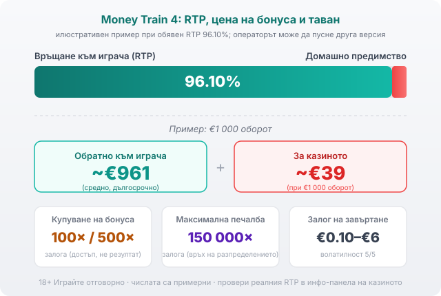

Title tag: Money Train 4: какво променя четвъртата част
Meta description: Money Train 4 на Relax Gaming: RTP 96.10%, таван 150 000× и ново поле 6×6. Какво променя четвъртата част спрямо Money Train 3 в бонуса Money Cart.

---

# Money Train 4 (Relax Gaming): какво променя четвъртата част

Таванът на печалбата в Money Train 4 стига 150 000 пъти залога. В Money Train 3 беше 100 000 пъти, а в Money Train 2 само 50 000. Това число обикновено се цитира първо, но то не е причината четвъртата част да се играе различно от третата.

## Каква е серията и къде сяда четвъртата част

Relax Gaming ([профил на доставчиците](/blog/games-providers/)) пуска оригиналния Money Train през 2019 г., след него Money Train 2 през 2020 г. и Money Train 3 през 2022 г. Money Train 4 излиза мрежово на 20.09.2023 г. и е обявена за финала на серията. Темата се измества към мрачно sci-fi, ръждив метал и неон вместо биопънк декора на третата част, но декорът е козметика. Всяка част стъпва върху един и същ скелет: скучновата основна игра, чиято единствена задача е да те вкара в бонуса Money Cart, където се случва почти всичко. Четвъртата част не пипа този скелет, а го надгражда с повече символи и по-висок таван.

## По-голямото поле и другата основна игра

Money Train 3 се играе на поле 5×4 с 40 фиксирани линии. Money Train 4 минава на 6×6 и сменя логиката на изплащане към scatter pays: плаща при поне 8 еднакви високи символа или поне 10 еднакви ниски, независимо къде стоят на екрана. Полето е по-голямо, но задачата на основната игра си остава същата, да събере сейфовете, които отключват Money Cart.

## Money Cart: същият бонус, повече инструменти

Бонусът Money Cart тръгва с брояч от 3 респина. Всеки нов символ, който падне, връща брояча на 3, а персистиращите символи остават залепени на екрана и стрелят, събират или умножават при всеки следващ спин, докато респините свършат. В Money Train 4 бонусът стартира на поле 6×4 и може да отключва още редове в движение.

Разликата спрямо третата част е в арсенала. Money Train 4 добавя няколко символа, които ги няма в Money Train 3:

- **Arms Dealer**: превръща 1 до 4 scatter символа в специални feature символи.
- **Upgrader**: ъпгрейдва 1 до 3 символа на екрана до постоянните им версии.
- **Unlocker**: отключва нов ред (същото става и когато запълниш ред със символи).
- **Reset Plus**: добавя 1 към началния брой респини.
- **Persistent Shapeshifter**: при всеки спин се преобразява в друг символ, например Payer, Sniper или Collector.

Тези символи не са просто повече иконки. Arms Dealer вкарва още активни модификатори, Upgrader ги прави постоянни, така че стрелят до края на бонуса, а Unlocker разширява полето, за да има къде да се трупат. Комбинацията от повече персистиращи символи върху по-голямо поле е пътят към горния край на изплащането. Absorber-ът от предишната част пък е премахнат. Relax описват общо над 20 функции в бонуса. [VERIFY: точният брой символи в бонуса, цитиран като „21, от които 8 напълно нови" в игрални бази данни, не е потвърден на официалната страница на Relax Gaming.]

## Какво остава същото

Въпреки новите символи и по-голямото поле, сърцето на играта е непокътнато. Money Cart работи по същия принцип на респини и персистиращи символи като в Money Train 3, а двойката RTP стойности е същата, 96.10% и 96.50%. Самата идея за купуване на бонус също не е нова за серията. Ако си играл третата част, четвъртата няма да те обърка; промяната е в мащаба и в броя лостове, с които бонусът може да ескалира, не в правилата, които вече знаеш.

## RTP: 96.10%, или 96.50% ако купиш бонуса

Обявеният RTP на Money Train 4 е 96.10% в стандартната версия и 96.50% във версиите с купуване на бонус, по данни на Relax Gaming. Това е същата двойка стойности като в Money Train 3. Играта се доставя в няколко RTP конфигурации и операторът избира коя да пусне, така че реалният процент зависи от конкретното казино. Затова в [страниците с висок RTP](/slot-igri/visok-rtp/) гледаме реалната версия на казиното, не рекламния номер. RTP е дългосрочна статистика върху милиони завъртания, не обещание за една сесия.

При обявен RTP 96.10% и примерно €1 000 оборот средно се връщат около €961 в дългосрочен план, а към €39 остават за казиното. Числата са илюстративни; конкретна сесия може да завърши много над или много под тази средна.

*Илюстративен пример при обявен RTP 96.10%: €1 000 оборот връща средно ~€961, ~€39 остават за казиното. Купуването на бонуса струва 100× (или 500×) залога, а максималната печалба е 150 000× залога. Реалната RTP версия се проверява в инфо-панела на конкретното казино.*

## Волатилността: защо между ударите е сухо

Money Train 4 е с екстремно висока волатилност, оценка 5/5 при Relax. На практика това значи дълги серии от празни или дребни завъртания, прекъсвани рядко от голям удар в бонуса. Балансът се движи на резки скокове, а не плавно, и това прави играта неподходяща за малък бюджет и дълга сесия. Високата волатилност не е по-голям шанс да си на плюс; тя разпределя същото домашно предимство на по-редки, но по-едри колебания.

## Залози и реалната цена на купуването

Залогът върви от €0.10 до €6 на завъртане. Купуването на бонуса струва 100× залога за влизане в Money Cart, или 500× залога за влизане с 1 гарантиран постоянен символ, по данни на игрални бази данни. При примерен залог €1 това са €100 за обикновеното влизане и €500 за скъпото; при максималния залог €6 същите множители излизат €600 и €3 000. Сумата не е малка, а срещу нея получаваш достъп до бонуса, не гарантиран резултат. Платените 100× или 500× спокойно могат да се върнат като нула, докато таванът от 150 000× е горният край на разпределението и се случва изключително рядко. Купуването на бонус скъсява играта до най-скъпата ѝ част, което при екстремна волатилност изпразва бюджета бързо.

## За кого е Money Train 4

Money Train 4 пасва на играч, който харесва екстремна волатилност и приема, че между големите удари стои дълго сухо поле. За плавна, дълга сесия с малък бюджет играта не става, ще изяде баланса на пресекулки. Пусни я първо в [демо режим](/slot-igri/), за да усетиш темпото, и си задай лимит за загуба и за време преди първия реален залог. Хазартът не е начин да си върнеш пари или да изкараш доход; в дългосрочен план математиката работи за казиното и това важи с пълна сила за високоволатилен слот с купуване на бонус. 18+ Хазартът може да пристрасти. Играйте отговорно. Ако усетиш, че играта излиза извън контрол, виж [инструментите за отговорна игра](/otgovorna-igra/).

---

**Георги Тодоров**
Публикувано: 20.09.2026 · Последна редакция: 20.09.2026

[About Всички Казина boilerplate]

**Отговорна игра.** 18+ Хазартът може да пристрасти. Играйте отговорно. Ако усетиш, че играта излиза извън контрол или искаш да я ограничиш, виж [инструментите за отговорна игра](/otgovorna-igra/) и възможността за самоизключване чрез националния регистър на уязвимите лица към НАП (подава се писмено само от засегнатото лице). Национална информационна линия за наркотиците, алкохола и хазарта („Солидарност") 0888 99 18 66, делнични дни 10:00–17:00.

**Разкриване на партньорства.** Всички Казина съдържа партньорски (афилиейт) връзки; когато отвориш оферта през такава връзка, това може да финансира сайта, без да променя цената за теб и без да влияе на оценките ни. От 1 август 2026 г. дейността на афилиейт оператори в България се лицензира съгласно Закона за държавния бюджет за 2026 г. (ДВ, бр. 69 от 31.07.2026 г.). Всички Казина е подало заявление за лиценз пред Националната агенция по приходите и очаква издаването му.
