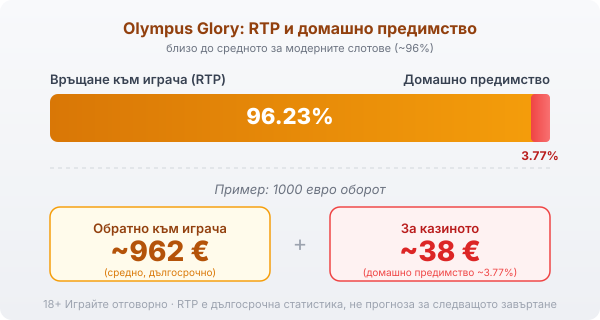

Title tag: Olympus Glory: RTP 96.23% и характеристики (Amusnet/EGT)
Meta description: Olympus Glory на Amusnet (EGT): 5 барабана, 10 линии, RTP 96.23%, Зевс като wild и scatter, 10 безплатни завъртания с разширяващ символ и Jackpot Cards. Какво значат числата.

---

# Olympus Glory: RTP и характеристики

Olympus Glory качва играча на върха на Олимп, при Зевс и мълниите му. Прави я [Amusnet Interactive](/blog/amusnet-egt-provajdar/), българската компания, която до лятото на 2022 г. се казваше EGT и чиито наземни автомати се въртят из залите от години. Темата е класическа гръцка митология. Под нея работи висока волатилност и обявен RTP от 96.23% по официалната стойност на производителя.

## Пет барабана, десет линии

Устройството е познато от старите машини на EGT: пет барабана, три реда и десет фиксирани линии. При всяко завъртане залагаш на всичките десет наведнъж, без опция да свалиш броя им, а комбинациите се броят отляво надясно. По барабаните се редят митологични фигури, Зевс и храмът на Олимп сред тях, плюс класическите карти от девятка до асо за по-дребните печалби.

## Зевс държи две роли

Зевс е и wild, и scatter, което рядко се пада на един символ. Като wild той замества другите и допълва комбинация по линия. Като scatter плаща, където и да се появи по барабаните, и три или повече негови изображения отварят безплатните завъртания. Без него няма бонус кръг и повечето от едрите печалби минават през него.

## Безплатните завъртания и разширяващият символ

Три Зевса някъде по екрана дават 10 безплатни завъртания. Преди да тръгнат, играта тегли на случаен принцип един символ и го прави специален разширяващ: щом падне, той покрива целия барабан и плаща по позиции, не по строга линия. Колко ще върне серията зависи изцяло от това кой символ е бил изтеглен. Стойностен символ пълни екрана с добри печалби; дребен едва покрива залозите за бонуса. Тегленето е ново при всеки бонус.

## Гембълът е монета, не план

След печеливша комбинация можеш да заложиш сумата в гембъл: познай цвета на скритата карта, червено или черно, и я удвояваш. Познаеш ли, качваш се едно ниво нагоре. Грешката нулира целия кръг. Шансът е горе-долу колкото на хвърлена монета, а функцията спира на таван, над който не пуска. Всяко удвояване трупа сумата, докато една грешна карта не я върне на нула. Гембълът не пипа математиката на слота; носи само по-резки люшкания в банката.

## Jackpot Cards: прогресивът отгоре

Olympus Glory е закачена за [Jackpot Cards](/blog/progresivni-dzhakpoti/), мрежовия прогресив на Amusnet. Нивата са четири, кръстени на боите: спатията е най-малкото, следват каро и купа, а пиката е най-голямото. Системата се пуска на случаен принцип след кое да е завъртане и не зависи от това дали основната игра е спечелила. Отваря се поле с обърнати карти; обръщаш ги една по една и събереш ли три от една боя, взимаш нивото ѝ. Пулът се пълни от малка част от залозите на всички по мрежата, затова расте бързо и се пада рядко. Наличието на джакпот не сваля домашното предимство в редовната игра; просто отделя част от парите към един голям и много рядък изход.

## RTP 96.23% и какво значи за банката

Обявеният RTP на Olympus Glory е 96.23%, което оставя домашно предимство от около 3.77%. При 1000 евро оборот това значи средно връщане от порядъка на 962 евро в дълъг период и около 38 евро, които остават за казиното. Числото е близо до средното за модерните слотове и малко над старите плодови класики на EGT, които често седят под 96%. В [методологията ни](/kak-ocenyavame/) четем RTP като реална статистика върху милиони завъртания, не като прогноза за отделната сесия. EGT понякога пуска една и съща игра в няколко версии на RTP, затова провери процента в инфо-панела на конкретното казино, преди да заложиш.

*RTP 96.23%, домашно предимство ~3.77%: близо до средното за модерните слотове.*

## Волатилност 5 от 5

Amusnet оценява волатилността на максималните 5 от 5. На практика това са дълги серии без нищо, накъсани от редки по-едри удари, обикновено през бонуса или разширяващия символ. Такъв слот иска по-голям бюджет и търпение; на къси сесии с малка банка високата волатилност я изяжда бързо. Таванът е 5000 пъти залога на линия, но това е ръбът на разпределението, не сметка, на която да разчиташ.

## Преди да завъртиш

[Слот игрите](/slot-igri/) обикновено имат демо режим, в който да усетиш темпото без пари, а различните [ротативки](/kazino-igri/rotativki/) се сравняват най-честно точно по RTP и волатилност. Задай си лимит за загуба и за време преди първото завъртане. 18+ Хазартът може да пристрасти. Играйте отговорно. Ако усетиш, че играта излиза извън контрол, виж [инструментите за отговорна игра](/otgovorna-igra/).

---

**Георги Тодоров**
Публикувано: 20.09.2026 · Последна редакция: 20.09.2026

[About Всички Казина boilerplate]

**Отговорна игра.** 18+ Хазартът може да пристрасти. Играйте отговорно. Ако усетиш, че играта излиза извън контрол или искаш да я ограничиш, виж [инструментите за отговорна игра](/otgovorna-igra/) и възможността за самоизключване чрез националния регистър на уязвимите лица към НАП (подава се писмено само от засегнатото лице). Национална информационна линия за наркотиците, алкохола и хазарта („Солидарност") 0888 99 18 66, делнични дни 10:00–17:00.

**Разкриване на партньорства.** Всички Казина съдържа партньорски (афилиейт) връзки; когато отвориш оферта през такава връзка, това може да финансира сайта, без да променя цената за теб и без да влияе на оценките ни. От 1 август 2026 г. дейността на афилиейт оператори в България се лицензира съгласно Закона за държавния бюджет за 2026 г. (ДВ, бр. 69 от 31.07.2026 г.). Всички Казина е подало заявление за лиценз пред Националната агенция по приходите и очаква издаването му.
