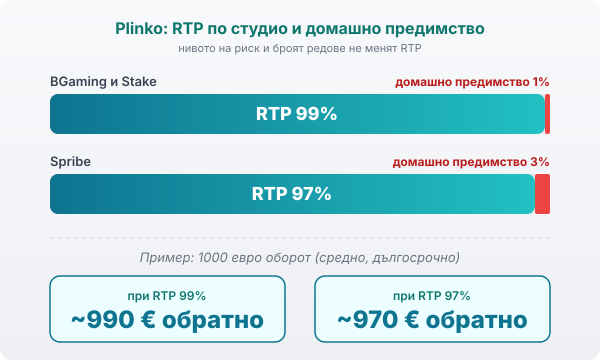

Title tag: Plinko: как работи, RTP и нивата на риск
Meta description: Plinko на BGaming, Spribe и Stake: топче пада по дъска с щифтове до множител. RTP 97–99%, нивото на риск сменя волатилността, не шанса. Как се четат числата.

---

# Plinko: как работи и какво значат нивата на риск

Plinko не е слот и не е рулетка. Топче пада от върха на триъгълна дъска с щифтове, отскача наляво или надясно на всеки ред и накрая се приземява в едно от долните легла, всяко със свой множител. Форматът дойде от телевизионните игри и после се пресъздаде онлайн от студиа като BGaming и Spribe, а платформи като Stake го пуснаха като собствена игра. Простият вид лъже: отдолу стои чиста статистика.

## Топчето, щифтовете и защо центърът пада най-често

Всеки ред щифтове е едно решение, ляво или дясно. При дъска с 16 реда топчето прави 16 такива независими избора, преди да спре. Резултатът следва биномно разпределение, същото като Паскаловия триъгълник: пътищата, които водят към средата, са в пъти повече от тези към краищата. Затова повечето топчета кацат близо до центъра, където множителите са малки, а най-високите множители в двата ръба падат рядко. Това не е лош късмет, а формата на самата дъска.

## Редовете: от 8 до 16

При BGaming и повечето версии избираш броя редове, обикновено от 8 до 16. Spribe дава по-тесен набор: 12, 14 или 16. Повече редове значат повече долни легла, по-дълъг път за топчето и по-висок таван на множителя в краищата. По-малкото редове свиват разпределението, така че печалбите излизат по-скромни, но и по-предвидими.

## Нивото на риск сменя волатилността, не шанса

Тук е най-честото недоразумение. BGaming предлага три нива: ниско, нормално и високо. Spribe ги дава като цветни топчета: зелено, жълто, червено. Смяната на нивото преразпределя множителите по леглата, но не мени обявения RTP. На високо ниво крайните легла плащат многократно повече, докато централните падат под 1x и връщат по-малко от залога. На ниско ниво всички множители се сбиват в тесен пояс около 1x: дребни, чести, спокойни.

Погледнато по този начин, бутонът за риск е избор на волатилност, не на по-добър шанс. Високото ниво е дълго чакане за рядък голям удар в края на дъската. Ниското е бавно топене или ситни връщания около входа. Средният резултат в дълъг период остава един и същ, защото процентът на връщане не се движи с нивото на риск.

## RTP и домашно предимство

Обявеният RTP зависи от студиото. BGaming пише 99% на официалната си страница за Plinko, а оригиналното Plinko на Stake също се посочва с 99%. Spribe е с 97%. Разликата до 100% е домашното предимство: 1% при 99% и 3% при 97%. При 1000 евро оборот това е средно връщане около 990 евро при версия с 99% и около 970 евро при версия с 97%, изгладено през хиляди рундове.

За конкретно заглавие RTP обикновено е фиксиран от доставчика. Нито нивото на риск, нито броят редове го местят: те само разтягат или свиват разпределението около същия среден процент. Все пак някои платформи пускат версии с различен RTP, затова провери числото в инфо-панела на самата игра, преди да заложиш.

*RTP 99% (BGaming, Stake) срещу 97% (Spribe): домашното предимство е 1% или 3% от оборота.*

## Доказуемо честна игра (provably fair)

Повечето онлайн версии на Plinko вървят на provably-fair технология. BGaming и Spribe генерират всеки рунд от комбинация сървърен и клиентски seed, които можеш да провериш след залога. Така потвърждаваш, че траекторията на топчето не е нагласена, след като парите вече са вътре. Само че provably fair доказва честността на конкретния рунд; то не маха домашното предимство и не прави играта печеливша в дълъг период.

## Какво значи това за банката ти

Високата волатилност плюс малък бюджет е тежка комбинация: централните легла на високо ниво връщат под залога, а голямият множител в края може да не дойде цяла сесия. Търсиш ли дълга игра, ниското ниво и по-малко редове дават повече рундове за същите пари. Гониш ли върха от 1000x при BGaming или 555x при Spribe, помни, че това е крайност на разпределението, а не число, върху което да строиш плана си за вечерта.

## Преди да пуснеш топчето

Plinko е инстант игра: бърза, без пауза за завъртане, което лесно те тегли към презалагане. Задай си лимит за загуба и за време преди първия рунд, точно както при [казино игрите](/kazino-igri/) въобще. В [методологията ни](/kak-ocenyavame/) четем RTP като статистика върху хиляди рундове, не като обещание за следващото топче. 18+ Хазартът може да пристрасти. Играйте отговорно. Ако усетиш, че играта излиза извън контрол, виж [инструментите за отговорна игра](/otgovorna-igra/).

---

**Георги Тодоров**
Публикувано: 20.09.2026 · Последна редакция: 20.09.2026

[About Всички Казина boilerplate]

**Отговорна игра.** 18+ Хазартът може да пристрасти. Играйте отговорно. Ако усетиш, че играта излиза извън контрол или искаш да я ограничиш, виж [инструментите за отговорна игра](/otgovorna-igra/) и възможността за самоизключване чрез националния регистър на уязвимите лица към НАП (подава се писмено само от засегнатото лице). Национална информационна линия за наркотиците, алкохола и хазарта („Солидарност") 0888 99 18 66, делнични дни 10:00–17:00.

**Разкриване на партньорства.** Всички Казина съдържа партньорски (афилиейт) връзки; когато отвориш оферта през такава връзка, това може да финансира сайта, без да променя цената за теб и без да влияе на оценките ни. От 1 август 2026 г. дейността на афилиейт оператори в България се лицензира съгласно Закона за държавния бюджет за 2026 г. (ДВ, бр. 69 от 31.07.2026 г.). Всички Казина е подало заявление за лиценз пред Националната агенция по приходите и очаква издаването му.
