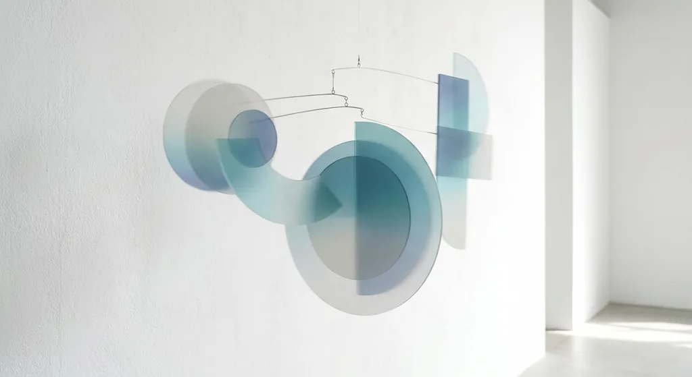
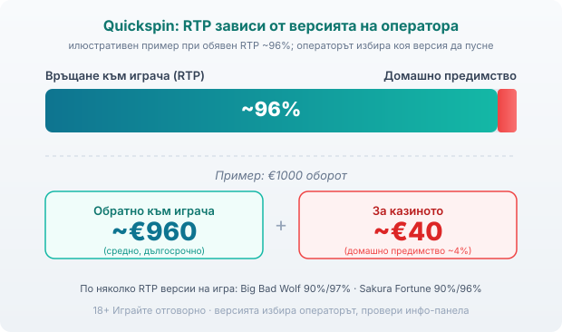

Title tag: Quickspin: профил на доставчика и топ слотове
Meta description: Quickspin (куикспин): механики, Achievements Engine и топ слотове като Big Bad Wolf и Sakura Fortune. Защо операторът, а не студиото, избира RTP версията.

---

# Quickspin: профил на доставчика, механики и топ слотове

Quickspin (куикспин) е шведско студио за ротативки, основано през 2011 г. в Стокхолм от хора, минали през NetEnt и Unibet, които решили да правят игрите, които сами биха играли. През 2016 г. Playtech ги купи и оттогава Quickspin работи като част от този гигант, но с разпознаваем собствен почерк. Видиш ли логото им в българско лицензирано казино, зад него стои точно това: премиум видео слотове с внимание към визията и математиката. Полишът обаче не мести правилото, което важи за всяка ротативка. Домашното предимство си остава на страната на казиното, колкото и добре да изглежда играта, а коя RTP версия ще завъртиш зависи не от студиото, а от оператора.

## Кои са и какво ги отличава

Quickspin залага на по-малко заглавия, но по-изпипани: разказвачество, силни математически модели, разработка първо за телефона. Каталогът е нарочно по-тесен от този на масовите фабрики за слотове, а принадлежността към Playtech дава на игрите достъп до широка мрежа лицензирани оператори. Това е друг подход спрямо [Pragmatic Play](/blog/pragmatic-play-provajdar/), които пускат игри почти на конвейер и покриват всякакви ниши, и спрямо локалната ДНК на [Amusnet (EGT)](/blog/amusnet-egt-provajdar/) с класическите „плодове" и джакпот мрежите, познати от наземните зали. Quickspin е по-близо до скандинавската школа: чист дизайн, тематична дълбочина и често доста висока волатилност. Кое студио ще ти легне е въпрос на вкус, а не на по-добри шансове. Как ги подреждаме едно спрямо друго може да видиш в [прегледа ни на доставчиците](/blog/games-providers/).

## Механиките, с които са известни

Сърцето на един Quickspin слот обикновено е разширяващ се или залепващ wild, вързан за безплатни завъртания. В Big Bad Wolf барабаните се спускат (Swooping Reels). Печелившите символи изчезват, падат нови, а на всяко второ спускане едно от трите прасенца се превръща в wild. Три скатера пускат 10 безплатни завъртания, а събирането на луни на последния барабан носи още завъртания и шанс за множител x2, функцията Blowing Down the House. В Sticky Bandits масивни wild символи покриват огромни части от полето и остават залепени по време на бонуса. В Sakura Fortune принцесата-wild се разтяга до цял барабан в свободните завъртания. Различни теми, една и съща идея отдолу: функция, която за кратко нарежда барабаните във твоя полза, преди играта да се върне към обичайния си ритъм.

## Achievements Engine и защо промоцията не е печалба

Освен игрите Quickspin продава на казината и цял инструментариум за задържане на играча, наречен Quickspin Promote. В центъра му е Achievements Engine, двигател на постиженията на четири нива: докато въртиш, трупаш прогрес, а наградите се изплащат като Quickspin tokens, с които се задейства основната функция на играта, най-често безплатни завъртания. Отгоре сядат турнири, предизвикателства и режимът Achievements Races, който ускорява отключването за определен период.

Това е добре направен слой ангажираност и толкова. Той не пипа математиката на слота. Токен, който ти носи безплатно завъртане, е маркетинг, не по-висок шанс, и в дългосрочен план играта връща същия процент със или без него. Струва си да разделяш кое е игра и кое е промоция, преди да сметнеш нещо за подарък.

## RTP не е фиксиран, операторът избира версията

Много заглавия на Quickspin се доставят в повече от една RTP версия и официалните страници на самото студио го признават открито. Big Bad Wolf е обявен с два модела, 90% и 97%. Sakura Fortune също с два, 90% и 96%. Коя от тях играеш не решава Quickspin, а казиното, което е заредило играта. Затова RTP числото, което ще прочетеш в някой глобален сайт за ревюта, може да няма нищо общо с версията пред теб. Не се доверявай на рекламния RTP: отвори инфо-панела на конкретната игра в конкретното казино и виж какво пише там. Как претегляме реалния спрямо рекламния RTP е част от [методологията ни](/kak-ocenyavame/).

На едно завъртане разликата не се усеща, на оборот се вижда. При обявен RTP около 96% и €1000 завъртян оборот средно се връщат около €960, а към €40 остават за казиното, тоест домашно предимство около 4% (числата са примерни, за илюстрация). Волатилността подрежда същия този процент по различен начин. Ниска волатилност значи чести дребни печалби и по-плавен баланс; висока значи дълги сухи серии, прекъсвани от рядък по-едър удар. Голяма част от каталога на Quickspin клони към високия край, така че балансът ти скача по-рязко и в двете посоки, без това да значи по-голям шанс да си на плюс.

*Илюстративен пример при обявен RTP ~96%: €1000 оборот връща средно ~€960, ~€40 остават за казиното. Много заглавия на Quickspin се доставят в по няколко RTP версии (напр. Big Bad Wolf 90%/97%, Sakura Fortune 90%/96%), а коя върви пред теб избира операторът, затова се проверява в инфо-панела.*

## Топ слотове накратко

Big Bad Wolf (2013) е заглавието, с което мнозина свързват студиото: висока волатилност, спускащи се барабани и бонус с прасенцата, които стават wild. Sakura Fortune (2017) е поле 5x4 с 40 линии, японска тема, respin и свободни завъртания с разтягащи се wild-ове, също към високоволатилния край. Sticky Bandits (2017) е Wild West на 5x5 с 30 линии, средно-висока волатилност и масивни залепващи wild-ове; често цитираният RTP е около 96.58%, но реалната версия пак се проверява в инфо-панела на казиното. И трите са на Quickspin. Студиото често разширява успешните си заглавия в серии, както при Sticky Bandits с по-късните Unchained, Trail of Blood и Thunder Rail, всяка с различни параметри, така че името на играта не гарантира един и същ RTP или волатилност. Популярни имена като Razor Shark обаче не са на Quickspin, така че не бъркай студиото по темата на играта.

## Струва ли си за твоя бюджет

Ако харесваш изпипани, тематични слотове и понасяш сухи серии заради шанса за по-едър удар, Quickspin има какво да ти предложи. Ако предпочиташ чести дребни печалби и по-плавен баланс, високата волатилност на голяма част от каталога ще ти дойде в повече. В българските лицензирани казина заглавията на Quickspin обикновено стоят в общото лоби до другите доставчици, без собствена секция, така че лесно ще ги подминеш, ако не ги търсиш по име. И в двата случая пусни играта първо в демо режим, задай си лимит за загуба и за време още преди първия депозит и провери реалния RTP на място. Хазартът не е начин да изкараш пари, а платено забавление с известна цена; математиката работи за казиното и при най-добре направената ротативка. 18+ Хазартът може да пристрасти. Играйте отговорно. Ако усетиш, че играта излиза извън контрол, виж [инструментите за отговорна игра](/otgovorna-igra/).

---

**Георги Тодоров**
Публикувано: 20.09.2026 · Последна редакция: 20.09.2026

[About Всички Казина boilerplate]

**Отговорна игра.** 18+ Хазартът може да пристрасти. Играйте отговорно. Ако усетиш, че играта излиза извън контрол или искаш да я ограничиш, виж [инструментите за отговорна игра](/otgovorna-igra/) и възможността за самоизключване чрез националния регистър на уязвимите лица към НАП (подава се писмено само от засегнатото лице). Национална информационна линия за наркотиците, алкохола и хазарта („Солидарност") 0888 99 18 66, делнични дни 10:00–17:00.

**Разкриване на партньорства.** Всички Казина съдържа партньорски (афилиейт) връзки; когато отвориш оферта през такава връзка, това може да финансира сайта, без да променя цената за теб и без да влияе на оценките ни. От 1 август 2026 г. дейността на афилиейт оператори в България се лицензира съгласно Закона за държавния бюджет за 2026 г. (ДВ, бр. 69 от 31.07.2026 г.). Всички Казина е подало заявление за лиценз пред Националната агенция по приходите и очаква издаването му.
