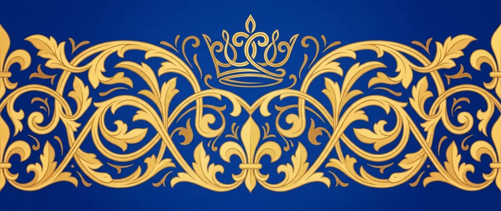
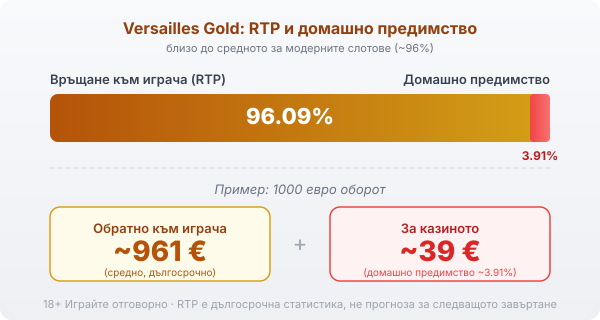

Title tag: Versailles Gold: RTP 96.09% и характеристики (Amusnet/EGT)
Meta description: Versailles Gold на Amusnet (EGT): 5 барабана, 10 линии, RTP 96.09%, Кралят-Слънце като wild, кралски печат за 12 безплатни завъртания с разширяващ символ.

---

# Versailles Gold: RTP и характеристики

Versailles Gold сяда в двореца на Луи XIV, Краля-Слънце, сред злато и барок. Прави я [Amusnet](/blog/amusnet-egt-provajdar/), българският производител с наземно минало, който до 2022 г. работеше под името EGT. Под лъскавата тема стои позната EGT механика: пет барабана, десет линии и обявен RTP от 96.09%, а волатилността е висока.

## Пет барабана и до десет линии

Барабаните са пет на три реда, а линиите са десет. Тук има малка разлика от някои по-нови слотове: броят активни линии се избира, обикновено 1, 3, 5, 7 или всичките 10, и залогът се смята върху избраните. Играеш ли на по-малко линии, свиваш залога, но и покриваш по-малко възможни комбинации. Символите смесват бароковата дворцова тематика с класическите карти за по-дребните печалби.

## Кралят-Слънце е wild, печатът е scatter

Двата специални символа вършат различна работа. Златният знак на Краля-Слънце е wild и замества останалите символи, за да допълни комбинация по линия. Кралският печат е scatter и плаща разпръснато, където и да падне, а три или повече печата отключват безплатните завъртания. Част от игровите бази бъркат двата символа, но на практика king-ът пълни линиите, а печатът носи бонуса.

## Дванайсет безплатни завъртания с разширяващ символ

Три или повече кралски печата дават 12 безплатни завъртания. Преди да започнат, играта избира на случаен принцип един символ и го превръща в специален разширяващ: през целия бонус той се разпъва върху цял барабан и плаща по позиции, не само по строга линия. Ако късметът извади стойностен символ, серията може да върне сериозна сума; извади ли дребен, бонусът минава кротко. Обърни внимание на бройката: тук завъртанията са 12, а не 15 както в някои други класики на EGT.

## Гембълът: червено или черно

След печалба можеш да заложиш сумата в гембъл и да познаваш цвета на скритата карта. Всяко вярно познаване удвоява и качва още едно ниво, до пет пъти подред, след което функцията спира; има и таван на сумата, над който не пуска. Една грешна карта нулира целия кръг. Шансът е близо до хвърляне на монета, така че гембълът е забавление с висок риск, а не начин да си оправиш баланса.

## Jackpot Cards и версиите на RTP

Като повечето класики на EGT, Versailles Gold в много казина върви със системата [Jackpot Cards](/blog/progresivni-dzhakpoti/), четиристепенния мистерия прогресив на Amusnet, който се пуска на случаен принцип и се пълни от залозите на всички по мрежата. Наличието ѝ се потвърждава от игровите бази данни, но официалното обобщение на функциите на Amusnet не я изрежда изрично, а дали прогресивът е активен зависи и от конкретната версия на казиното. Джакпотът не сваля домашното предимство в редовната игра; той просто събира част от оборота към един голям, много рядък изход. Струва си да знаеш и че EGT понякога пуска една игра в няколко версии на RTP, затова провери процента в инфо-панела на конкретното казино.

## RTP 96.09% и какво значи за банката

Обявеният RTP на Versailles Gold е 96.09%, което оставя домашно предимство от около 3.91%. При 1000 евро оборот това е средно връщане от порядъка на 961 евро в дълъг период и около 39 евро за казиното. Числото е близо до средното за модерните слотове и типично за плодово-класическата линия на EGT. В [методологията ни](/kak-ocenyavame/) четем RTP като статистика върху милиони завъртания, а не като обещание за отделната сесия.

*RTP 96.09%, домашно предимство ~3.91%: близо до средното за модерните слотове.*

## Висока волатилност

Amusnet определя волатилността като висока. На практика банката ти ще стои дълго на едно място или ще слиза, преди да дойде по-голям удар, обикновено през бонуса и разширяващия символ. Таванът на печалба е 5000 пъти залога на линия, но това е крайност на разпределението и не бива да влиза в сметките ти за една вечер. Висока волатилност плюс малък бюджет е лоша комбинация: парите свършват, преди играта да е показала добрата си страна.

## Преди да завъртиш

[Слот игрите](/slot-igri/) обикновено имат демо режим, в който да видиш темпото на Versailles Gold без пари, а различните [ротативки](/kazino-igri/rotativki/) се сравняват най-честно по RTP и волатилност. Задай си лимит за загуба и за време преди първото завъртане. 18+ Хазартът може да пристрасти. Играйте отговорно. Ако усетиш, че играта излиза извън контрол, виж [инструментите за отговорна игра](/otgovorna-igra/).

---

**Георги Тодоров**
Публикувано: 20.09.2026 · Последна редакция: 20.09.2026

[About Всички Казина boilerplate]

**Отговорна игра.** 18+ Хазартът може да пристрасти. Играйте отговорно. Ако усетиш, че играта излиза извън контрол или искаш да я ограничиш, виж [инструментите за отговорна игра](/otgovorna-igra/) и възможността за самоизключване чрез националния регистър на уязвимите лица към НАП (подава се писмено само от засегнатото лице). Национална информационна линия за наркотиците, алкохола и хазарта („Солидарност") 0888 99 18 66, делнични дни 10:00–17:00.

**Разкриване на партньорства.** Всички Казина съдържа партньорски (афилиейт) връзки; когато отвориш оферта през такава връзка, това може да финансира сайта, без да променя цената за теб и без да влияе на оценките ни. От 1 август 2026 г. дейността на афилиейт оператори в България се лицензира съгласно Закона за държавния бюджет за 2026 г. (ДВ, бр. 69 от 31.07.2026 г.). Всички Казина е подало заявление за лиценз пред Националната агенция по приходите и очаква издаването му.
