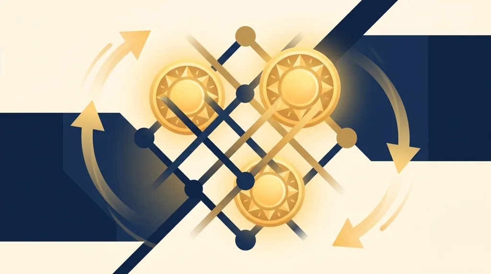

Title tag: 3 Oaks Gaming: профил на доставчика, механики и топ слотове
Meta description: 3 Oaks Gaming е студиото зад Sun of Egypt, познато преди като Booongo. Механиката Hold and Win, RTP по версия и как заглавията стигат до казината.

---

# 3 Oaks Gaming: профил на доставчика, механики и топ слотове

3 Oaks Gaming е студио за слот игри, което най-често ще срещнеш зад серията Sun of Egypt. То е B2B доставчик, тоест не е казино: прави игрите, а до теб те стигат през лицензирани оператори и агрегатори. Доскоро студиото се казваше Booongo и още се води така в част от базите данни, затова египетските слотове със залепващи символи слънце, които може да си въртял, всъщност са негови.

## Кой стои зад студиото

3 Oaks Gaming е предишното Booongo. Студиото Booongo тръгва по публични данни през 2015 г., през 2021 г. се разделя на две, а частта за създаване на съдържание излиза под новото име 3 Oaks Gaming около 2022 г. [VERIFY: точна дата на ребрандирането]. Собственик е Green Rock Ltd, а регистрацията е на остров Ман, където студиото се мести от предишен лиценз от Кюрасао.

Като доставчик 3 Oaks държи свои B2B лицензи, сред които на малтийската MGA и на британската Gambling Commission. Лицензът на студиото обаче не е лицензът на казиното. Това, че играта е сертифицирана и авторът е лицензиран доставчик, не казва нищо за това дали конкретното казино има право да работи в България. За българския играч меродавен е [лицензът на оператора от НАП](/blog/proverka-licenz-kazino/), не студийната регистрация на разработчика. 3 Oaks е едно от многото имена в [каталога с доставчици](/blog/games-providers/), които стоят зад игрите в лицензираните казина.

## Hold and Win: механиката, с която се разпознава студиото

Почти цялото портфолио на 3 Oaks стъпва на един и същ бонус: Hold and Win, познат и като Hold and Spin. Събираш определен брой специални символи на екрана, те залепват на място и стартират кръг с ограничен брой повторни завъртания.

При Sun of Egypt 3 например бонусът тръгва при 6 или повече символа със слънце. Започваш с 3 повторни завъртания, които се връщат на 3 при всеки нов паричен символ, който падне. В играта има пет джакпота: Mini, Minor, Major, Grand и Royal. Ако запълниш и петнайсетте позиции на екрана, печелиш Royal, който при това заглавие е 10 000 пъти залога.

*Пътят на Hold and Win и двете последни части на Sun of Egypt; числата са от инфо-панела на съответната игра.*

Множителите и стойностите на символите се различават по заглавие, така че една и съща механика дава различни максимуми в различните игри. Общото остава принципът: залепени символи, повторни завъртания и таван, който се стига само при пълен екран.

## Как заглавията стигат до казината

Освен собствени игри, 3 Oaks разпространява и заглавия на партньорски студия, което разширява каталога му. Съдържанието стига до операторите през агрегатори и платформи. Студиото има дистрибуционни договори с Games Global, Relax Gaming, St8.io, iSoftBet и EveryMatrix, така че едно и също заглавие може да върви в много казина едновременно, но през различни интеграции. За теб това означава, че ще срещнеш едни и същи слотове на 3 Oaks в сайтове, които иначе нямат нищо общо помежду си.

## Серията Sun of Egypt и другите носещи заглавия

Разпознаваемото лице на 3 Oaks е серията Sun of Egypt. Първата част излиза през 2019 г. още под марката Booongo и пуска египетската тема с Hold and Win. Следващите части вдигат тавана: Sun of Egypt 3 е с RTP 95.61%, 5x3 барабана, 25 начина за печалба и максимум 10 000 пъти залога, а Sun of Egypt 4 върви с RTP 95.47%, решетка 5x4 и същия таван от 10 000 пъти залога. По-подробен разбор на Sun of Egypt 3 подготвяме отделно.

Извън египетската серия каталогът включва Book of Sun, ацтекските теми и Lucky Jack, повечето отново около Hold and Win, понякога с добавен Bonus Buy или Megaways. Студиото пуска около 20 нови заглавия годишно и вече надхвърля 100 слота.

## RTP се мени по версия, чети инфо-панела

Едно и също заглавие на 3 Oaks често съществува в няколко конфигурируеми RTP версии, а коя от тях върви при дадено казино, решава операторът. Затова процентът, който виждаш при един сайт, понякога не съвпада с този при друг за буквално същата игра. Точната стойност стои в информацията на самата игра, преди да заложиш. А [RTP е дългосрочна статистика](/kak-ocenyavame/) върху милиони завъртания, не обещание какво ще стане в твоята сесия.

## Преди да завъртиш

Провайдър лицензът на студиото не значи, че казиното е законно у нас; за това се гледа лицензът от НАП. Изборът на казино не е избор на студио, а Hold and Win дава един и същ дълготраен резултат независимо колко ефектно изглежда бонусът. Задай си лимит за загуба и за време, преди да седнеш, и гледай на слота като на платено забавление с известна цена, не като на начин да изкараш пари. 18+ Хазартът може да пристрасти. Играйте отговорно. Ако усетиш, че играта излиза извън контрол, виж [инструментите за отговорна игра](/otgovorna-igra/).

---

**Георги Тодоров**
Публикувано: 21.09.2026 · Последна редакция: 21.09.2026

[About Всички Казина boilerplate]

**Отговорна игра.** 18+ Хазартът може да пристрасти. Играйте отговорно. Ако усетиш, че играта излиза извън контрол или искаш да я ограничиш, виж [инструментите за отговорна игра](/otgovorna-igra/) и възможността за самоизключване чрез националния регистър на уязвимите лица към НАП (подава се писмено само от засегнатото лице). Национална информационна линия за наркотиците, алкохола и хазарта („Солидарност") 0888 99 18 66, делнични дни 10:00–17:00.

**Разкриване на партньорства.** Всички Казина съдържа партньорски (афилиейт) връзки; когато отвориш оферта през такава връзка, това може да финансира сайта, без да променя цената за теб и без да влияе на оценките ни. От 1 август 2026 г. дейността на афилиейт оператори в България се лицензира съгласно Закона за държавния бюджет за 2026 г. (ДВ, бр. 69 от 31.07.2026 г.). Всички Казина е подало заявление за лиценз пред Националната агенция по приходите и очаква издаването му.
