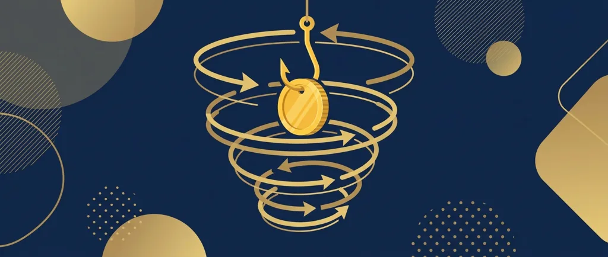
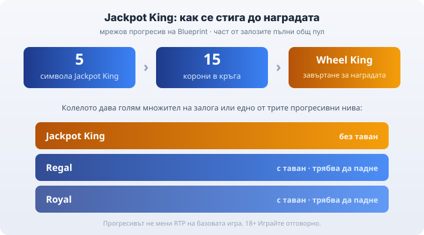

Title tag: Blueprint Gaming: профил на доставчика, механики и топ слотове
Meta description: Blueprint Gaming е британско студио от групата Gauselmann (марката Merkur). Мрежовият джакпот Jackpot King, Megaways под лиценз и хитове като Fishin' Frenzy и Ted.

---

# Blueprint Gaming: профил на доставчика, механики и топ слотове

Blueprint Gaming е британско студио за слот игри, което ще срещнеш зад заглавия като Fishin' Frenzy, Ted и King Kong Cash. То е B2B доставчик, тоест не е казино: прави игрите, а до теб те стигат през лицензирани оператори и агрегатори. Ако си въртял риболовния слот с рибаря, който събира улова, вече си играл на Blueprint, без непременно да си го разпознал по име.

## Кой стои зад студиото

Blueprint работи от Нюарк в Нотингамшър, Англия, и по публични данни е основано през 2001 г. Днес е част от германската група Gauselmann, същата група, която стои зад марката Merkur по игралните зали в Европа. Gauselmann влиза в студиото с дял през 2008 г. и го придобива изцяло през 2012 г., така че Blueprint е сестринско студио под общия собственик, а не подразделение на самата Merkur.

Като доставчик Blueprint държи свои B2B лицензи, сред които на британската Gambling Commission и на малтийската MGA. Тук е важна една разлика, която лесно се подминава: лицензът на студиото не е лицензът на казиното. Това, че играта е сертифицирана и авторът е лицензиран доставчик, не казва нищо за това дали конкретното казино има право да работи в България. За българския играч меродавен е [лицензът на оператора от НАП](/blog/proverka-licenz-kazino/), не студийната регистрация на разработчика.

## Jackpot King: мрежовият прогресив на Blueprint

Най-разпознаваемата собствена механика на студиото е Jackpot King, прогресивна джакпот мрежа, която върви през много заглавия и много казина едновременно. Част от реалните залози в мрежата пълни общ пул, който расте, докато някой не го вземе.

Влизаш в джакпота, когато събереш 5 символа Jackpot King на екрана. Това отваря кръг, в който трупаш корони, а при 15 корони преминаваш към завъртане на Wheel King, където се решава наградата. Освен голям множител на залога, колелото може да даде и едно от прогресивните нива. Долните нива (Royal и Regal) са с таван и трябва да паднат, преди да го стигнат, а горното Jackpot King е без определен таван. Конкретните начални суми и таваните се различават по валута и оператор и не се публикуват стабилно, затова точни числа за тях няма да прочетеш тук.

*Пътят до наградата: 5 символа, събиране на 15 корони и завъртане на Wheel King с трите прогресивни нива.*

Важното за преценката: [прогресивният джакпот](/blog/progresivni-dzhakpoti/) не мени домашното предимство в базовата игра. Той просто отделя малка част от оборота и я трупа към няколко редки, много големи изхода. Шансът да го хванеш си остава нищожен, а RTP-то на редовната игра работи по същия начин, със или без джакпот отгоре.

## Megaways, но взето под лиценз

Много от по-новите слотове на Blueprint излизат във варианти Megaways, при които броят на начините за печалба се мени на всяко завъртане. Струва си да е ясно чия е технологията: Blueprint лицензира двигателя Megaways от Big Time Gaming през 2018 г. и е първият лицензополучател изобщо. Megaways е разработка на Big Time Gaming, не изобретение на Blueprint. При Fishin' Frenzy Megaways например шест барабана дават до 15 625 начина за печалба в едно завъртане.

## Кои слотове са носещите

Портфолиото стъпва на няколко разпознаваеми франчайза. Fishin' Frenzy е риболовната класика с RTP 96.12%, при която бонусът с безплатни игри пуска рибар да събира уловените риби за пари. Базовата игра всъщност е дело на Reel Time Gaming, студио в същата група, а Blueprint я издава и разширява за онлайн пазара. Версията Megaways върви с RTP 95.02%, шест барабана и максимална печалба 10 000 пъти залога.

Ted е брандиран слот по филма от 2012 г. с RTP 95.80% и набор от случайни модификатори и бонус кръгове. King Kong Cash разчита на случайни модификатори в базовата игра, но се доставя в няколко версии, така че RTP-то се движи някъде около 95–96% според конкретното казино. Wish Upon a Leprechaun е ирландски франчайз с няколко варианта, при които процентът също зависи от версията (при Megaways например около 95.50%). Ако конкретно число има значение за теб, най-сигурно е да го провериш в инфо-панела на самата игра.

## Кое често се приписва грешно на Blueprint

Две имена редовно попадат под грешен етикет. Rainbow Riches не е игра на Blueprint: марката е интелектуална собственост на Barcrest (днес Light & Wonder), затова не бива да я търсиш в каталога на студиото. Eye of Horus пък е разработен първоначално от Reel Time Gaming/Merkur, а Blueprint издава и адаптира онлайн версиите му, включително Megaways. Точната рамка е: автор Reel Time/Merkur, издател и адаптатор за онлайн Blueprint.

## RTP се мени по версия, чети инфо-панела

Общото правило при Blueprint е, че едно и също заглавие може да съществува в няколко конфигурируеми RTP версии. Затова процентът при един оператор понякога не съвпада с този при друг за буквално същата игра. Не приемай едно число за даденост: отвори информацията на играта и виж кой процент върви там. И помни, че [RTP е дългосрочна статистика](/kak-ocenyavame/) върху милиони завъртания, а не обещание какво ще стане в твоята сесия.

## Преди да завъртиш

Blueprint е сериозен доставчик с разпознаваеми механики, но изборът на казино не е избор на студио. Провайдър лицензът не значи, че казиното е законно у нас, за това гледаш лиценза от НАП. Задай си лимит за загуба и за време, преди да седнеш, и гледай на слота като на платено забавление с известна цена, не като на начин да изкараш пари. 18+ Хазартът може да пристрасти. Играйте отговорно. Ако усетиш, че играта излиза извън контрол, виж [инструментите за отговорна игра](/otgovorna-igra/).

---

**Георги Тодоров**
Публикувано: 21.09.2026 · Последна редакция: 21.09.2026

[About Всички Казина boilerplate]

**Отговорна игра.** 18+ Хазартът може да пристрасти. Играйте отговорно. Ако усетиш, че играта излиза извън контрол или искаш да я ограничиш, виж [инструментите за отговорна игра](/otgovorna-igra/) и възможността за самоизключване чрез националния регистър на уязвимите лица към НАП (подава се писмено само от засегнатото лице). Национална информационна линия за наркотиците, алкохола и хазарта („Солидарност") 0888 99 18 66, делнични дни 10:00–17:00.

**Разкриване на партньорства.** Всички Казина съдържа партньорски (афилиейт) връзки; когато отвориш оферта през такава връзка, това може да финансира сайта, без да променя цената за теб и без да влияе на оценките ни. От 1 август 2026 г. дейността на афилиейт оператори в България се лицензира съгласно Закона за държавния бюджет за 2026 г. (ДВ, бр. 69 от 31.07.2026 г.). Всички Казина е подало заявление за лиценз пред Националната агенция по приходите и очаква издаването му.
