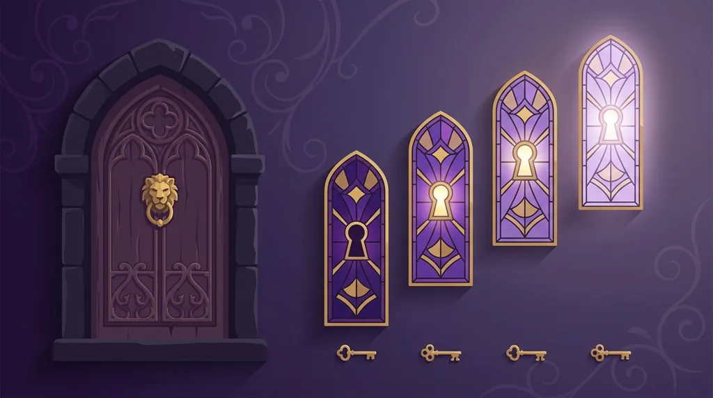

Title tag: Immortal Romance (Microgaming): RTP, 243 начина и Chamber of Spins
Meta description: Immortal Romance на Microgaming: RTP 96.86%, 243 начина за печалба и бонусът Chamber of Spins с четири нива безплатни игри. Как работят Amber, Troy, Michael и Sarah.

---

# Immortal Romance (Microgaming): RTP, 243 начина и Chamber of Spins

Immortal Romance е един от най-разпознаваемите слотове на Microgaming, излязъл още през 2011 г. и презаписан през май 2020 г. с обновени звук и анимации. Днес заглавието се разпространява от Games Global, което пое портфолиото на Microgaming през 2022 г. Известен е най-вече с бонуса Chamber of Spins и неговите четири нива, който се отваря постепенно, докато играеш върху темата за вампирска любовна история.

## Основното накратко

Играта е на пет барабана с три реда и печели по 243 начина, тоест няма фиксирани линии: комбинацията се брои, ако съседни барабани показват еднакви символи отляво надясно. RTP-то по подразбиране е 96.86%, което е [над средното за ротативка](/slot-igri/visok-rtp/), но операторът може да пусне и по-ниски версии (срещат се 94.12% и 92.1%), затова числото се проверява в самата игра. Волатилността е средна до висока според различните бази, а максималната печалба е около 12 150 пъти залога (част от източниците посочват 12 000×). Залогът върви от 0.30 до 30.00 на завъртане.

## Героите и темата

Сюжетът се върти около четирима герои, всеки със своя роля в бонуса. В центъра са Sarah, смъртна лекарка, и вампирът Michael, около 800-годишен бивш професор по генетика, в когото тя се влюбва. До Sarah стои Amber, вещица и нейна закрилница, а по-младият вампир Troy, ловец на жени на около 200 години, допълва четворката. Всяко от тези имена отключва отделно ниво в Chamber of Spins.

## Wild Desire в основната игра

Извън бонуса слотът има една случайна изненада. Wild Desire може да се задейства на всяко завъртане в основната игра и превръща между един и пет цели барабана в диви символи, след което печалбите се изчисляват с тях. Не можеш да го предизвикаш и не отваря безплатните игри, а само подобрява текущото завъртане.

## Chamber of Spins: четирите нива

Основната атракция е бонусът с безплатни игри, който се пуска от 3 или повече символа скатер (чукалото с лъвска глава на вратата). Нивата се отключват постепенно, според това колко пъти общо си влизал в бонуса.

*Четирите нива и как се отключват: колкото повече влизаш в бонуса, толкова по-нагоре стигаш.*

В началото ти е достъпна само Amber: 10 безплатни игри, в които всяка печалба се умножава по 5. Колкото повече влизаш в бонуса, толкова по-нагоре стигаш. След 5 задействания се отваря Troy с 15 игри, където прилепи падат с множители 2x или 3x и се комбинират до 6x. Още по-навътре, на 10-то задействане, идва Michael: 20 игри с въртящи барабани, при които поредните печалби качват множителя по стъпки до 5x. Последна остава Sarah, чак след 15 задействания, с 25 игри и дива лоза на трети барабан, която превръща случайни символи в диви. Стигнеш ли веднъж тези 15 задействания, вече избираш свободно кое от четирите нива да играеш.

## RTP не е обещание за сесията

96.86% звучи високо, но това е [дългосрочна статистика](/kak-ocenyavame/) върху милиони завъртания на всички играчи, не прогноза за твоята вечер. Заради средно-високата волатилност балансът може да стои дълго на едно място и после да подскочи в бонуса, или обратно. Точно затова числото не бива да се чете като план за печалба, а версията с 94.12% или 92.1% при някои оператори прави разликата още по-осезаема в дълъг период.

## Кое да не бъркаш

Под същото име излизат няколко различни игри. Immortal Romance Mega Moolah (2021) добавя прогресивния [джакпот Mega Moolah](/blog/progresivni-dzhakpoti/), но върви с по-ниско RTP около 93.4%, така че не е същата математика като оригинала. Immortal Romance II пък е отделно заглавие на студиото Stormcraft Studios с 1024 начина за печалба и максимум около 15 000 пъти залога. Оригиналът от 2011 г. е дело на самия Microgaming, не на Stormcraft.

## Преди да завъртиш

Нивата в Chamber of Spins се отключват бавно, с натрупване на влизания, и лесно се увличаш да гониш следващото. Задай си лимит за загуба и за време, преди да седнеш, и гледай на волатилността като на въпрос на темперамент и бюджет, не на по-добри или по-лоши шансове. 18+ Хазартът може да пристрасти. Играйте отговорно. Ако усетиш, че играта излиза извън контрол, виж [инструментите за отговорна игра](/otgovorna-igra/).

---

**Георги Тодоров**
Публикувано: 21.09.2026 · Последна редакция: 21.09.2026

[About Всички Казина boilerplate]

**Отговорна игра.** 18+ Хазартът може да пристрасти. Играйте отговорно. Ако усетиш, че играта излиза извън контрол или искаш да я ограничиш, виж [инструментите за отговорна игра](/otgovorna-igra/) и възможността за самоизключване чрез националния регистър на уязвимите лица към НАП (подава се писмено само от засегнатото лице). Национална информационна линия за наркотиците, алкохола и хазарта („Солидарност") 0888 99 18 66, делнични дни 10:00–17:00.

**Разкриване на партньорства.** Всички Казина съдържа партньорски (афилиейт) връзки; когато отвориш оферта през такава връзка, това може да финансира сайта, без да променя цената за теб и без да влияе на оценките ни. От 1 август 2026 г. дейността на афилиейт оператори в България се лицензира съгласно Закона за държавния бюджет за 2026 г. (ДВ, бр. 69 от 31.07.2026 г.). Всички Казина е подало заявление за лиценз пред Националната агенция по приходите и очаква издаването му.
