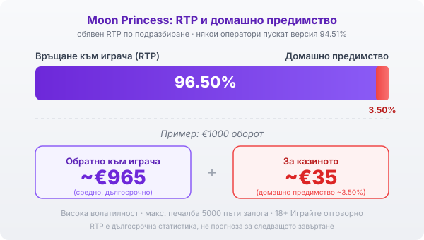

# 02 — Author draft (Moon Princess)
Byline: Editorial (signed Георги Тодоров) | Market: BG — slot explainer, patient-teacher slider, no persona anecdote, no Протокол block.

---

# Moon Princess (Play'n GO): RTP, клъстер механика и как се играе

Moon Princess на Play'n GO излезе през 2017 г. и стана едно от разпознаваемите заглавия на компанията, с аниме стил и трите принцеси над решетката. Ефектът е приятен за окото, но зад каскадите работи конкретна математика с висока волатилност, която е добре да познаваш преди първото завъртане.

## Решетка 5×5 вместо линии

Moon Princess не използва класически линии. Играта е върху решетка от пет реда и пет колони, а печалба се образува, когато поне три еднакви символа се подредят плътно един до друг във вертикална или хоризонтална редица. Тук значение имат броят и съседството на символите, не някакъв фиксиран път през барабаните. Три еднакви символа един под друг в колона плащат; същите три, разпръснати из решетката, не значат нищо, докато не се допрат. Заради това следиш групите еднакви символи, вместо да търсиш пейлайни.

## Каскади и защо целта е чиста решетка

След всяка печалба печелившите символи изчезват и на тяхно място падат нови отгоре. Едно завъртане може да върже няколко последователни попадения, докато спрат да излизат нови комбинации. Смисълът на този каскаден механизъм е да те доведе до напълно изчистена решетка, защото точно тя отваря безплатните завъртания. По пътя дотам всяка печеливша каскада качва и множителя, за който става дума по-долу.

## Трите принцеси и функцията Girl Power

Над решетката стоят три принцеси, всяка със своя намеса в хода. Love превръща един тип символ в друг, за да събере съвпадения. Star добавя един или два wild символа. Storm премахва два типа символи от решетката и разчиства място за нови. В основната игра тези сили се появяват чрез функцията Girl Power: тя се включва на случаен принцип след завъртане без печалба и дава на една от принцесите шанс да спаси хода. Не можеш да я извикаш нарочно; идва, когато играта реши. Същите три сили движат и безплатните завъртания, така че Girl Power е на практика доза от бонус-логиката насред основната игра.

## Безплатните завъртания и множителят

Изчистиш ли цялата решетка, започва рунд безплатни завъртания. Преди старта избираш принцеса и изборът определя колко спина получаваш: Love дава 4, Star дава 5, Storm дава 8. Множителят е сърцето на рунда. Той расте с по едно при всяка печеливша каскада и стига до x20, без да се нулира до края на рунда, а ако вече си го натрупал в основната игра, стойността се пренася в бонуса. Тук идват едрите резултати на Moon Princess, но при спрели рано каскади рундът приключва скромно. Максималната печалба в играта е 5000 пъти залога и това е таван, до който повечето сесии няма да се доближат.

## RTP, версии и волатилност

Обявеният RTP на Moon Princess по подразбиране е 96.50%, което оставя домашно предимство от около 3.50%. При €1000 оборот това значи средно връщане от порядъка на €965 в дългосрочен план и около €35, които остават за казиното. Play'n GO обаче предлага играта и във втора версия с RTP 94.51%, а коя от двете върви зависи от оператора. [VERIFY: коя версия (96.50% или 94.51%) работи в конкретното казино се чете в инфо-панела на играта.] Разликата е съвсем реална: същата игра, същите принцеси, но по-малко върнати пари в дългосрочен план. По-важното число обаче остава волатилността. Тя е висока, тоест печалбите идват рядко и могат да са големи, което на практика значи дълги серии без нищо, прекъсвани от отделни по-едри попадения. Банката ти трябва да издържи на тези сухи периоди, иначе рундът с растящия множител просто няма да те завари на масата.

*Обявен RTP 96.50% по подразбиране: при €1000 оборот средно ~€965 се връщат на играча, ~€35 остават за казиното (домашно предимство ~3.50%). Някои оператори пускат версия 94.51%. Волатилността е висока, а максималната печалба е 5000 пъти залога.*

## Как да провериш реалния процент

Двете версии на RTP не се различават по нищо на екрана: символите, принцесите и множителят изглеждат еднакво при 96.50% и при 94.51%. Разликата е само в дългосрочната математика и се обявява в инфо-панела на играта, обикновено под менюто с правилата. Отвори го веднъж, преди да заложиш реални пари, и виж кое число стои там. Това е единственият сигурен начин да разбереш коя версия ти сервира конкретното казино, а разликата от близо два процентни пункта не е дреболия при дълга сесия.

## Преди да завъртиш

[Слот игрите](/slot-igri/) на Play'n GO обикновено имат демо режим, в който да усетиш темпото и волатилността, без да залагаш реални пари. Ако сравняваш доставчици, [профилите ни на доставчиците](/blog/games-providers/) стъпват на същата логика. Отвори инфо-панела и виж кой RTP върви, защото [начинът, по който оценяваме казината](/kak-ocenyavame/), гледа реалния процент на конкретното място. Харесваш ли този тип решетъчни игри с висока волатилност, [Gates of Olympus](/blog/gates-of-olympus/) работи на близка логика с каскади и множители. Задай си лимит за загуба и за време още преди първото завъртане, особено при толкова волатилна игра. 18+ Хазартът може да пристрасти. Играйте отговорно. Ако усетите, че играта излиза извън контрол, вижте [инструментите за отговорна игра](/otgovorna-igra/).

---

**Георги Тодоров**
Публикувано: 21.09.2026 · Последна редакция: 21.09.2026

[About Всички Казина boilerplate]

**Отговорна игра.** 18+ Хазартът може да пристрасти. Играйте отговорно. Ако усетиш, че играта излиза извън контрол или искаш да я ограничиш, виж [инструментите за отговорна игра](/otgovorna-igra/) и възможността за самоизключване чрез националния регистър на уязвимите лица към НАП (подава се писмено само от засегнатото лице). Национална информационна линия за наркотиците, алкохола и хазарта („Солидарност") 0888 99 18 66, делнични дни 10:00–17:00.

**Разкриване на партньорства.** Всички Казина съдържа партньорски (афилиейт) връзки; когато отвориш оферта през такава връзка, това може да финансира сайта, без да променя цената за теб и без да влияе на оценките ни. От 1 август 2026 г. дейността на афилиейт оператори в България се лицензира съгласно Закона за държавния бюджет за 2026 г. (ДВ, бр. 69 от 31.07.2026 г.). Всички Казина е подало заявление за лиценз пред Националната агенция по приходите и очаква издаването му.

---
CANON ADDITIONS: none (editorial mode).
[DATA NEEDED]: none. [VERIFY]: 1 (live per-casino RTP build via the info panel).
