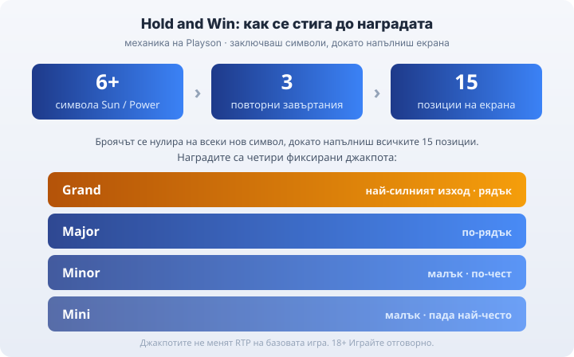

# 01 — Synthesis (Playson, vk-0140)

## SYNTHESIS REPORT
Query: playson | Intent: informational (provider profile / "who is this studio + what do they make") | Market: bg
Sources: 5 reachable (igamingx.com provider guide, pokernews.com Playson slots, slotcatalog.com Coin-Volcano, yogonet.com Timeless Diamonds news, plus autosuggest/game-DB corroboration). playson.com/about = HTTP 403 (geo-block in cloud), so studio facts rest on secondary DBs + iGaming press.
Corroborated facts used: founded 2012 (2 sources), HQ Malta/Sliema (2 sources), B2B slots supplier (all), Hold and Win signature mechanic (all), Solar Queen base RTP 95.78% (2 sources), Book of Gold: Classic RTP 95.94% (1 source).
[VERIFY] flags: founding year 2012 (secondary DBs only, about-page geo-blocked); exact MGA/UKGC licence numbers (not quoted); Buffalo Power exact RTP (sources conflict 95.04% vs 95.78% → configurable-build angle, no single % asserted); Solar Queen Megaways ~96.52% (single source).
[CONFLICT] flags: Buffalo Power RTP (95.04 pokernews vs 95.78 igamingx) — NOT written as a two-camp structure; resolved by omitting a hard % and stating the configurable-build reality (the honest angle itself). Max win for Buffalo Power (1,187x / 5,000x / 10,468x across sources) → omitted entirely, too divergent by build.
Entity union coverage: complete (studio identity, B2B model, MGA/UKGC licences, Hold and Win mechanic, four jackpots, series/collections, top titles + RTP, RTP-build angle, provider-vs-operator-licence angle, RG).
Gaps closed that no source covered: the BG-player consequence — a Playson B2B licence says nothing about whether a casino is legal in Bulgaria (НАП operator licence is separate); and the RTP-build point framed for the reader (check the info panel).
Source claims excluded as dubious: "Coin Volcano" as a Playson title — it is 3 Oaks Gaming (Booongo), released 2023 (SlotCatalog + allslotsonline). Excluded and flagged as common misattribution. A "Giant" series — unsourced against Playson → omitted.
Localisation adjustments: € currency, BG native slot vocabulary (ротативки, безплатни завъртания), НАП as the operator regulator, provider licence framed against the BG legality question.

SUGGESTED PERSONA: Георги Тодоров (persona voice applied to a provider guide — factual, receipts-first register, second person for advice, NO fabricated anecdote, NO Протокол block since there is no operator test). Reasoning: brief sets BYLINE persona; the honest RTP-build / licence angle is exactly his "банерът е реклама, общите условия са договорът" posture.

---

## THE ARTICLE (draft, with flags inline)

# Playson: профил на доставчика, механики и топ слотове

Playson е малтийско студио за слот игри, което стои зад заглавия като Solar Queen и серията Buffalo Power. То е B2B доставчик, тоест не е казино: прави ротативките, а до теб те стигат през лицензирани оператори. Ако си въртял слот, в който светещи символи се заключват и трупат джакпот в долния край на екрана, вероятно вече си играл на Playson, без да си го разпознал по име.

## Кой стои зад студиото

Playson работи от Малта, със седалище в Слима, и по публични данни е основано през 2012 г. [VERIFY: точна година на основаване — само вторични бази данни; официалната about страница е недостъпна от тук]. Като доставчик държи свои B2B лицензи, сред които признание от малтийската MGA и лиценз на британската Gambling Commission (UKGC), и предлага игрите си на над 20 регулирани пазара.

Лицензът на студиото обаче не е лицензът на казиното. Това, че играта е сертифицирана и авторът е лицензиран доставчик, не казва нищо за това дали конкретното казино има право да работи в България. За българския играч меродавен е [лицензът на оператора от НАП](/blog/proverka-licenz-kazino/), не студийната регистрация на разработчика.

## Hold and Win: механиката с четирите джакпота

Най-разпознаваемата собствена механика на Playson е Hold and Win, тоест „заключи и завърти". Влизаш в бонуса, когато на екрана паднат 6 или повече символа Sun или Power. Получаваш 3 повторни завъртания, но броячът се нулира на всеки нов символ, който се залепи, така че бонусът продължава, докато не свършат завъртанията или докато не се запълнят всичките 15 позиции.

В този режим се гонят четири фиксирани джакпота: Mini, Minor, Major и Grand. Долните падат често и са малки; Grand иска пълен екран от символи и е рядък. Точните суми на джакпотите се различават по валута и оператор, затова конкретни числа за тях няма да прочетеш тук.

*Пътят до наградата: 6+ символа задействат режима, 3 нулиращи се завъртания пълнят 15 позиции, а четирите джакпота се раздават по броя събрани символи.*

## Кои слотове са носещите

Solar Queen е египетската класика на студиото с RTP 95.78% и механика Fire Frame: на всеки 10 завъртания събраните слънца се превръщат в разширяващи се wild символи. Buffalo Power: Hold and Win е флагманът на механиката с джакпотите, а Book of Gold: Classic е книжният слот с разширяващ се символ и RTP 95.94%.

При Buffalo Power ще срещнеш различни числа за RTP според сайта, и това не е грешка. Едно и също заглавие се доставя в няколко конфигурируеми RTP версии, така че процентът при един оператор понякога не съвпада с този при друг за буквално същата игра. [VERIFY: точен RTP на Buffalo Power — източниците дават 95.04% и 95.78% за различни версии]. Конкретната стойност стои в информационния панел на самата игра.

## Кое често се приписва грешно на Playson

Coin Volcano редовно попада под грешен етикет. Тя не е игра на Playson, а на студиото 3 Oaks Gaming (Booongo), и излиза през 2023 г., затова няма да я намериш в каталога на Playson. Бъркотията идва от това, че и двете студия работят с една и съща популярна Hold-and-Win рамка, но авторът е различен.

## RTP се мени по версия, чети инфо-панела

Едно и също заглавие на Playson може да съществува в няколко конфигурируеми RTP версии, а операторът избира коя пуска. Затова процентът при един сайт понякога не съвпада с този при друг за същата игра. Точната стойност стои в информацията на играта. А [RTP е дългосрочна статистика](/kak-ocenyavame/) върху милиони завъртания, не обещание какво ще стане в твоята сесия. Ако искаш да сравниш студиото с останалите доставчици, виж [профилите в хъба за провайдъри](/blog/games-providers/).

## Преди да завъртиш

Провайдър лицензът на студиото не значи, че казиното е законно у нас; за това се гледа лицензът от НАП. Изборът на казино така или иначе не е избор на студио. Задай си лимит за загуба и за време, преди да седнеш, и гледай на слота като на платено забавление с известна цена, не като на начин да изкараш пари. 18+ Хазартът може да пристрасти. Играйте отговорно. Ако усетиш, че играта излиза извън контрол, виж [инструментите за отговорна игра](/otgovorna-igra/).

## CANON ADDITIONS
none.

## FLAGS
- [VERIFY] founding year 2012 (secondary DBs; about page geo-blocked).
- [VERIFY] Buffalo Power exact RTP (95.04% / 95.78% by build) — hedged in prose as configurable versions, no single hard % asserted.
- (Non-fabrication) exact MGA/UKGC licence numbers NOT quoted; Buffalo Power max win OMITTED (too divergent by build); Coin Volcano kept OUT as 3 Oaks Gaming, not Playson; "Giant" series omitted (unsourced).
