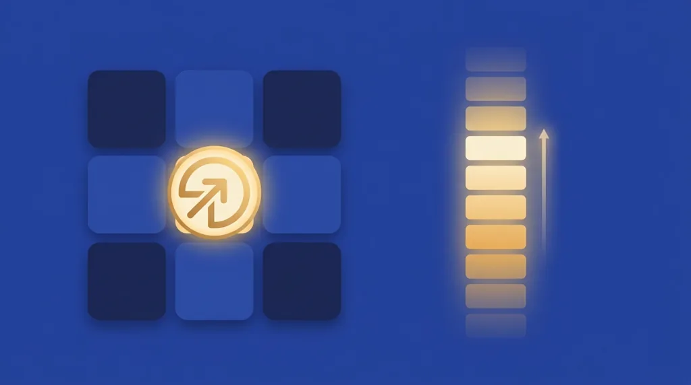

Title tag: Playson: профил на доставчика, механики и топ слотове
Meta description: Playson (плейсън) е малтийско B2B студио за слотове. Механиката Hold and Win с четири джакпота, хитове като Solar Queen и Buffalo Power и защо RTP се мени по версия.

---

# Playson: профил на доставчика, механики и топ слотове

Playson (плейсън) е малтийско студио за слот игри, зад което стоят заглавия като Solar Queen и серията Buffalo Power. То е B2B доставчик, тоест не е казино: прави ротативките, а до теб те стигат през лицензирани оператори. Ако си въртял слот, в който светещи символи се заключват на екрана и трупат джакпот в долния ъгъл, вероятно вече си играл на Playson, без да си го разпознал по име.

## Кой стои зад студиото

Playson работи от Малта, със седалище в Слима, и по публични данни е основано през 2012 г. Като доставчик държи свои B2B лицензи, сред които признание от малтийската MGA и лиценз на британската Gambling Commission, а игрите му вървят на над 20 регулирани пазара. Като B2B студио то не оперира собствено казино: заглавията му се разпространяват през оператори и агрегатори, затова една и съща игра ще срещнеш в десетки различни сайтове.

Лицензът на студиото обаче не е лицензът на казиното. Това, че играта е сертифицирана и авторът е лицензиран доставчик, не казва нищо за това дали конкретното казино има право да работи в България. За българския играч меродавен е [лицензът на оператора от НАП](/blog/proverka-licenz-kazino/), не студийната регистрация на разработчика.

## Hold and Win: механиката с четирите джакпота

Най-разпознаваемата собствена механика на Playson е Hold and Win, „заключи и завърти". Влизаш в бонуса, когато на екрана паднат 6 или повече символа Sun или Power. Получаваш 3 повторни завъртания, но броячът се нулира на всеки нов символ, който се залепи, така че режимът продължава, докато не свършат завъртанията или докато не се запълнят всичките 15 позиции на екрана.

Вътре се гонят четири фиксирани джакпота: Mini, Minor, Major и Grand. Долните падат по-често и са малки, а Grand иска най-силния изход и е рядък. Точните суми се различават по валута и оператор, затова конкретни числа за тях няма да прочетеш тук. Както при повечето слотове с тази механика, тежестта пада върху бонуса: базовата игра често е по-скоро изчакване, докато не се задейства заключването, и точно там се решават големите изходи.

*Пътят до наградата: 6+ символа задействат режима, 3 нулиращи се завъртания пълнят 15 позиции, а четирите джакпота се раздават по силата на изхода.*

## Кои слотове са носещите

Solar Queen е египетската класика на студиото с RTP 95.78% и механика Fire Frame: на всеки десет завъртания събраните слънца се превръщат в разширяващи се wild символи. Buffalo Power: Hold and Win е флагманът на механиката с джакпотите, стъпил изцяло върху заключването и повторните завъртания. Book of Gold: Classic пък е книжният слот с разширяващ се символ в безплатните игри и RTP 95.94%.

Около Hold and Win студиото е събрало цяла фамилия: до Buffalo Power стоят Wolf Power и Sunny Fruits, все на същия принцип със заключване и джакпоти. Класическата линия Timeless залага на простите плодови барабани с добавени джакпоти, за по-леки сесии. А Solar Queen има роднина в Solar Temple, който върви на същата Fire Frame механика.

При Buffalo Power ще срещнеш различни стойности за RTP според сайта, и това не е печатна грешка. Едно и също заглавие се доставя в няколко конфигурируеми RTP версии, а операторът избира коя пуска, така че процентът при един сайт понякога не съвпада с този при друг за буквално същата игра. Конкретната стойност винаги стои в информационния панел на самата игра.

## Кое често се приписва грешно на Playson

Coin Volcano редовно попада под грешен етикет. Тя не е игра на Playson, а на студиото 3 Oaks Gaming (Booongo), и излиза през 2023 г., затова в каталога на Playson няма да я откриеш. Объркването идва оттам, че двете студия работят с една и съща популярна Hold-and-Win рамка, но авторът зад Coin Volcano е друг.

## RTP се мени по версия, чети инфо-панела

Едно и също заглавие на Playson може да съществува в няколко конфигурируеми RTP версии, а кой процент върви на дадения сайт решава операторът. Затова стойността при един оператор понякога не съвпада с тази при друг за същата игра, а точното число стои в информацията на играта. Механиката с джакпотите не мени тази сметка: тя просто отделя част от изплащането към няколко редки големи изхода, така че сесиите стават по-разкъсани, но дългосрочното връщане не се качва заради самия джакпот. [RTP е дългосрочна статистика](/kak-ocenyavame/) върху милиони завъртания, не обещание какво ще стане в твоята сесия. Ако искаш да сравниш студиото с останалите разработчици, тръгни от [профилите в хъба за доставчици](/blog/games-providers/).

## Преди да завъртиш

Провайдър лицензът на студиото не значи, че казиното е законно у нас; за това се гледа лицензът от НАП. Изборът на казино така или иначе не е избор на студио. Задай си лимит за загуба и за време, преди да седнеш, и гледай на слота като на платено забавление с известна цена, не като на начин да изкараш пари. 18+ Хазартът може да пристрасти. Играйте отговорно. Ако усетиш, че играта излиза извън контрол, виж [инструментите за отговорна игра](/otgovorna-igra/).

---

**Георги Тодоров**
Публикувано: 21.09.2026 · Последна редакция: 21.09.2026

[About Всички Казина boilerplate]

**Отговорна игра.** 18+ Хазартът може да пристрасти. Играйте отговорно. Ако усетиш, че играта излиза извън контрол или искаш да я ограничиш, виж [инструментите за отговорна игра](/otgovorna-igra/) и възможността за самоизключване чрез националния регистър на уязвимите лица към НАП (подава се писмено само от засегнатото лице). Национална информационна линия за наркотиците, алкохола и хазарта („Солидарност") 0888 99 18 66, делнични дни 10:00–17:00.

**Разкриване на партньорства.** Всички Казина съдържа партньорски (афилиейт) връзки; когато отвориш оферта през такава връзка, това може да финансира сайта, без да променя цената за теб и без да влияе на оценките ни. От 1 август 2026 г. дейността на афилиейт оператори в България се лицензира съгласно Закона за държавния бюджет за 2026 г. (ДВ, бр. 69 от 31.07.2026 г.). Всички Казина е подало заявление за лиценз пред Националната агенция по приходите и очаква издаването му.
