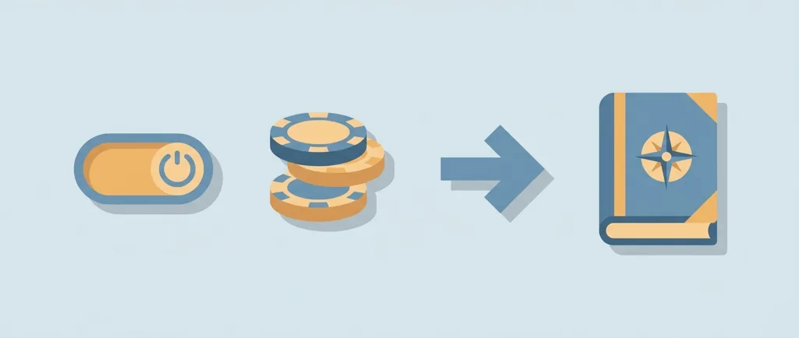
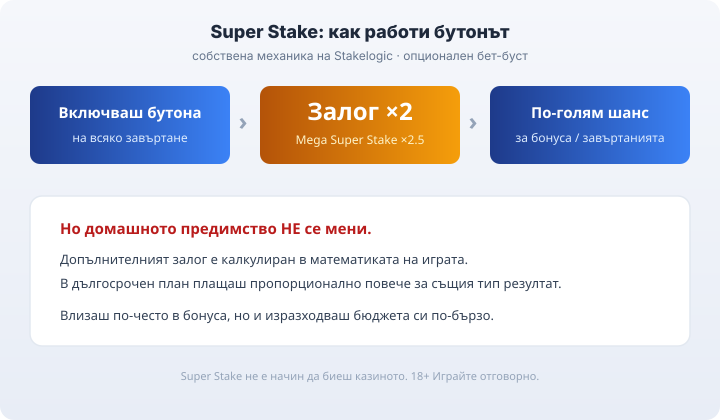

Title tag: Stakelogic: профил на доставчика, механики и топ слотове
Meta description: Stakelogic е нидерландско B2B студио (по-рано в групата Novomatic, вече на Sega Sammy). Механиката Super Stake, живо казино Stakelogic Live и хитове като Book of Adventure.

---

# Stakelogic: профил на доставчика, механики и топ слотове

Stakelogic прави онлайн ротативки и игри за живо казино, които стигат до теб само през лицензирани оператори. B2B доставчик е, не казино. Ако си пускал Book of Adventure или си засичал бутона „Super Stake" отстрани на барабаните, вече си играл на игра на студиото, без непременно да си го разпознал по име.

## Кой стои зад студиото

Stakelogic е нидерландско студио, което по публични данни стартира около 2014 г. (някои източници сочат 2015 г.) като част от Greentube, интерактивното подразделение на австрийската група Novomatic. По-късно излиза от групата и минава към външни собственици, а през 2024 г. японската Sega Sammy Holdings се договаря да го придобие. Днес работи като самостоятелно студио под нов собственик, с офиси в Нидерландия и Малта, и се вписва в дългия списък [доставчици на игри](/blog/games-providers/), които захранват регулирания пазар.

Като доставчик Stakelogic държи свои B2B лицензи, сред които на малтийската MGA (№ MGA/CRP/322/2016) и на британската Gambling Commission, наред с други юрисдикции. Лицензът на студиото обаче не е лицензът на казиното. Това, че играта е сертифицирана и авторът е лицензиран доставчик, не казва нищо за това дали конкретното казино има право да работи в България. За българския играч меродавен е [лицензът на оператора от НАП](/blog/proverka-licenz-kazino/), не студийната регистрация на разработчика.

## Живото казино: Stakelogic Live

През 2021 г. студиото отваря отделно подразделение за живо казино, Stakelogic Live, с рулетка, блекджек и бакара, стриймвани от студио с истински крупиета. Част от масите носят версии Super Stake на живо, при които залагаш допълнително срещу по-агресивна изплащателна логика.

## Super Stake: какво прави този бутон

Най-разпознаваемата собствена механика на студиото е Super Stake. Опционален страничен залог: включиш ли го, залогът ти за завъртането се удвоява (×2), а срещу това играта ти дава по-голям шанс да задействаш бонуса или безплатните завъртания. Има и по-агресивен вариант, Mega Super Stake, който вдига залога около 2.5 пъти. Бутонът се включва и изключва на всяко завъртане, така че решаваш сам кога да го ползваш.

По-големият шанс за бонус се плаща с по-голям залог. Super Stake не мени домашното предимство на играта: допълнителните пари, които залагаш, са калкулирани в математиката ѝ, така че в дългосрочен план плащаш пропорционално повече за същия тип резултат. Влизаш по-често в бонуса, но и изразходваш бюджета си по-бързо.

*Super Stake накратко: удвоен залог срещу по-голям шанс за бонуса; домашното предимство остава същото.*

## Кои слотове са носещите

Портфолиото стъпва на разпознаваеми серии, най-вече книжните („book") слотове и джокер/плодовите заглавия. Book of Adventure е книжният хит на студиото, силно повлиян от Book of Dead: RTP 96.21%, пет барабана, десет линии, висока волатилност и максимална печалба 5 000 пъти залога. Съществува и издание Super Stake на същата игра с малко по-висок процент. Super Joker Megaways върви с RTP около 96.5%, а сред джокер заглавията се среща и Twin Joker с висок обявен процент. Числата са базови и ориентировъчни, защото едно и също заглавие излиза в няколко конфигурируеми RTP версии, затова точната стойност проверявай в инфо-панела на играта в конкретното казино.

## RTP се мени по версия, чети инфо-панела

Едно и също заглавие на Stakelogic може да съществува в няколко RTP версии, така че процентът при един оператор понякога не съвпада с този при друг за буквално същата игра. Точната стойност винаги стои в информацията на самата игра. А [RTP е дългосрочна статистика](/kak-ocenyavame/) върху милиони завъртания, не обещание какво ще стане в твоята сесия.

## Кое често се приписва грешно на Stakelogic

Едно име редовно попада под грешен етикет. Fruit Party не е игра на Stakelogic, а на Pragmatic Play, затова няма да я намериш в каталога на студиото. Самият бутон Super Stake е на Stakelogic, но идеята да платиш за по-голям шанс за бонус съществува в цялата индустрия под различни имена, така че наличието ѝ само по себе си не значи, че играта е на това студио.

## Преди да завъртиш

Провайдър лицензът на студиото не значи, че казиното е законно у нас; за това се гледа лицензът от НАП. Изборът на казино така или иначе не е избор на студио. Задай си лимит за загуба и за време, преди да седнеш, и гледай на слота като на платено забавление с известна цена, не като на начин да изкараш пари. 18+ Хазартът може да пристрасти. Играйте отговорно. Ако усетиш, че играта излиза извън контрол, виж [инструментите за отговорна игра](/otgovorna-igra/).

---

**Георги Тодоров**
Публикувано: 21.09.2026 · Последна редакция: 21.09.2026

[About Всички Казина boilerplate]

**Отговорна игра.** 18+ Хазартът може да пристрасти. Играйте отговорно. Ако усетиш, че играта излиза извън контрол или искаш да я ограничиш, виж [инструментите за отговорна игра](/otgovorna-igra/) и възможността за самоизключване чрез националния регистър на уязвимите лица към НАП (подава се писмено само от засегнатото лице). Национална информационна линия за наркотиците, алкохола и хазарта („Солидарност") 0888 99 18 66, делнични дни 10:00–17:00.

**Разкриване на партньорства.** Всички Казина съдържа партньорски (афилиейт) връзки; когато отвориш оферта през такава връзка, това може да финансира сайта, без да променя цената за теб и без да влияе на оценките ни. От 1 август 2026 г. дейността на афилиейт оператори в България се лицензира съгласно Закона за държавния бюджет за 2026 г. (ДВ, бр. 69 от 31.07.2026 г.). Всички Казина е подало заявление за лиценз пред Националната агенция по приходите и очаква издаването му.
