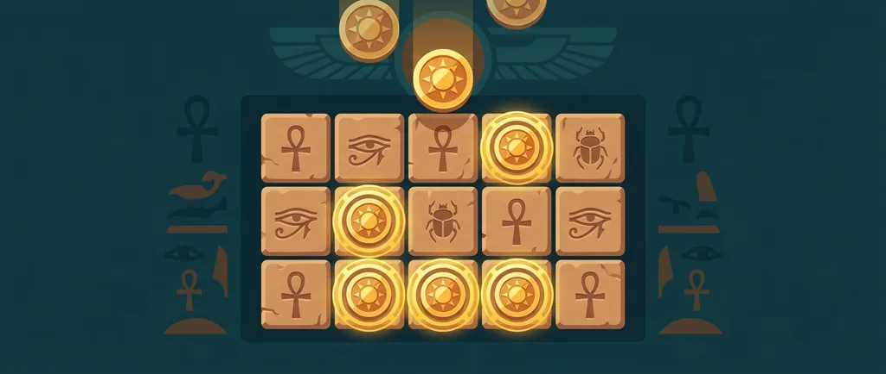
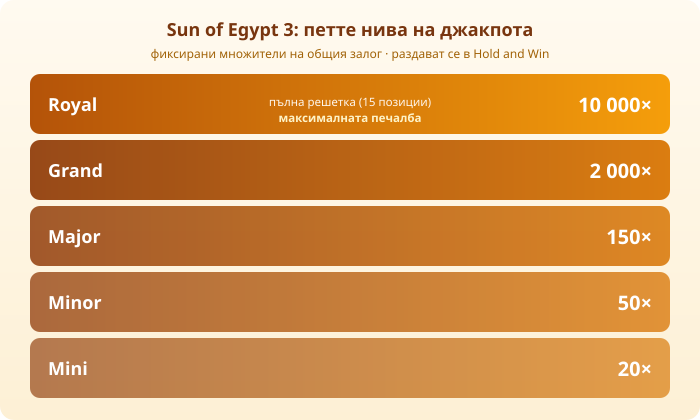

Title tag: Sun of Egypt 3 (3 Oaks): RTP, Hold-and-Spin и как се играе
Meta description: Sun of Egypt 3 на 3 Oaks: RTP 95.61%, Hold-and-Win с 3 повторни завъртания и пет нива джакпот до 10 000 пъти залога. Какво сменя третата част.

---

# Sun of Egypt 3 (3 Oaks): RTP, Hold-and-Spin и как се играе

Sun of Egypt 3 е [ротативка](/kazino-igri/rotativki/) с египетска тема от 3 Oaks Gaming, студиото, което до 2022 г. се казваше Booongo. Това е третата част от серията Sun of Egypt и както предишните две, разчита на механиката Hold-and-Win със слънчеви монети, които се залепват на екрана. Основната разлика в тройката е горе на таблото с наградите, където се появява ново, най-високо ниво.

## Основното накратко

Играта е на пет барабана с три реда и 25 фиксирани линии. RTP-то е 95.61%, което е малко под средното за жанра, а волатилността е висока, тоест печалбите идват по-рядко, но могат да са едри. Максималната печалба е 10 000 пъти залога и се пада на най-горното ниво на джакпота. Заглавието излиза през март 2022 г. Минималният и максималният залог се различават по оператор, така че конкретните суми ги виждаш в самата игра.

## Hold and Win: как се пуска бонусът

Бонусът Hold and Win се пуска, когато на барабаните паднат 6 или повече символа слънце. Тогава екранът се изчиства и остават само тези символи, залепени по местата си на решетка от 15 позиции, а ти получаваш 3 повторни завъртания. Всеки път, когато падне нов символ слънце, броячът се връща на 3. Бонусът свършва, щом завъртанията се изчерпат или когато се напълни цялата решетка.

Всеки слънчев символ носи своя стойност, случайна за завъртането, някъде от 1 до 15 пъти залога. Накрая стойностите се събират и се изплащат наведнъж, заедно с нивото на джакпота, ако си го спечелил.

## Петте нива на джакпота

Джакпотът се раздава вътре в Hold and Win и има пет нива, всичките фиксирани множители на общия залог. За разлика от [прогресивните джакпоти](/blog/progresivni-dzhakpoti/), тук наградата не расте от залозите на другите играчи, а е предварително известна.

*Петте нива и техните множители. Royal се печели само при пълна решетка и е максималната печалба в играта.*

Долните четири нива са Mini 20 пъти залога, Minor 50 пъти, Major 150 пъти и Grand 2 000 пъти. Те се разкриват чрез мистерия символи по време на бонуса. Най-горното ниво Royal дава 10 000 пъти залога и се печели само ако запълниш и петнадесетте позиции на решетката със слънчеви символи. Точно то е и максималната печалба в играта.

## Безплатните игри

Освен Hold and Win играта има и отделен кръг безплатни игри. Три или повече символа скатер пускат 8 завъртания, а ако паднат отново по време на кръга, добавят още 8. През безплатните игри ниско платените символи изчезват от барабаните и остават само по-ценните, дивите и слънчевите, което вдига шанса за по-добри комбинации.

## Какво сменя третата част

Ако си играл предишните части, най-голямата новост е в джакпота. Първата Sun of Egypt имаше три нива и максимум 1 000 пъти залога, втората мина на четири нива и 5 000 пъти. Тройката добавя петото ниво Royal и качва тавана на 10 000 пъти. Забележи една подробност: с идването на Royal нивото Grand всъщност слиза от 5 000 пъти във втората част на 2 000 пъти тук, защото над него вече стои по-голямата награда. Иначе базовата механика Hold and Win с 6 символа и 3 повторни завъртания остава същата през цялата серия.

## RTP и волатилност

95.61% е [дългосрочна статистика](/kak-ocenyavame/) върху милиони завъртания, не прогноза за твоята сесия. При висока волатилност балансът може дълго да не мърда и после да подскочи в бонуса, или обратното, да се стопи, преди изобщо да си стигнал до Hold and Win. Затова таванът от 10 000 пъти е рядък изход в математиката на играта, а не цел, която да гониш.

## Преди да завъртиш

Hold and Win е направен да те държи на ръба със залепените монети и връщането на брояча, а точно това усещане за „почти" лесно те увлича да въртиш още. Задай си лимит за загуба и за време, преди да седнеш, и гледай на слота като на платено забавление, а не като на начин да изкараш пари. 18+ Хазартът може да пристрасти. Играйте отговорно. Ако усетиш, че играта излиза извън контрол, виж [инструментите за отговорна игра](/otgovorna-igra/).

---

**Георги Тодоров**
Публикувано: 21.09.2026 · Последна редакция: 21.09.2026

[About Всички Казина boilerplate]

**Отговорна игра.** 18+ Хазартът може да пристрасти. Играйте отговорно. Ако усетиш, че играта излиза извън контрол или искаш да я ограничиш, виж [инструментите за отговорна игра](/otgovorna-igra/) и възможността за самоизключване чрез националния регистър на уязвимите лица към НАП (подава се писмено само от засегнатото лице). Национална информационна линия за наркотиците, алкохола и хазарта („Солидарност") 0888 99 18 66, делнични дни 10:00–17:00.

**Разкриване на партньорства.** Всички Казина съдържа партньорски (афилиейт) връзки; когато отвориш оферта през такава връзка, това може да финансира сайта, без да променя цената за теб и без да влияе на оценките ни. От 1 август 2026 г. дейността на афилиейт оператори в България се лицензира съгласно Закона за държавния бюджет за 2026 г. (ДВ, бр. 69 от 31.07.2026 г.). Всички Казина е подало заявление за лиценз пред Националната агенция по приходите и очаква издаването му.
