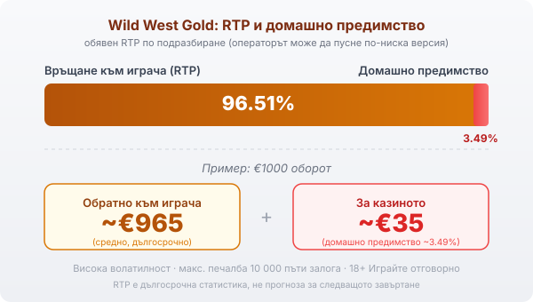

Title tag: Wild West Gold: RTP, sticky wilds и как се играе
Meta description: Wild West Gold на Pragmatic Play: мрежа 5x4 с 40 линии, sticky wilds с множители 2x/3x/5x, RTP 96.51% и защо високата волатилност значи дълги сухи серии.

---

# Wild West Gold (Pragmatic): RTP, sticky wilds и как се играе

Wild West Gold на Pragmatic Play излезе през март 2020 г. и остана един от каубойските хитове на компанията, с прерия, револвери и златни кюлчета по барабаните. Големите печалби в нея идват от един механизъм в безплатните завъртания: лепкавите wild символи с множители. Около него, RTP-то и волатилността се върти всичко, което има смисъл да знаеш, преди да заложиш реални пари.

## Как е устроена играта

Мрежата е класическа: пет колони и четири реда, с 40 фиксирани линии. Печалба се образува, когато еднакви символи се подредят по някоя от тези линии отляво надясно, така че тук няма „pay anywhere" логика, а стандартни линии, които са винаги активни. Wild символът замества обикновените символи и се появява само на трите средни барабана (2, 3 и 4). Всеки wild идва със случаен множител: 2×, 3× или 5×. Още в основната игра това вдига стойността на линиите, в които участва.

## Sticky wilds: сърцето на играта

В безплатните завъртания wild символите се държат различно. Веднъж паднал, wild се залепва на позицията си и остава там до края на рунда. Колкото повече завъртания минават, толкова повече лепкави wild-ове се трупат по барабаните, а с тях и множителите им.

Когато на една печеливша линия попаднат няколко wild-а, множителите им се събират, а не се умножават. Wild с 3× и wild с 5× на една и съща линия дават 8×, тоест 15× не се случва. Приложеният към една линия множител е сборът само на wild-овете, които участват в конкретната печеливша комбинация, а не на всички залепени по екрана. Затова големите резултати се трупат постепенно, през серия от лепкави символи. Множителите остават на екрана и работят за всяко следващо завъртане до края на рунда, което прави добре напълнената мрежа основния двигател на печалбите в играта.

## Как се стартират безплатните завъртания

За бонуса ти трябват три scatter символа (залезът над каньона) едновременно на барабани 1, 3 и 5. Те носят 8 безплатни завъртания за начало. По време на рунда допълнителни scatter-и под формата на златни шерифски звезди добавят още спинове: две звезди дават 4, три звезди 8, четири звезди 12, а пет звезди 20 допълнителни завъртания. При достатъчно ретригери един рунд може да се проточи дълго, а лепкавите wild-ове да покрият голяма част от мрежата.

В такива моменти играта достига тавана си от 10 000 пъти залога. Това число обаче е таван, не очакване. Повечето рундове с безплатни завъртания приключват скромно, ако звездите и wild-овете не дойдат в правилната комбинация, и това е нормалната математика на високоволатилна ротативка.

## RTP и волатилност

Обявеният RTP на Wild West Gold по подразбиране е 96.51%, което оставя домашно предимство от около 3.49%. При €1000 оборот това значи средно връщане от порядъка на €965 в дългосрочен план и около €35, които остават за казиното. Pragmatic Play обаче доставя играта и в по-ниски версии, чийто RTP е 95.56% и 94.53%, а операторът избира коя да пусне. Коя точно работи при теб проверяваш в инфо-панела на играта в конкретното казино, защото там пише реалната стойност.

Волатилността на играта е висока, оценена на 5 от 5 по скалата в самата игра, тоест печалбите са редки, но потенциално големи. На практика това значи дълги серии празни завъртания, прекъсвани от отделни по-едри попадения, и банка, която трябва да издържи на сухите периоди. RTP описва средното връщане над милиони завъртания и не обещава нищо за твоята конкретна сесия.

*Обявен RTP 96.51% по подразбиране: при €1000 оборот средно ~€965 се връщат на играча, ~€35 остават за казиното (домашно предимство ~3.49%). Волатилността е висока, а максималната печалба е 10 000 пъти залога.*

## Bonus buy и залозите

Залогът върви от €0.20 до €100 на завъртане, което дава широк диапазон и за малки, и за по-агресивни бюджети. Играта предлага и функция за купуване на бонуса: срещу 100 пъти залога влизаш директно в безплатните завъртания, без да чакаш трите scatter-а. Плащаш сумата веднага, а тя купува единствено по-бърз достъп до вариацията, не по-добри дългосрочни шансове. Дали bonus buy изобщо е наличен зависи от пазара и оператора (в някои юрисдикции е забранен), затова провери дали опцията присъства в самата игра, преди да разчиташ на нея.

## Каква банка иска толкова волатилна игра

Когато десетки завъртания минават без нищо, преди един рунд да върне повечето, малкият залог спрямо цялата банка удължава сесията и дава повече шансове бонусът изобщо да се появи. Избираш сума, която можеш да загубиш изцяло без последствия, и я делиш на достатъчно завъртания, за да издържиш на сухите серии. Диапазонът от €0.20 до €100 позволява това, стига да не гониш бонуса с все по-големи залози, когато той не идва. Дългосрочният резултат се решава от RTP-то на конкретния билд, докато размерът на отделния залог определя най-вече колко бързо върви банката ти.

## Преди да завъртиш

[Слот игрите](/slot-igri/) на Pragmatic обикновено имат демо режим, в който да усетиш темпото и волатилността, без да залагаш; при толкова висока волатилност това е честният начин да разбереш дали стилът ти пасва. Ако искаш да сравниш заглавия на един доставчик, [профилът ни на Pragmatic Play](/blog/pragmatic-play-provajdar/) и [прегледът на доставчиците](/blog/games-providers/) стъпват на същата логика, а различните [ротативки](/kazino-igri/rotativki/) се сравняват най-честно по RTP, затова в [методологията ни](/kak-ocenyavame/) гледаме реалния процент при конкретното казино. Задай си лимит за загуба и за време преди първото завъртане. 18+ Хазартът може да пристрасти. Играйте отговорно. Ако усетиш, че играта излиза извън контрол, виж [инструментите за отговорна игра](/otgovorna-igra/).

---

**Георги Тодоров**
Публикувано: 21.09.2026 · Последна редакция: 21.09.2026

[About Всички Казина boilerplate]

**Отговорна игра.** 18+ Хазартът може да пристрасти. Играйте отговорно. Ако усетиш, че играта излиза извън контрол или искаш да я ограничиш, виж [инструментите за отговорна игра](/otgovorna-igra/) и възможността за самоизключване чрез националния регистър на уязвимите лица към НАП (подава се писмено само от засегнатото лице). Национална информационна линия за наркотиците, алкохола и хазарта („Солидарност") 0888 99 18 66, делнични дни 10:00–17:00.

**Разкриване на партньорства.** Всички Казина съдържа партньорски (афилиейт) връзки; когато отвориш оферта през такава връзка, това може да финансира сайта, без да променя цената за теб и без да влияе на оценките ни. От 1 август 2026 г. дейността на афилиейт оператори в България се лицензира съгласно Закона за държавния бюджет за 2026 г. (ДВ, бр. 69 от 31.07.2026 г.). Всички Казина е подало заявление за лиценз пред Националната агенция по приходите и очаква издаването му.
