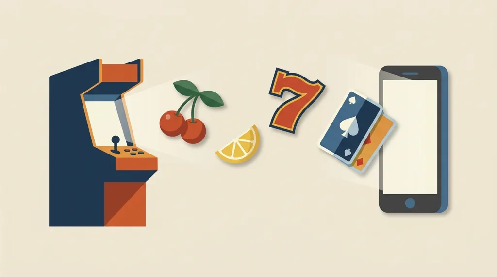
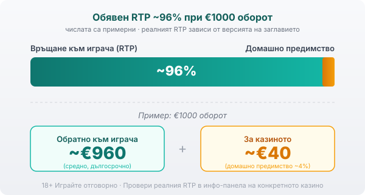

Title tag: Amatic Industries: профил, механики и топ слотове
Meta description: Кой е Amatic Industries (Аматик), какви механики прави (плодове, гембъл, Book of Aztec) и кои са топ слотовете. Защо RTP се проверява в инфо-панела.

---

# Amatic Industries: профил на доставчика, механики и топ слотове

Плодовете, седмиците и картата за гембъл, познати на всеки, който е пускал ротативка в българска зала, често идват от една австрийска компания: Amatic Industries, или просто „Аматик", както я знаят мнозина играчи. Основана е през 1993 г. и дълги години прави класически слотове за наземните обекти, преди да ги пренесе онлайн. Игрите ѝ се появяват в българските казина под същата разпознаваема, семпла визия.

## Кой е Amatic и откъде идва

Amatic Industries е австрийски разработчик с дълго наследство в наземните зали. Компанията прави физически игрални машини, кабинети, автоматизирана рулетка и видеолотарийни терминали, а от 2014 г. пренася заглавията си онлайн под марката AMANET. Пътят е обратен на много чисто онлайн студиа: игрите първо живеят в залата и оттам стигат до екрана на телефона, което личи в темпото им и в опростената механика.

## Доставчик, не оператор

Amatic прави игрите, но не ги предлага сам. Софтуерът е негов, а казиното е операторът: то приема залозите, държи парите ти и отговаря за лиценза си пред НАП. Затова, преди да депозираш, гледаш лиценза на конкретното казино в регистъра на НАП, независимо чие лого свети на слота.

## Какво значат сертификатите

Игрите на Amatic се тестват от независими лаборатории, а компанията държи доставчически (B2B) лицензи за регулирани пазари като Великобритания, Малта, Румъния и Испания. Проверката означава, че генераторът на случайни числа е тестван и обявеният RTP отговаря на реалната математика на играта. Сертификатът потвърждава, че играта спазва обявените си правила. Самите правила са писани в полза на казиното и домашното предимство е вградено в тях. Тестът гарантира, че играта е честна спрямо тези правила.

## Класическите механики

Повечето известни заглавия на Amatic споделят една и съща семпла схема. На барабаните са класическите плодове, седмиците и звездата, като седмицата обикновено играе ролята на wild и замества другите символи, а звездата е scatter. Book-style заглавията като Book of Aztec работят по различен начин: там специален символ се разширява върху целия барабан по време на безплатните завъртания и може да плати наведнъж. След печалба играта често предлага гембъл: обръщаш карта и рискуваш току-що спечеленото. Познаеш ли цвета ѝ (червено или черно), удвояваш; познаеш ли боята, печалбата се учетворява. Сбъркаш ли, кръгът отива на нула. Механиката не пипа RTP-то на играта, а само добавя резки колебания в банката.

## Серията „Hot" и топ заглавията

Няколко заглавия направиха компанията разпознаваема за българския играч. Сърцевината е серията „Hot": Hot Scatter, Hot Fruits 20, 27, 40 и 100, Hot Choice и роднините им, плодови слотове с малко линии и бърз ритъм. До тях стоят Book of Aztec с неговия разширяващ се символ, както и заглавия като Admiral Nelson, Wild Stars, Billyonaire, Lucky Coin и Diamond Cats. Полезно е да ги познаваш, но популярността им казва повече за навика от залата и за визията, отколкото за шансовете ти.

## Прогресивните джакпоти

Част от заглавията на Amatic предлагат прогресивен джакпот, но компанията не е известна с големи свързани мрежи като някои конкуренти. Джакпотът тук по-често виси на отделно заглавие или на локална група машини, а не на широка национална мрежа. Пуловете се пълнят от малка част от залозите на самите играчи. Наличието на джакпот не сваля домашното предимство и не подобрява шансовете ти в редовната игра.

## RTP: проверявай, не приемай

Обявеният RTP на класиките на Amatic обикновено е около 96%. При €1000 оборот това значи средно връщане от порядъка на €960 в дългосрочен план и около €40 за казиното. Едно и също заглавие се доставя в няколко сертифицирани версии с различен RTP, а операторът избира коя да пусне. По данни на игрални бази данни някои версии на „Hot" заглавията се качват към 97–98%, докато други заглавия седят чувствително по-ниско, например Lucky Coin около 94%. Точните проценти по заглавие се разминават между отделните бази данни, а конкретната версия се проверява в самото казино. Заради това в [методологията ни](/kak-ocenyavame/) гледаме реалния RTP на конкретното казино, а не рекламния. Отвори инфо-панела на играта, намери реда за RTP и виж кое число работи там, преди да заложиш.

*Илюстративен пример при обявен RTP ~96%: €1000 оборот връща средно ~€960, ~€40 остават за казиното. Числата са примерни; реалният RTP зависи от версията, която операторът е пуснал, затова се проверява в инфо-панела.*

## Демо режим, лимити и реален RTP

[Слот игрите](/slot-igri/) на Amatic обикновено имат демо режим, в който да усетиш темпото и механиката, без да залагаш, а ако искаш да сравниш доставчици един до друг, [прегледът ни на доставчиците](/blog/games-providers/) стъпва на същата логика. Задай си лимит за загуба и за време преди първото завъртане и провери реалния процент на конкретното казино. 18+ Хазартът може да пристрасти. Играйте отговорно. Ако усетите, че играта излиза извън контрол, вижте [инструментите за отговорна игра](/otgovorna-igra/).

---

**Георги Тодоров**
Публикувано: 22.09.2026 · Последна редакция: 22.09.2026

[About Всички Казина boilerplate]

**Отговорна игра.** 18+ Хазартът може да пристрасти. Играйте отговорно. Ако усетиш, че играта излиза извън контрол или искаш да я ограничиш, виж [инструментите за отговорна игра](/otgovorna-igra/) и възможността за самоизключване чрез националния регистър на уязвимите лица към НАП (подава се писмено само от засегнатото лице). Национална информационна линия за наркотиците, алкохола и хазарта („Солидарност") 0888 99 18 66, делнични дни 10:00–17:00.

**Разкриване на партньорства.** Всички Казина съдържа партньорски (афилиейт) връзки; когато отвориш оферта през такава връзка, това може да финансира сайта, без да променя цената за теб и без да влияе на оценките ни. От 1 август 2026 г. дейността на афилиейт оператори в България се лицензира съгласно Закона за държавния бюджет за 2026 г. (ДВ, бр. 69 от 31.07.2026 г.). Всички Казина е подало заявление за лиценз пред Националната агенция по приходите и очаква издаването му.
