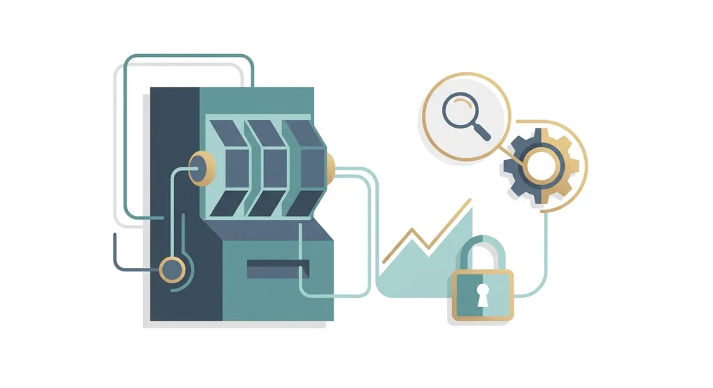
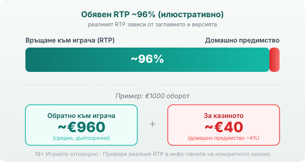

Title tag: CT Interactive: профил на доставчика, механики и топ слотове
Meta description: Кой е CT Interactive (Casino Technology) - българският доставчик на слотове от София. Какви игри прави, какви са RTP стойностите и защо локалното не значи по-добри шансове.

---

# CT Interactive: профил на доставчика, механики и топ слотове

CT Interactive е български доставчик на слот игри със седалище в София. Компанията е онлайн подразделението на Casino Technology (днес CT Gaming), утвърдена фирма за наземни казино автомати, а самото интерактивно направление е обособено през 2012 г., за да покрие бързо растящия онлайн и мобилен сегмент. За българския играч това е рядкост: голяма част от слотовете, които среща в лицензираните тук казина, идват от чужди студиа, а тук разработчикът е местен.

## Кой е CT Interactive и какво прави

CT Interactive е B2B доставчик: прави игрите, а казиното-оператор ги пуска и държи парите. Каталогът минава над 250 видео слота [VERIFY: точен брой заглавия, някои източници сочат над 500], всичките със сертифициран генератор на случайни числа. Наземният произход си личи: много от заглавията са адаптации на автомати, познати от физическите зали, пренесени в браузъра на HTML5. Живо казино с дилъри студиото не прави, така че рулетката със стрийм идва от другаде.

## Локалното не значи по-добри шансове

Фактът, че доставчикът е български, е удобен за разпознаване на игрите, но не мени математиката им. Обявените RTP стойности на CT Interactive обикновено се въртят около 96%, тоест на нивото на средния модерен слот, а конкретните числа се разминават силно между заглавията. Fire Egg се сочи с 98.11%, Purple Fruits около 97%, а Doctor Winstein около 95% [VERIFY: точни обявени RTP по заглавие и източник]. Разминаването не е грешка. Доставчикът предлага на операторите различни версии на едно заглавие с различен RTP, и казиното избира коя да пусне. Затова една и съща игра може да ти връща различен процент в различни казина, независимо откъде е разработчикът.

## Механики и свързани джакпоти

Повечето слотове на CT Interactive стъпват на класическа рамка: разширяващи се и заместващи wild символи, scatter-и, които пускат безплатни завъртания, и семпли бонус кръгове, близки до усещането на наземния автомат. Отделно студиото предлага система за свързани джакпоти, при която няколко игри и няколко казина захранват общ пул, който расте с оборота на всички играчи. Джакпотът е ефектен, но не е бонус за твоя сметка: пулът се пълни от заложените пари, а шансът да го удариш е нищожен. Домашното предимство на самата игра не се променя от наличието на джакпот над нея.

## Лиценз и сертификати: какво всъщност значат

CT Interactive е сертифициран за редица регулирани пазари, а съдържанието му е одобрено и за българския онлайн пазар от Националната агенция за приходите, наред със сертификация от Malta Gaming Authority [VERIFY: актуален обхват на сертификациите]. Практическото значение за теб е ограничено: сертификатът потвърждава, че генераторът на случайни числа е тестван от независима лаборатория и обявеният RTP отговаря на реалната математика на играта. Той гарантира, че играта е честна спрямо собствените си правила, не че тези правила са в твоя полза. Важното за сигурността ти остава лицензът на самото казино в публичния регистър на НАП, а не произходът на доставчика.

## RTP: проверявай, не приемай

При обявен RTP около 96% и €1000 оборот средното връщане е от порядъка на €960 в дългосрочен план, а около €40 остават за казиното. Заради версиите с различен RTP числото на конкретната ти игра може да е по-ниско от рекламното. Затова в [методологията ни](/kak-ocenyavame/) гледаме реалния RTP на конкретното казино вместо обявения. Точното число за версията, която играеш, стои в инфо-панела на самата игра.

*Илюстративен пример при обявен RTP ~96%: €1000 оборот връща средно ~€960, ~€40 остават за казиното. Реалният RTP зависи от заглавието и от версията, която операторът е пуснал, затова се проверява в инфо-панела.*

## Демо режим, лимити и реален RTP

[Слот игрите](/slot-igri/) на CT Interactive обикновено имат демо режим, в който да усетиш темпото и волатилността, без да залагаш, а ако искаш да сравниш доставчици един до друг, [прегледът ни на доставчиците](/blog/games-providers/) стъпва на същата логика. Демото е чудесно, за да усетиш ритъма на играта, но истинската ѝ цена в дългосрочен план се вижда чак от реалния RTP на конкретното казино. Преди първото завъртане си задай лимит за загуба и за време. 18+ Хазартът може да пристрасти. Играйте отговорно. Ако усетите, че играта излиза извън контрол, вижте [инструментите за отговорна игра](/otgovorna-igra/).

---

**Георги Тодоров**
Публикувано: 22.09.2026 · Последна редакция: 22.09.2026

[About Всички Казина boilerplate]

**Отговорна игра.** 18+ Хазартът може да пристрасти. Играйте отговорно. Ако усетиш, че играта излиза извън контрол или искаш да я ограничиш, виж [инструментите за отговорна игра](/otgovorna-igra/) и възможността за самоизключване чрез националния регистър на уязвимите лица към НАП (подава се писмено само от засегнатото лице). Национална информационна линия за наркотиците, алкохола и хазарта („Солидарност") 0888 99 18 66, делнични дни 10:00–17:00.

**Разкриване на партньорства.** Всички Казина съдържа партньорски (афилиейт) връзки; когато отвориш оферта през такава връзка, това може да финансира сайта, без да променя цената за теб и без да влияе на оценките ни. От 1 август 2026 г. дейността на афилиейт оператори в България се лицензира съгласно Закона за държавния бюджет за 2026 г. (ДВ, бр. 69 от 31.07.2026 г.). Всички Казина е подало заявление за лиценз пред Националната агенция по приходите и очаква издаването му.
