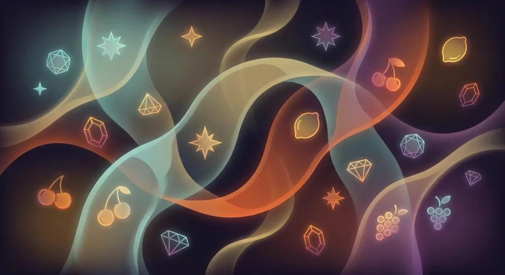
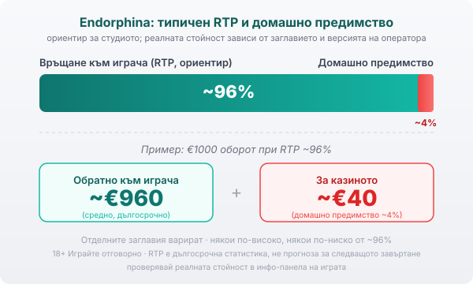

Title tag: Endorphina: профил на доставчика, механики и топ слотове
Meta description: Кой е Endorphina, какви игри прави и кои са познатите му слотове. Защо сертификатът GLI не е предимство за играча, какво значи типичният RTP около 96% и защо реалната стойност се проверява в инфо-панела.

---

# Endorphina: профил на доставчика, механики и топ слотове

Endorphina е чешко студио с разпознаваем визуален почерк, което прави само слотове, от древен Египет до крипто мотиви. Под пъстрата обвивка работи същата математика като при всеки друг доставчик, така че си струва да знаеш кой стои зад заглавията.

## Кой е Endorphina

Endorphina е студио за онлайн слотове, основано през 2012 г. и базирано в Прага, Чехия, с присъствие и в Малта заради лицензирането. За разлика от големите доставчици, които покриват целия спектър игри, Endorphina се е специализирала тясно: тя прави ротативки и нищо друго, без игри на живо, маси или моментни лотарии.

## Само слотове, но с характер

Портфолиото на компанията надхвърля 200 заглавия, а темпото е около две до три нови игри на месец. Египет, класически плодове, лукс и глем, крипто мотиви: темите са пъстри, но студиото запазва характерния си стил. Една и съща логика на игрите се пренася от заглавие на заглавие, което улеснява играча, свикнал вече с механиките им.

## Лицензи и сертификати (и защо не са предимство)

Endorphina прави софтуера, но не приема залози: това прави казиното, операторът, който държи парите. Компанията държи доставчически лицензи за регулирани пазари, сред които Малта (MGA) и Румъния (ONJN), а генераторът на случайни числа в игрите се тества от независима лаборатория като Gaming Laboratories International. Този сертификат потвърждава само, че математиката на играта отговаря на обявения RTP. Правилата обаче са писани в полза на казиното: домашното предимство си остава вградено, а тестът гарантира единствено, че то е точно такова, каквото пише.

## Характерни механики

Почти всяко заглавие на Endorphina предлага Risk игра, познатия гембъл: залагаш печалбата си на цвета на една карта и ако познаеш, я удвояваш, при това няколко пъти подред, обикновено до около десет удвоявания. Горе-долу като да хвърлиш монета — познаеш ли, удвояваш, сгрешиш ли, губиш печалбата от кръга. Тя не мени математиката, а само добавя резки колебания в банката. Освен нея игрите разчитат на стандартния арсенал: wild символите заместват другите в комбинация, scatter символите плащат независимо от позицията, а към тях се добавят множители и безплатни завъртания. Част от игрите позволяват и да купиш директно рунда безплатни завъртания срещу цена, което пак не подобрява дългосрочните ти шансове, а само спестява чакането.

## RTP: проверявай, не приемай

Обявеният RTP на слотовете на Endorphina обикновено се върти около 96%, като отделни заглавия седят по-високо, а някои версии падат по-ниско. Колко точно връща дадено заглавие зависи от версията, която операторът е пуснал, затова една и съща игра дава различен процент в различни казина — реалната стойност я четеш в инфо-панела при избрания оператор.

При RTP 96% домашното предимство е около 4%. На €1000 оборот това значи средно връщане от порядъка на €960 в дългосрочен план и около €40 за казиното. Числото е статистика над много завъртания, не прогноза за конкретна сесия. Затова в [методологията ни](/kak-ocenyavame/) гледаме реалния RTP на конкретното казино вместо рекламния, а ти отвори инфо-панела на играта, намери реда за RTP и виж кое число работи там, преди да заложиш.

*Как изглежда типичното домашно предимство при слот с RTP около 96%: диаграмата показва дългосрочното разпределение над много завъртания, а не изхода от една сесия. Реалната стойност зависи от конкретното заглавие и от версията, която операторът е пуснал.*

## Топ заглавия

Сред по-разпознаваемите заглавия са сериите Lucky Streak и Hell Hot 100 с класическата плодова визия, както и по-новите Fortune Stars и Sticky Lips. Точните им RTP и волатилност варират от игра на игра и от версия на версия.

## Преди да играеш

[Слот игрите](/slot-igri/) на Endorphina обикновено имат демо режим, в който да усетиш темпото и механиката, без да залагаш, а различните [ротативки](/kazino-igri/rotativki/) се сравняват най-честно точно по RTP. Ако искаш да сравниш доставчици един до друг, [прегледът ни на доставчиците](/blog/games-providers/) стъпва на същата логика. Задай си лимит за загуба и за време преди първото завъртане и провери реалния процент на конкретното казино. 18+ Хазартът може да пристрасти. Играйте отговорно. Ако усетите, че играта излиза извън контрол, вижте [инструментите за отговорна игра](/otgovorna-igra/).

---

**Георги Тодоров**
Публикувано: 22.09.2026 · Последна редакция: 22.09.2026

[About Всички Казина boilerplate]

**Отговорна игра.** 18+ Хазартът може да пристрасти. Играйте отговорно. Ако усетиш, че играта излиза извън контрол или искаш да я ограничиш, виж [инструментите за отговорна игра](/otgovorna-igra/) и възможността за самоизключване чрез националния регистър на уязвимите лица към НАП (подава се писмено само от засегнатото лице). Национална информационна линия за наркотиците, алкохола и хазарта („Солидарност") 0888 99 18 66, делнични дни 10:00–17:00.

**Разкриване на партньорства.** Всички Казина съдържа партньорски (афилиейт) връзки; когато отвориш оферта през такава връзка, това може да финансира сайта, без да променя цената за теб и без да влияе на оценките ни. От 1 август 2026 г. дейността на афилиейт оператори в България се лицензира съгласно Закона за държавния бюджет за 2026 г. (ДВ, бр. 69 от 31.07.2026 г.). Всички Казина е подало заявление за лиценз пред Националната агенция по приходите и очаква издаването му.
