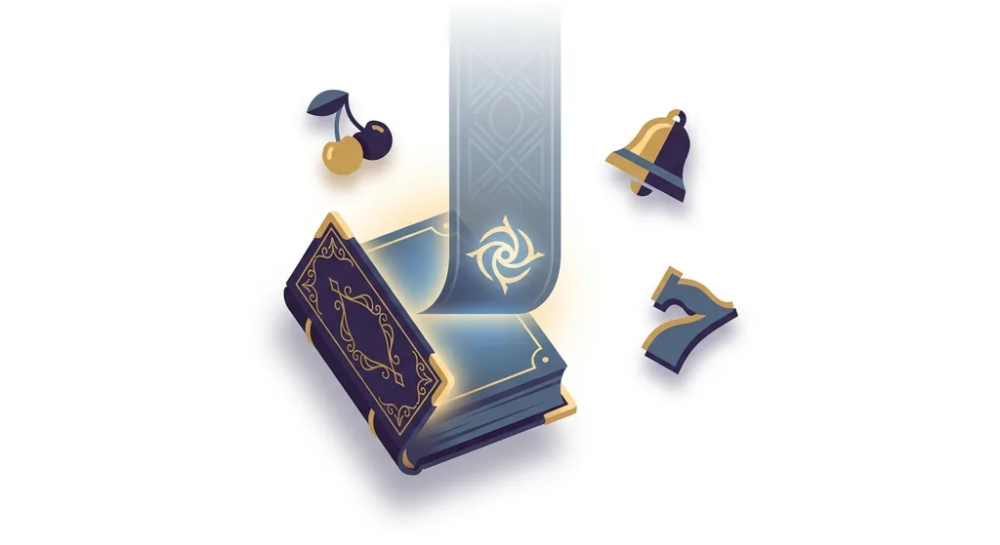
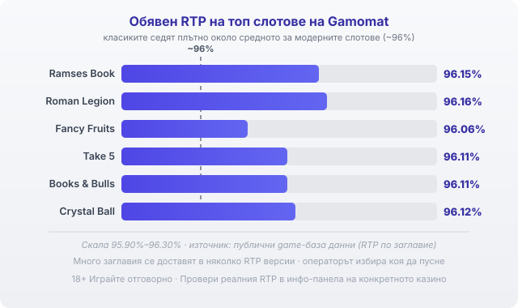

Title tag: Gamomat: профил на доставчика, механики и топ слотове
Meta description: Кой е Gamomat, какви игри и механики прави и кои са топ слотовете му. Защо RTP седи около 96%, защо B2B лицензът не е предимство и как да го провериш.

---

# Gamomat: профил на доставчика, механики и топ слотове

Немските слотове с разгръщащ се символ от „книгата" и класическите плодове със седмици, които виждаш в много български каталози, често идват от една берлинска компания: Gamomat. Тя работи от 2008 г. и дълго време правеше игри за наземните зали в Германия, преди да се насочи към онлайн. Зад над 150 заглавия стои една и съща проста, разпознаваема математика.

## От наземните зали към онлайн

Gamomat е основана през 2008 г. в Берлин от Dietmar Hermjohannes, който и до днес я управлява. Компанията тръгва от физическите зали в Германия и постепенно пренася каталога си онлайн, където заглавията ѝ вече се предлагат в над 35 държави и на около 27 езика. Как точно е стигало онлайн съдържанието до конкретните оператори през годините се описва различно в публичните източници [VERIFY: историческият онлайн дистрибутор/партньор на Gamomat], но посоката е ясна: студио с наземно наследство, което се превърна в независим доставчик за интернет казината.

## B2B доставчик, не казино

Gamomat прави игрите, но не ги предлага сам. Той е доставчик на софтуер, а казиното е операторът, който приема залозите и държи парите. Компанията оперира през GAMOMAT RGS Ltd в Малта и държи доставнически (B2B) лиценз от Malta Gaming Authority за критично игрално съдържание (MGA/B2B/1066/2024). Този лиценз значи, че генераторът на случайни числа и обявеният RTP са проверени спрямо правилата на играта. Играта е честна спрямо това, което пише в нея. Правилата обаче пак са писани в полза на казиното, а домашното предимство си остава вградено.

## Механиките, които разпознаваш

Каталогът на Gamomat стъпва на няколко познати схеми. Първата е „книгата" в стил Book of Ra: символът на книгата е едновременно wild и scatter, три от тях пускат 10 безплатни завъртания, а в началото им се тегли един символ, който после се разширява върху целия барабан и плаща, където и да падне. Ramses Book и Book of Madness работят точно така. Втората схема са класическите плодове и седмици, на които след печалба обикновено се предлага gamble: обръщаш карта и познаваш червено или черно, за да удвоиш сумата, иначе губиш печалбата от кръга. По-новите заглавия често добавят лепкави wild-ове или респини, при които печеливш символ остава заключен за няколко завъртания. Много от игрите излизат и с Double Rush или Triple Rush, при които един залог се разделя на две или три завъртания заради изискванията за темпо на немския пазар. Тази добавка не мени обявения RTP, нито максималната печалба на заглавието.

## Топ слотове на Gamomat

Няколко игри направиха студиото разпознаваемо. Ramses Book е най-известната му „книга", с обявен RTP 96.15% и максимална печалба до 6 716 пъти залога. Roman Legion залага на лепкави wild-ове с легионери и обявява 96.16%. Класическите плодови заглавия Fancy Fruits (96.06%), Take 5 (96.11%) и Books & Bulls (96.11%) държат същия семпъл стил, а Crystal Ball с респини обявява 96.12%. Полезно е да ги познаваш, но популярността им казва повече за дизайна и за наследството на марката, отколкото за шансовете ти. Едно широко играно заглавие не ти връща повече от друго само защото е познато.

*Обявени RTP на шест заглавия на Gamomat спрямо ориентира ~96%: класиките седят плътно около средното за модерните слотове. Реалната стойност зависи от заглавието и от версията, която операторът е пуснал, затова се проверява в инфо-панела.*

## RTP: проверявай, не приемай

Обявените RTP на класиките на Gamomat седят плътно около 96%, тоест точно на средното за модерните слотове, нито под него, нито осезаемо над него. При €1000 оборот и RTP около 96% средното връщане в дългосрочен план е от порядъка на €960, а около €40 остават за казиното. Числото обаче е за самото заглавие. Много слотове се доставят в няколко RTP версии и операторът избира коя да пусне [VERIFY: конкретните per-casino RTP версии на Gamomat], така че една и съща игра може да връща различен процент в различни казина. Заради това в [методологията ни](/kak-ocenyavame/) гледаме реалния RTP на конкретното казино, а не рекламния. Отвори инфо-панела на играта и виж кое число работи там, преди да заложиш.

## Демо режим, лимити и реален RTP

[Слот игрите](/slot-igri/) на Gamomat обикновено имат демо режим, в който да усетиш темпото и волатилността, без да залагаш, а ако искаш да сравниш доставчици един до друг, [прегледът ни на доставчиците](/blog/games-providers/) стъпва на същата логика. Задай си лимит за загуба и за време преди първото завъртане и провери реалния процент на конкретното казино. 18+ Хазартът може да пристрасти. Играйте отговорно. Ако усетите, че играта излиза извън контрол, вижте [инструментите за отговорна игра](/otgovorna-igra/).

---

**Георги Тодоров**
Публикувано: 22.09.2026 · Последна редакция: 22.09.2026

[About Всички Казина boilerplate]

**Отговорна игра.** 18+ Хазартът може да пристрасти. Играйте отговорно. Ако усетиш, че играта излиза извън контрол или искаш да я ограничиш, виж [инструментите за отговорна игра](/otgovorna-igra/) и възможността за самоизключване чрез националния регистър на уязвимите лица към НАП (подава се писмено само от засегнатото лице). Национална информационна линия за наркотиците, алкохола и хазарта („Солидарност") 0888 99 18 66, делнични дни 10:00–17:00.

**Разкриване на партньорства.** Всички Казина съдържа партньорски (афилиейт) връзки; когато отвориш оферта през такава връзка, това може да финансира сайта, без да променя цената за теб и без да влияе на оценките ни. От 1 август 2026 г. дейността на афилиейт оператори в България се лицензира съгласно Закона за държавния бюджет за 2026 г. (ДВ, бр. 69 от 31.07.2026 г.). Всички Казина е подало заявление за лиценз пред Националната агенция по приходите и очаква издаването му.
