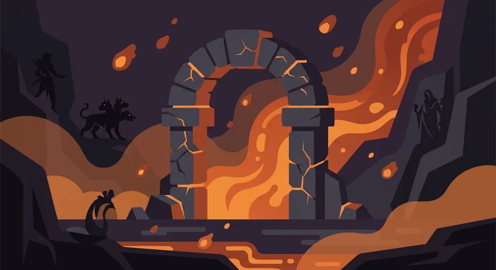
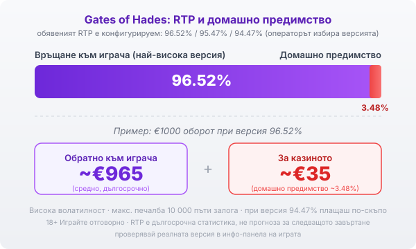

Title tag: Gates of Hades: RTP, каскади и как се играе
Meta description: Как работи Gates of Hades на Pragmatic Play: мрежа 6x6 с клъстерни печалби, каскади, wild множители до 100x, безплатни завъртания със запазващи се множители, конфигурируем RTP 96.52% и висока волатилност.

---

# Gates of Hades: RTP, каскади и как се играе

Gates of Hades на Pragmatic Play излезе през май 2025 г. и слиза в подземното царство на гръцката митология. Въпреки сходното име това не е Gates of Olympus, а различна игра с различна механика. Тъмната визия е ефектна, но по-важното е, че под нея стои високоволатилна математика с клъстерни печалби, която работи по своя логика.

## Как е устроена играта

Gates of Hades няма линии. Мрежата е 6 на 6 символа, а печалба се образува чрез клъстери: когато пет или повече еднакви символа се допират един до друг, те се броят за печалба, без значение по коя точно посока. Тоест значение има колко еднакви символа са се събрали накуп, а не дали лежат на определена линия. Заради това не следиш линии, а гледаш дали някъде на екрана се е образувала достатъчно голяма група.

## Каскади и множителите

След всяка печалба печелившите символи изчезват, а на тяхно място падат нови отгоре. Този каскаден механизъм значи, че едно завъртане може да донесе няколко последователни печалби, докато спрат да се събират клъстери. Тук се появяват и wild символите: всеки от тях носи случаен множител със стойност от 1 до 100 пъти, застава над своята колона и умножава всеки печеливш клъстер, който го докосне по време на каскадите. Тези множители са причината играта да може да плаща едро, но и причината повечето завъртания да минават без нищо.

## Безплатните завъртания

Рундът безплатни завъртания е истинският двигател на играта, а колко завъртания получаваш зависи от броя символи Hades scatter: три носят десет завъртания, четири дават дванайсет, пет отключват петнайсет, а шест или повече дават двайсет завъртания заедно с достъп до режима Super Free Spins. Разликата спрямо основната игра е съществена: множителите на всички wild символи, които събереш, остават на барабаните до края на рунда и се трупат, вместо да изчезват след завъртането. В режима Super Free Spins стойностите тръгват от 10 и могат да стигнат до 500 пъти. Точно тук се случват големите резултати, но и тук важи същото: рундът може да завърши скромно, ако символите не дойдат.

## RTP и волатилност

Обявеният RTP на Gates of Hades не е едно число. Играта се доставя в няколко версии: 96.52%, 95.47% и 94.47%, а операторът избира коя да пусне. Разликата не е дребна, защото при 94.47% плащаш осезаемо повече за същата игра. Коя версия работи при теб проверяваш в инфо-панела на играта в конкретното казино, защото именно там пише реалната стойност.

При най-високата версия от 96.52% домашното предимство е около 3.48%. На €1000 оборот това значи средно връщане от порядъка на €965 в дългосрочен план и около €35 за казиното. Числото е статистика над много завъртания, не прогноза за следващото. По-важна тук е волатилността: тя е висока, тоест печалбите са редки, но потенциално големи. На практика това значи дълги серии без печалба, прекъсвани от отделни по-едри попадения. Максималната печалба в играта е 10 000 пъти залога, което е таван, а не очакване, и се случва изключително рядко.

*Обявеният RTP е конфигурируем (96.52% / 95.47% / 94.47%), операторът избира версията. При най-високата (96.52%) и €1000 оборот средно ~€965 се връщат на играча, ~€35 остават за казиното (домашно предимство ~3.48%). Волатилността е висока, а максималната печалба е 10 000 пъти залога.*

## Купуването на бонуса

Играта позволява и директно купуване на безплатните завъртания: рундът Regular Free Spins струва 100 пъти залога, а достъпът до Super Free Spins е по-скъп, 500 пъти залога. И двете плащаш веднага, а нито едното не мени дългосрочното домашно предимство на играта: купуваш си по-бърз достъп до вариацията, не по-добри шансове. Дали опцията изобщо е налична зависи от пазара и от конкретния оператор, затова провери дали присъства в самата игра, преди да разчиташ на нея.

## Gates of Hades или Gates of Olympus

Двете игри лесно се бъркат, но работят различно. [Gates of Olympus](/blog/gates-of-olympus/) е с мрежа 6 на 5 и печалби от осем еднакви символа където и да паднат, а множителите на сферите се събират в общ множител в бонуса. Gates of Hades е с мрежа 6 на 6 и клъстерни печалби, а множителите на wild символите остават на барабаните до края на безплатните завъртания. Различни механики, различни числа: не пренасяй очаквания от едната към другата.

## Преди да завъртиш

[Слот игрите](/slot-igri/) на Pragmatic Play обикновено имат демо режим, в който да усетиш темпото и волатилността, без да залагаш, а ако искаш да сравниш доставчици, [прегледът ни на доставчиците](/blog/games-providers/) стъпва на същата логика. Различните [ротативки](/kazino-igri/rotativki/) се сравняват най-честно по RTP, затова в [методологията ни](/kak-ocenyavame/) гледаме реалния процент на конкретното казино, а не рекламния. Задай си лимит за загуба и за време преди първото завъртане, особено при толкова волатилна игра. 18+ Хазартът може да пристрасти. Играйте отговорно. Ако усетите, че играта излиза извън контрол, вижте [инструментите за отговорна игра](/otgovorna-igra/).

---

**Георги Тодоров**
Публикувано: 22.09.2026 · Последна редакция: 22.09.2026

[About Всички Казина boilerplate]

**Отговорна игра.** 18+ Хазартът може да пристрасти. Играйте отговорно. Ако усетиш, че играта излиза извън контрол или искаш да я ограничиш, виж [инструментите за отговорна игра](/otgovorna-igra/) и възможността за самоизключване чрез националния регистър на уязвимите лица към НАП (подава се писмено само от засегнатото лице). Национална информационна линия за наркотиците, алкохола и хазарта („Солидарност") 0888 99 18 66, делнични дни 10:00–17:00.

**Разкриване на партньорства.** Всички Казина съдържа партньорски (афилиейт) връзки; когато отвориш оферта през такава връзка, това може да финансира сайта, без да променя цената за теб и без да влияе на оценките ни. От 1 август 2026 г. дейността на афилиейт оператори в България се лицензира съгласно Закона за държавния бюджет за 2026 г. (ДВ, бр. 69 от 31.07.2026 г.). Всички Казина е подало заявление за лиценз пред Националната агенция по приходите и очаква издаването му.
