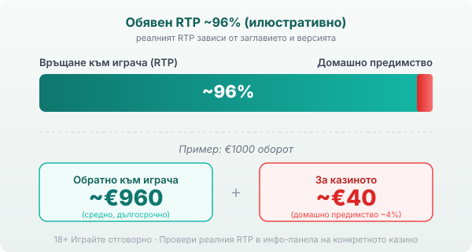

Title tag: Habanero: профил на доставчика, механики и топ слотове
Meta description: Кой е Habanero (хабанеро), какви игри и механики прави и кои са топ слотовете му. Защо сертификатът не е предимство за играча и защо RTP се проверява в инфо-панела.

---

# Habanero: профил на доставчика, механики и топ слотове

Habanero (произнася се „хабанеро") прави ротативки от началото на 2010-те (различни източници сочат 2010 или 2012 г.) и за над десетилетие събра каталог от над 200 заглавия с подчертан азиатски уклон. Централата е в Малта, но сред офисите на компанията се посочва и такъв в София, което прави доставчика доста по-близък до българския играч, отколкото името му подсказва.

## Кой е Habanero и какво прави

Habanero прави игрите, но не ги предлага сам: той е доставчик на софтуер, а казиното е операторът, който приема залозите и държи парите. Ядрото са видео слотовете, като официалният каталог изброява 227 заглавия, а до тях стоят RNG маси като блекджек и рулетка, плюс видео покер. Игри на живо с истински дилъри няма, така че ако търсиш рулетка със студио и крупие, тя идва от друг доставчик. Всичко върви на HTML5, тоест игрите се отварят направо в браузъра на телефона без отделно приложение.

## Азиатската тема и защо е навсякъде

Голяма част от разпознаваемите заглавия стъпват на китайска и източна иконография: Fa Cai Shen, Koi Gate, 5 Lucky Lions и 9 Lucky Lions, Shaolin Fortunes, Tuk Tuk Thailand. Компанията се утвърди първо на азиатските пазари и този визуален почерк остана нейна запазена марка. Разпознаването на линията е полезно, но темата е дизайн и маркетинг. Златните дракони и монети на екрана не пипат математиката на играта и не ти връщат повече от обикновен плодов слот със същия RTP.

## Основни механики

Повтарящият се трик при Habanero са заключените респини, версия на познатата Hold & Win механика. Определени символи се закотвят на екрана, останалите барабани се въртят наново и това продължава, докато паднат нови съвпадения. При Koi Gate например появата на символа Koi носи респин, в който печалбите са удвоени. Wild символите заместват другите, за да допълнят комбинация, scatter-ите обикновено пускат безплатни завъртания или бонус кръг, а множителите се появяват най-вече във free spins. Нищо от това не е изобретено от Habanero, но подредбата, темпото и честотата на респините са характерни за студиото и се пренасят от заглавие на заглавие.

## Лиценз и сертификати: какво всъщност значат

Habanero държи лиценз от Malta Gaming Authority сред други регулатори и е сертифициран за над 20 регулирани пазара, като официалният сайт сочи 26 юрисдикции. Практическото значение е, че генераторът на случайни числа е тестван от независима лаборатория и обявеният RTP отговаря на реалната математика на играта. Сертификатът гарантира, че играта е честна спрямо собствените си правила, не че тези правила са писани в твоя полза. Домашното предимство си остава вградено; проверката просто потвърждава, че то е точно такова, каквото пише.

## Топ заглавия и техните RTP

Няколко игри направиха компанията разпознаваема: Koi Gate, Hot Hot Fruit, Fa Cai Shen и серията Lucky Lions. Обявените им RTP обикновено са в диапазона 96–98%, тоест на или над средното за модерните слотове. Конкретните числа обаче се разминават силно между отделните източници. Koi Gate се дава като 96.26% на едно място (ниска волатилност, 5x3, 18 линии) и до 98.07% на друго, Hot Hot Fruit се сочи като 96.74%, а 5 Lucky Lions варира между около 96.5% и 97.9% според източника. Разминаването си има практично обяснение: Habanero, като повечето доставчици, предлага на операторите няколко версии на едно заглавие с различен RTP, и казиното избира коя да пусне.

## RTP: проверявай, не приемай

Обявените RTP стойности на Habanero обикновено са около 96%, което при €1000 оборот означава средно връщане от порядъка на €960 в дългосрочен план и около €40 за казиното. Заради версиите с намален RTP една и съща игра може да ти връща различен процент в различни казина. Затова в [методологията ни](/kak-ocenyavame/) гледаме реалния RTP на конкретното казино вместо рекламния. Отвори инфо-панела на играта, намери реда за RTP и виж кое число работи там, преди да заложиш.

*Илюстративен пример при обявен RTP ~96%: €1000 оборот връща средно ~€960, ~€40 остават за казиното. Реалният RTP зависи от заглавието и от версията, която операторът е пуснал, затова се проверява в инфо-панела.*

## Демо режим, лимити и реален RTP

[Слот игрите](/slot-igri/) на Habanero обикновено имат демо режим, в който да усетиш темпото и волатилността, без да залагаш, а ако искаш да сравниш доставчици един до друг, [прегледът ни на доставчиците](/blog/games-providers/) стъпва на същата логика. Задай си лимит за загуба и за време преди първото завъртане и провери реалния RTP на конкретното казино, вместо да се доверяваш на числото от промоционалната страница. 18+ Хазартът може да пристрасти. Играйте отговорно. Ако усетите, че играта излиза извън контрол, вижте [инструментите за отговорна игра](/otgovorna-igra/).

---

**Георги Тодоров**
Публикувано: 22.09.2026 · Последна редакция: 22.09.2026

[About Всички Казина boilerplate]

**Отговорна игра.** 18+ Хазартът може да пристрасти. Играйте отговорно. Ако усетиш, че играта излиза извън контрол или искаш да я ограничиш, виж [инструментите за отговорна игра](/otgovorna-igra/) и възможността за самоизключване чрез националния регистър на уязвимите лица към НАП (подава се писмено само от засегнатото лице). Национална информационна линия за наркотиците, алкохола и хазарта („Солидарност") 0888 99 18 66, делнични дни 10:00–17:00.

**Разкриване на партньорства.** Всички Казина съдържа партньорски (афилиейт) връзки; когато отвориш оферта през такава връзка, това може да финансира сайта, без да променя цената за теб и без да влияе на оценките ни. От 1 август 2026 г. дейността на афилиейт оператори в България се лицензира съгласно Закона за държавния бюджет за 2026 г. (ДВ, бр. 69 от 31.07.2026 г.). Всички Казина е подало заявление за лиценз пред Националната агенция по приходите и очаква издаването му.
