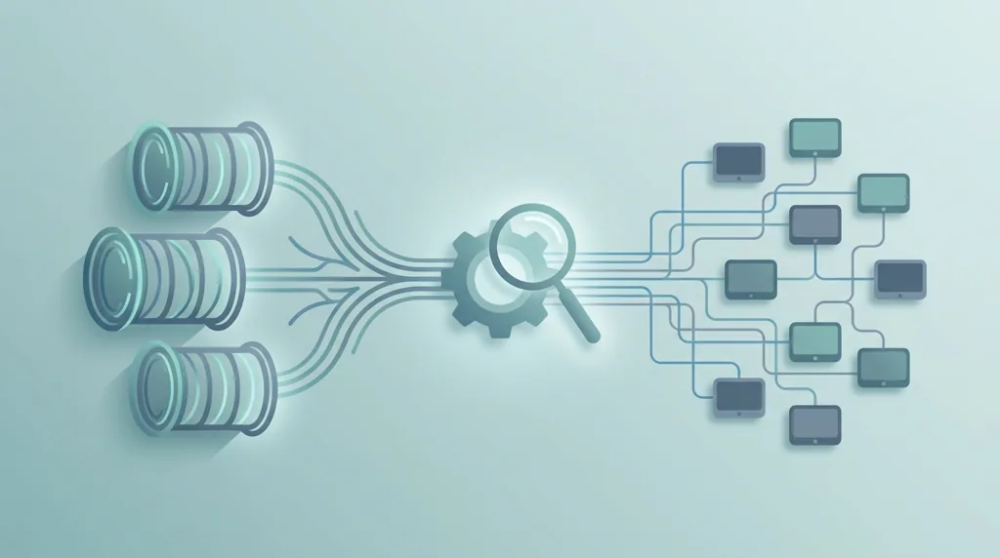
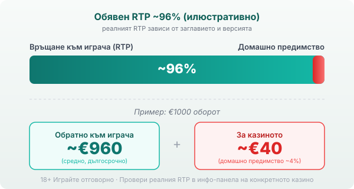

Byline: Editorial Team | Market: BG — provider-hub guide (neutral voice, published Георги Тодоров)

# iSoftBet: профил на доставчика, механики и топ слотове

iSoftBet (произнася се „айсофтбет") е лондонско студио за казино софтуер, основано през 2010 г. За повече от десетилетие натрупа каталог от над сто собствени слота и една допълнителна роля, която повечето играчи не виждат: платформа, през която стотици казина зареждат чужди игри. През април 2022 г. компанията беше купена от International Game Technology (IGT) за около €160 млн [VERIFY: точна сума на сделката] и влезе в дигиталното подразделение на групата.

## Кой е iSoftBet и какво прави

iSoftBet прави игрите, но не ги предлага сам на играча. Той е доставчик на софтуер, а казиното е операторът, който приема залозите и държи парите. Ядрото са видео слотовете, работещи изцяло на HTML5, тоест отварят се направо в браузъра на телефона без отделно приложение. Компанията се утвърди навремето и с лицензирани заглавия по филми и сериали, но днешният ѝ разпознаваем почерк са слотовете със заключени респини и купуване на бонуса, а не носталгията по онези брандове.

## Не само игри, а платформа за стотици казина

Освен собствените заглавия iSoftBet държи и агрегационна платформа, наречена GAP (Game Aggregation Platform). През нея едно казино се закача веднъж и получава достъп не само до игрите на iSoftBet, а до хиляди заглавия от десетки други студиа през един-единствен интерфейс. За теб това означава едно: щом видиш игра на iSoftBet в дадено казино, тя често стои редом до стотици чужди слотове, минали през същата платформа. Марката на разработчика под играта е едно, а къде и при какви условия я пускаш е съвсем друго, и второто зависи от оператора.

## Основни механики

Повтарящите се трикове при iSoftBet са няколко. Ultra Bet е режимът за купуване на бонуса: срещу увеличен залог влизаш директно в бонус кръга, без да чакаш scatter символите да паднат. Xpanding Ways разширява начините за печалба по време на игра, а Hold & Win заключва определени символи на екрана и върти останалите барабани наново, докато паднат нови съвпадения. Част от портфолиото ползва и лицензирания механизъм Megaways, при който броят на начините за печалба се мени на всяко завъртане и стига десетки хиляди. Нищо от това не е измислено само от iSoftBet, но подредбата и темпото се пренасят от заглавие на заглавие и правят игрите разпознаваеми.

## Купуването на бонуса не мести математиката

Ultra Bet звучи като пряк път към голямата печалба, затова заслужава трезва сметка. Когато платиш, за да влезеш в бонуса, ти просто купуваш достъп до кръг, който иначе би дошъл на случаен принцип. Средната възвръщаемост на функцията е калкулирана в цената ѝ, така че в дългосрочен план домашното предимство остава там, където си беше. Разликата е в темпото и в риска за банкрола ти: плащаш голяма сума наведнъж за нещо, което може да не се изплати. Ако избереш да го ползваш, прави го със същия лимит, с който сядаш на всяка друга игра.

## Топ заглавия и техните RTP

Няколко слота направиха студиото разпознаваемо: Book of Immortals, Hot Spin, Twister Wilds, Aztec Gold Megaways, Queen of Wonderland Megaways. Обявените им RTP обикновено се въртят около 96%, тоест на нивото на модерния слот. Book of Immortals например се дава с 96.31% (5 барабана, 20 линии, ниска до средна волатилност). При заглавията с Megaways числото често е конфигурируемо: Queen of Wonderland Megaways се сочи в диапазона 96.03–96.86% според версията [VERIFY: точен обявен RTP по източник]. Разминаването не е грешка. iSoftBet, като повечето доставчици, предлага на операторите няколко версии на едно заглавие с различен RTP, и казиното избира коя да пусне.

## RTP: проверявай, не приемай

Обявените RTP стойности на iSoftBet обикновено са около 96%, което при €1000 оборот означава средно връщане от порядъка на €960 в дългосрочен план и около €40 за казиното. Заради версиите с намален RTP една и съща игра може да ти връща различен процент в различни казина. Затова в [методологията ни](/kak-ocenyavame/) гледаме реалния RTP на конкретното казино вместо рекламния. Отвори инфо-панела на играта, намери реда за RTP и виж кое число работи там, преди да заложиш.

*Илюстративен пример при обявен RTP ~96%: €1000 оборот връща средно ~€960, ~€40 остават за казиното. Реалният RTP зависи от заглавието и от версията, която операторът е пуснал, затова се проверява в инфо-панела.*

## Демо режим, лимити и реален RTP

[Слот игрите](/slot-igri/) на iSoftBet обикновено имат демо режим, в който да усетиш темпото и волатилността, без да залагаш, а ако искаш да сравниш доставчици един до друг, [прегледът ни на доставчиците](/blog/games-providers/) стъпва на същата логика. Задай си лимит за загуба и за време преди първото завъртане и провери реалния RTP на конкретното казино, вместо да се доверяваш на числото от промоционалната страница. 18+ Хазартът може да пристрасти. Играйте отговорно. Ако усетите, че играта излиза извън контрол, вижте [инструментите за отговорна игра](/otgovorna-igra/).

---

**Георги Тодоров**
Публикувано: 22.09.2026 · Последна редакция: 22.09.2026

[About Всички Казина boilerplate]

**Отговорна игра.** 18+ Хазартът може да пристрасти. Играйте отговорно. Ако усетиш, че играта излиза извън контрол или искаш да я ограничиш, виж [инструментите за отговорна игра](/otgovorna-igra/) и възможността за самоизключване чрез националния регистър на уязвимите лица към НАП (подава се писмено само от засегнатото лице). Национална информационна линия за наркотиците, алкохола и хазарта („Солидарност") 0888 99 18 66, делнични дни 10:00–17:00.

**Разкриване на партньорства.** Всички Казина съдържа партньорски (афилиейт) връзки; когато отвориш оферта през такава връзка, това може да финансира сайта, без да променя цената за теб и без да влияе на оценките ни. От 1 август 2026 г. дейността на афилиейт оператори в България се лицензира съгласно Закона за държавния бюджет за 2026 г. (ДВ, бр. 69 от 31.07.2026 г.). Всички Казина е подало заявление за лиценз пред Националната агенция по приходите и очаква издаването му.
