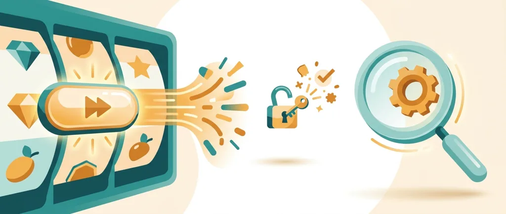
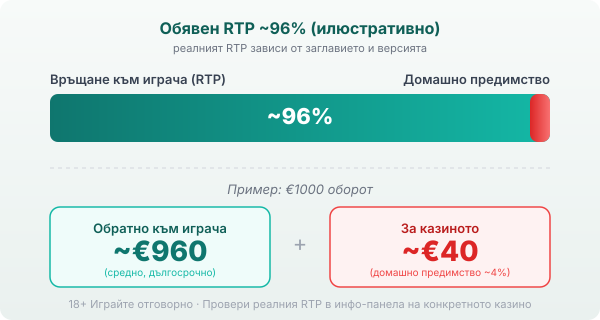

Byline: Editorial Team | Market: BG — provider-hub guide (neutral voice, published Георги Тодоров)

# Kalamba Games: профил на доставчика, механики и топ слотове

Kalamba Games (произнася се „каламба") е студио за видео слотове, основано в края на 2016 г. от Стив Кътлър и Алекс Коен. Централата е в Малта, а разработката се прави в студио в Краков, Полша. Каталогът е сравнително малък, около деветдесет заглавия [VERIFY: точен брой игри], но студиото е разпознаваемо с една своя функция повече, отколкото с обема: HyperBonus, режимът за директно купуване на бонуса.

## Кой е Kalamba и какво прави

Kalamba прави игрите, но не ги предлага сам на играча. Той е доставчик на софтуер, а казиното е операторът, който приема залозите и държи парите. Портфолиото е тясно и целенасочено: само видео слотове, плюс няколко по-нови крас игри. Игри на живо с дилъри, RNG маси и наземни автомати няма, тоест ако търсиш рулетка със студио, тя идва от друг доставчик. Всичко върви на HTML5 и се отваря направо в браузъра.

## HyperBonus и другите фирмени механики

Запазената марка на Kalamba е HyperBonus: срещу увеличен залог влизаш директно в бонус кръга, вместо да чакаш scatter символите да паднат сами. При част от заглавията можеш да избереш и нивото на волатилност на купения бонус, тоест колко рисков да е кръгът, за който плащаш. До него стоят K-Cash, вариант на Hold & Win със заключени символи и фиксирани джакпоти, и K-Boost, метър над барабаните, който се пълни по време на игра и надгражда безплатните завъртания. Тези функции се повтарят от заглавие на заглавие и правят слотовете на студиото разпознаваеми, дори темите да са различни.

## HyperBonus не побеждава казиното

Купуването на бонуса изглежда като пряк път към голямата печалба, но сметката е трезва. Когато платиш за HyperBonus, купуваш достъп до кръг, който иначе би дошъл на случаен принцип, а средната възвръщаемост на този кръг вече е калкулирана в цената му. Затова дори версия с по-висок обявен RTP не ти дава преимущество: по-високият процент е за сметка на голямия залог, който внасяш наведнъж. При Blazing Bull например HyperBonus се предлага на няколко нива с обявен RTP от порядъка на 97.6% до 98% [VERIFY: точни стойности по ниво и източник], но за да влезеш, залагаш кратно на обичайната си ставка. Домашното предимство не изчезва, просто мени формата си. Ако ползваш функцията, дръж я в рамките на същия лимит, с който сядаш на всяка друга игра.

## Топ заглавия и техните RTP

Няколко слота направиха студиото разпознаваемо: Blazing Bull, Goldaur Guardians, Joker Max, Bison Battle, Double Joker. Обявените им базови RTP обикновено са около 96%, тоест на нивото на модерния слот, а някои заглавия стоят по-нагоре. Double Joker се дава в диапазона 96.96–97.21% според версията [VERIFY: точен обявен RTP по източник]. Разминаването не е грешка. Kalamba, като повечето доставчици, предлага на операторите няколко версии на едно заглавие с различен RTP, и казиното избира коя да пусне. Максималните печалби варират силно: Blazing Bull се сочи с таван около 6480x залога, а по-новите заглавия стигат и над 10000x, което е знак за висока волатилност, дълги сухи серии и рядко големи попадения.

## RTP: проверявай, не приемай

Обявените базови RTP стойности на Kalamba обикновено са около 96%, което при €1000 оборот означава средно връщане от порядъка на €960 в дългосрочен план и около €40 за казиното. Заради версиите с различен RTP една и съща игра може да ти връща различен процент в различни казина, а купеният HyperBonus е просто още една версия с друга цена. Затова в [методологията ни](/kak-ocenyavame/) гледаме реалния RTP на конкретното казино вместо рекламния. Точното число за версията, която играеш, стои в инфо-панела на самата игра.

*Илюстративен пример при обявен RTP ~96%: €1000 оборот връща средно ~€960, ~€40 остават за казиното. Реалният RTP зависи от заглавието и от версията (включително купения HyperBonus), затова се проверява в инфо-панела.*

## Демо режим, лимити и реален RTP

[Слот игрите](/slot-igri/) на Kalamba обикновено имат демо режим, в който да усетиш темпото и волатилността, без да залагаш, а ако искаш да сравниш доставчици един до друг, [прегледът ни на доставчиците](/blog/games-providers/) стъпва на същата логика. Демото показва как се държи играта; реалният RTP на конкретното казино казва колко ти струва тя в дългосрочен план. Преди първото завъртане си задай лимит за загуба и за време. 18+ Хазартът може да пристрасти. Играйте отговорно. Ако усетите, че играта излиза извън контрол, вижте [инструментите за отговорна игра](/otgovorna-igra/).

---

**Георги Тодоров**
Публикувано: 22.09.2026 · Последна редакция: 22.09.2026

[About Всички Казина boilerplate]

**Отговорна игра.** 18+ Хазартът може да пристрасти. Играйте отговорно. Ако усетиш, че играта излиза извън контрол или искаш да я ограничиш, виж [инструментите за отговорна игра](/otgovorna-igra/) и възможността за самоизключване чрез националния регистър на уязвимите лица към НАП (подава се писмено само от засегнатото лице). Национална информационна линия за наркотиците, алкохола и хазарта („Солидарност") 0888 99 18 66, делнични дни 10:00–17:00.

**Разкриване на партньорства.** Всички Казина съдържа партньорски (афилиейт) връзки; когато отвориш оферта през такава връзка, това може да финансира сайта, без да променя цената за теб и без да влияе на оценките ни. От 1 август 2026 г. дейността на афилиейт оператори в България се лицензира съгласно Закона за държавния бюджет за 2026 г. (ДВ, бр. 69 от 31.07.2026 г.). Всички Казина е подало заявление за лиценз пред Националната агенция по приходите и очаква издаването му.
