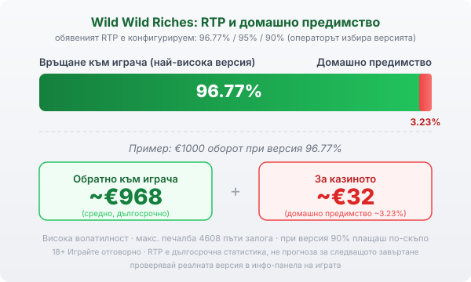

Title tag: Wild Wild Riches: RTP, Money Collect и как се играе
Meta description: Как работи Wild Wild Riches на Pragmatic Play: ирландска тема, мрежа 3-3-4-4-4 с 576 начина, Money Collect с гърне монети, джакпоти 50x/100x/500x, конфигурируем RTP 96.77% и висока волатилност.

---

# Wild Wild Riches: RTP, Money Collect и как се играе

Въпреки името си Wild Wild Riches няма нищо общо с Дивия запад. Слотът на Pragmatic Play излезе през 2020 г. и стъпва на ирландския фолклор: детелини, подкови и гърне със злато в края на дъгата. Визията е закачлива, но под нея работи високоволатилна математика, която е добре да разбереш, преди да заложиш.

## Как е устроена играта

Wild Wild Riches няма класически линии и няма правоъгълна мрежа. Барабаните са пет, но с различен брой позиции: три, три, четири, четири и четири реда, което дава 576 начина за печалба. Печалба се образува, когато еднакви символи паднат на съседни барабани отляво надясно, без значение на кой ред точно стоят. Тоест значение има кои барабани са покрити, а не по коя линия минават символите. Заради тази несиметрична подредба средните и десните барабани носят повече позиции и точно там се случват по-интересните неща.

## Money Collect и джакпотите

Сърцето на играта е функцията Money Collect. По барабани три, четири и пет падат символи гърне със злато, всеки от които носи парична стойност между 1 и 25 пъти залога. Тези стойности не се изплащат сами по себе си: за да ги прибереш, трябва да падне поне по един wild символ едновременно на първия и втория барабан. Когато това стане, функцията събира всички стойности на гърнетата, които са на екрана в момента. Тук се намесват и множителите: символи 2x, 3x и 5x могат да паднат на петия барабан и умножават събраната сума.

Освен паричните стойности, на петия барабан могат да паднат и три фиксирани джакпота: Mini на стойност 50 пъти залога, Major 100 пъти и Mega 500 пъти. Те звучат едро, но падат рядко и са таван, а не очакване. По-важното за сметката ти е, че цялата верига трябва да се подреди: гърнета на екрана, wild на първите два барабана, за да задействат събирането, и с късмет множител отгоре. Затова повечето завъртания минават без нищо, а стойността на играта се крие в отделните по-едри попадения.

## Безплатните завъртания

Играта има и рунд безплатни завъртания: десет на брой. Отключват се, когато wild символ падне на първите два барабана и заедно с това бонус символ се появи на третия. По време на рунда механиката е същата като в основната игра, но с повече шансове функцията Money Collect да се задейства. Както при всеки такъв рунд, резултатът може да е скромен, ако гърнетата и множителите не дойдат, така че и тук важи логиката на високата волатилност.

## RTP и волатилност

Обявеният RTP на Wild Wild Riches не е едно число. Играта се доставя в няколко версии: 96.77%, 95% и 90%, а операторът избира коя да пусне. Разликата не е козметична: при версия 90% плащаш чувствително по-скъпо за същата игра. Коя точно работи при теб проверяваш в инфо-панела на играта в конкретното казино, защото именно там пише реалната стойност. [VERIFY: конкретната RTP версия при целевия оператор — 96.77% / 95% / 90% през инфо-панела на играта]

За да е нагледно, ето сметка на най-високата обявена версия. При RTP 96.77% домашното предимство е около 3.23%. На €1000 оборот това значи средно връщане от порядъка на €968 в дългосрочен план и около €32 за казиното. Числото е статистика над много завъртания, не прогноза за следващото. По-съществена от процента тук е волатилността: тя е висока, тоест печалбите са редки, но потенциално големи. На практика това значи дълги серии без печалба, прекъсвани от отделни по-едри попадения, и банка, която трябва да издържи на тези сухи периоди. Максималната печалба в играта е 4608 пъти залога, което е таван, а не цел.

*Обявеният RTP е конфигурируем (96.77% / 95% / 90%), операторът избира версията. При най-високата (96.77%) и €1000 оборот средно ~€968 се връщат на играча, ~€32 остават за казиното (домашно предимство ~3.23%). Волатилността е висока, а максималната печалба е 4608 пъти залога.*

## Ante bet: повече честота, не по-добри шансове

Wild Wild Riches предлага опция ante bet, която вдига залога с 20% и приблизително удвоява шанса да задействаш функцията. Изкушаващо е, но е важно да се разбере какво точно купуваш: по-чест достъп до бонус механиката, не по-добро дългосрочно домашно предимство. Средният процент на връщане си остава същият, просто плащаш повече на завъртане, за да стигаш по-често до вариацията. Дали опцията изобщо е налична зависи от пазара и от конкретния оператор, затова провери дали присъства в самата игра, преди да разчиташ на нея.

## Преди да завъртиш

[Слот игрите](/slot-igri/) на Pragmatic Play обикновено имат демо режим, в който да усетиш темпото и волатилността, без да залагаш, а ако искаш да сравниш доставчици, [прегледът ни на доставчиците](/blog/games-providers/) стъпва на същата логика. Различните [ротативки](/kazino-igri/rotativki/) се сравняват най-честно по RTP, затова в [методологията ни](/kak-ocenyavame/) гледаме реалния процент на конкретното казино, а не рекламния. Задай си лимит за загуба и за време преди първото завъртане, особено при толкова волатилна игра. 18+ Хазартът може да пристрасти. Играйте отговорно. Ако усетите, че играта излиза извън контрол, вижте [инструментите за отговорна игра](/otgovorna-igra/).

---

**Георги Тодоров**
Публикувано: 22.09.2026 · Последна редакция: 22.09.2026

[About Всички Казина boilerplate]

**Отговорна игра.** 18+ Хазартът може да пристрасти. Играйте отговорно. Ако усетиш, че играта излиза извън контрол или искаш да я ограничиш, виж [инструментите за отговорна игра](/otgovorna-igra/) и възможността за самоизключване чрез националния регистър на уязвимите лица към НАП (подава се писмено само от засегнатото лице). Национална информационна линия за наркотиците, алкохола и хазарта („Солидарност") 0888 99 18 66, делнични дни 10:00–17:00.

**Разкриване на партньорства.** Всички Казина съдържа партньорски (афилиейт) връзки; когато отвориш оферта през такава връзка, това може да финансира сайта, без да променя цената за теб и без да влияе на оценките ни. От 1 август 2026 г. дейността на афилиейт оператори в България се лицензира съгласно Закона за държавния бюджет за 2026 г. (ДВ, бр. 69 от 31.07.2026 г.). Всички Казина е подало заявление за лиценз пред Националната агенция по приходите и очаква издаването му.
