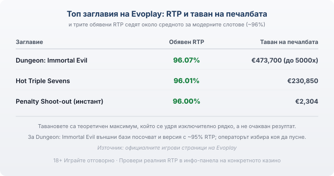

Title tag: Evoplay: профил на доставчика, механики и топ слотове
Meta description: Кой е Evoplay, какви игри прави и кои са топ слотовете му. RTP около средното, защо сертификатът не е предимство и как да проверите реалния процент.

---

# Evoplay: профил на доставчика, механики и топ слотове

Ако си пускал слот, в който героят се бие с чудовища в подземие, или бърза игра с дузпи, вероятно си играл заглавие на Evoplay, без да гледаш кой го е направил. Компанията е сравнително млада и заложи на нещо различно от плодовете и седмиците: 3D графика, RPG елементи, игри, които приличат повече на видеоигра, отколкото на барабани. Под ефектната обвивка обаче работи същата математика като навсякъде другаде.

## Кой е Evoplay и откъде идва

Evoplay е основана през 2017 г. и днес държи офиси в Лимасол и Варшава с екип от над 200 души. За разлика от производителите, които правят слотове от десетилетия, тя тръгна от идеята игрите да изглеждат и да се играят като модерни видеоигри. Затова каталогът ѝ е пълен с герои, сюжети и триизмерни сцени, а не с класическите редици плодове.

## Не само слотове

Ядрото на Evoplay са видео слотовете, много от тях в 3D, с имена като Necromancer, Star Guardians и Adrenaline Rush. До тях стоят инстант игрите, бързите заглавия от рода на Penalty Shoot-out, при които залагаш и виждаш резултата за секунди, плюс маси, класически игри, бинго и лотарийни продукти. Игровите каталози изброяват над 250 заглавия в над 1000 казина и 40+ регулирани пазара, а самата компания посочва България сред пазарите, на които присъства. Точният брой игри се разминава между източниците, така че го приемай като порядък, не като точно число.

## Какво значат сертификатите (и защо не са лиценз за игра)

Evoplay прави игрите, но не ги предлага сам. Той е доставчик на софтуер, а казиното е операторът, който приема залозите и държи парите. Игрите му минават през независими тестови лаборатории като BMM Testlabs, eCOGRA и QUINEL, а компанията притежава доставчически признания и разрешения за регулирани пазари: Recognition Notice от малтийския регулатор, разрешение от румънския ONJN, одобрение за Онтарио и лиценз от регулатора на Кюрасао. Всичко това е B2B ниво, не казино лиценз. Тестът потвърждава, че генераторът на случайни числа работи коректно и че играта спазва обявените си правила. Тези правила са писани в полза на казиното и домашното предимство си остава вградено; проверката гарантира честна игра спрямо тях, не че печелиш по-често.

## 3D обвивка, стара математика

Ефектите лесно подвеждат. Dungeon: Immortal Evil няма линии в обичайния смисъл, а система за плячка (Loot System), в която обръщаш оръжия, броня и отвари, докато напредваш през нива и се биеш с боса. Penalty Shoot-out пък те кара да се прицелваш в ъгъла на вратата, сякаш стрелбата зависи от теб. И в двата случая усещането за умение е част от дизайна, но изходът се определя от генератора на случайни числа, точно както при завъртане на барабан. Прицелването и битката са презентация върху същата случайност.

## Топ заглавия и техните числа

Три заглавия дават добра представа за подхода. Dungeon: Immortal Evil е 3D слот от февруари 2020 г. с обявен RTP 96.07%, висока към средна волатилност и таван на печалбата €473,700, което отговаря на до 5000 пъти залога в решаващата битка. Hot Triple Sevens от декември 2019 г. е обратното по дух: класически слот с 3 барабана и 5 линии, RTP 96.01% и таван €230,850, в който символът 777 е wild и три такива носят x500, а безплатните завъртания умножават печалбите по три. Penalty Shoot-out от май 2020 г. е инстант игра с RTP 96.00% и много по-нисък таван, €2,304.

*Обявени RTP и тавани на печалбата на три заглавия на Evoplay. И трите RTP седят около средното за модерните слотове (~96%); тавановете са рядък теоретичен максимум, не очакван резултат. Източник: официалните игрови страници на Evoplay.*

Обявените RTP на трите седят плътно около 96%, тоест горе-долу на средното за модерните слотове, а не под него като някои по-стари класики. Има и уловка при версиите: за Dungeon: Immortal Evil външни бази посочват билд с около 95%, а операторът избира коя версия да пусне.

## Макс. печалба и волатилност: чети наситно

Числата €473,700 и 5000x изглеждат внушително, но са теоретичен таван, който се удря изключително рядко и няма нищо общо с очаквания резултат от една сесия. По-важна за портфейла е волатилността. Висока към средна означава дълги серии без съществена печалба, прекъсвани от редки по-големи удари. Ако бюджетът ти е малък, такава игра го изяжда на пресекулки и рядко доживяваш големия изход. Затова тавановете са реклама, а волатилността е това, което усещаш реално.

## RTP: проверявай, не приемай

Една и съща игра може да ти връща различен процент в различни казина, затова в [методологията ни](/kak-ocenyavame/) гледаме реалния RTP на конкретното казино, а не рекламния. Отвори инфо-панела на играта, намери реда за RTP и виж кое число работи там, преди да заложиш. Ако версията е с чувствително по-нисък процент, плащаш по-скъпо за същата игра и си струва да потърсиш казино с по-добрия вариант.

## Демо, лимити и реален RTP

[Слот игрите](/slot-igri/) на Evoplay обикновено имат демо режим, в който да усетиш темпото и волатилността, без да залагаш, а различните [ротативки](/kazino-igri/rotativki/) се сравняват най-честно точно по RTP. Ако искаш да видиш доставчиците един до друг, [прегледът ни на доставчиците](/blog/games-providers/) стъпва на същата логика. Задай си лимит за загуба и за време преди първото завъртане и провери реалния процент на конкретното казино. 18+ Хазартът може да пристрасти. Играйте отговорно. Ако усетите, че играта излиза извън контрол, вижте [инструментите за отговорна игра](/otgovorna-igra/).

---

**Георги Тодоров**
Публикувано: 23.09.2026 · Последна редакция: 23.09.2026

[About Всички Казина boilerplate]

**Отговорна игра.** 18+ Хазартът може да пристрасти. Играйте отговорно. Ако усетиш, че играта излиза извън контрол или искаш да я ограничиш, виж [инструментите за отговорна игра](/otgovorna-igra/) и възможността за самоизключване чрез националния регистър на уязвимите лица към НАП (подава се писмено само от засегнатото лице). Национална информационна линия за наркотиците, алкохола и хазарта („Солидарност") 0888 99 18 66, делнични дни 10:00–17:00.

**Разкриване на партньорства.** Всички Казина съдържа партньорски (афилиейт) връзки; когато отвориш оферта през такава връзка, това може да финансира сайта, без да променя цената за теб и без да влияе на оценките ни. От 1 август 2026 г. дейността на афилиейт оператори в България се лицензира съгласно Закона за държавния бюджет за 2026 г. (ДВ, бр. 69 от 31.07.2026 г.). Всички Казина е подало заявление за лиценз пред Националната агенция по приходите и очаква издаването му.
