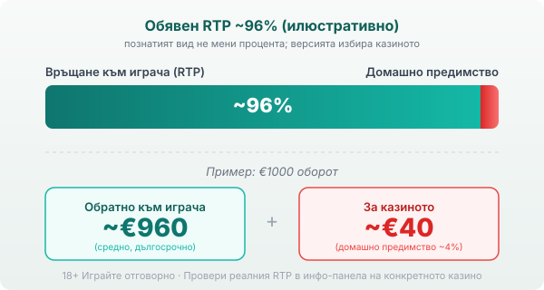

Title tag: Fazi Interactive: профил, механики и топ слотове
Meta description: Кой е Fazi Interactive, какви игри прави сръбският доставчик и кои са топ слотовете му. Защо RTP варира по казина и как да го проверите.

---

# Fazi Interactive: профил на доставчика, механики и топ слотове

Класическите слотове с плодове и седмици на Fazi често минават за заглавия на EGT в българските казина, но сръбският производител от Ниш носи собствена математика и дълъг стаж от наземните зали. Ретро изгледът не подсказва нищо за процентите под него.

## Кой е Fazi и какво прави

Fazi (Fazi d.o.o., с онлайн подразделение Fazi Interactive) е основана през 1991 г. в Ниш, Сърбия. Първите ѝ десетилетия минават в наземния бизнес: електронни рулетки, системи за управление на казина и слот машини за залите в Югоизточна Европа. По собствени данни компанията е продала над 2500 конфигурации електронни рулетки и държи около 85% от пазара в Сърбия. Онлайн частта тръгва по-късно, през 2013 г., с игри изцяло на HTML5 за десктоп и мобилни устройства. Днес Fazi поддържа офиси в Ниш и Белград, предлага над 150 онлайн заглавия (различните каталози изброяват между 150 и 260) и работи в над 50 пазара. Освен видео слотове прави рулетка, видео покер и игри със зарове, плюс физическо оборудване за наземните зали. Наземната история си личи в самите игри: класически изгледи с плодове и семпли барабани вместо тежки анимации и сложни бонус механики.

## Познатото не прави математиката по-добра

Слотът прилича на класика на EGT, затова мнозина му вярват повече, отколкото на непознато заглавие. Fazi обаче има собствено семейство от заглавия като Wild Hot 40, Golden Crown и Very Hot 5: на пръв поглед напомнят класиките на EGT/Amusnet, но са игри на съвсем друго студио, с коренно различна математика.

Fazi е известна и с джакпот слотовете си. При тях има три нива, наречени Gold, Diamond и Platinum, а джакпотът може да падне на случаен принцип след кое да е завъртане, независимо от резултата на барабаните. Малка част от всеки залог отива в общия пул. Този пул се пълни от малка част от парите на всички играчи, за да изплати една голяма печалба, без да сваля домашното предимство на играта. По-големите залози обикновено повишават шанса да се включи, но моментът остава случаен и рядък.

## Лиценз и сертификати: какво всъщност значат

Fazi работи на B2B модел: прави софтуера, а казиното-оператор приема залозите и държи парите. Компанията държи сертификати за качество и информационна сигурност (ISO 9001:2015 и ISO 27001:2022) и доставчически лицензи за регулирани пазари като Малта, Румъния, Гърция, Хърватия и Италия. Игрите ѝ се тестват за тези пазари, а тестът потвърждава, че генераторът на случайни числа работи коректно и играта спазва обявените си правила. Сертификацията гарантира честност спрямо правилата, но самите правила държат домашното предимство вградено в полза на казиното. Лицензът, който защитава теб като играч, е този на самото казино от НАП, а не сертификатът на доставчика.

## RTP: проверявай, не приемай

Обявените RTP на слотовете на Fazi се движат основно около 95-97%, но разликите между отделните заглавия и версии са големи. В един публичен списък едни титли връщат близо 97%, докато други падат до 93% и по-ниско. Едно и също заглавие може да върти различна версия в различни казина, защото операторът избира коя да пусне.

При обявен RTP около 96% всеки €1000 оборот се връща средно към €960 в дълъг план, а около €40 сядат за казиното. Това е средна стойност за милиони завъртания и за една вечер спокойно можеш да си далеч над или далеч под нея.

*Илюстративен пример при обявен RTP ~96%: €1000 оборот връща средно ~€960, ~€40 остават за казиното. Реалният RTP зависи от заглавието и версията, която операторът е пуснал, затова се проверява в инфо-панела.* Затова в [методологията ни](/kak-ocenyavame/) гледаме реалния RTP на конкретното казино, а не рекламния. Отвори инфо-панела на играта, намери реда за RTP и виж коя версия работи там, преди да заложиш.

## Демо, лимити и реален RTP

[Слот игрите](/slot-igri/) на Fazi обикновено имат демо режим, в който да усетиш темпото и волатилността, без да залагаш реални пари. При повечето заглавия волатилността е ниска до средна, тоест по-чести, но по-малки печалби, което е въпрос на бюджет и търпение. За да видиш как математиката на Fazi се съпоставя с други студиа, виж [прегледа ни на доставчиците](/blog/games-providers/). Задай си лимит за загуба и за време преди първото завъртане, играй с пари, които можеш да загубиш изцяло, и провери реалния процент, преди да приемеш познатата игра за подарък.

18+ Хазартът може да пристрасти. Играйте отговорно. Ако усетите, че играта излиза извън контрол, вижте [инструментите за отговорна игра](/otgovorna-igra/).

---

**Георги Тодоров**
Публикувано: 23.09.2026 · Последна редакция: 23.09.2026

[About Всички Казина boilerplate]

**Отговорна игра.** 18+ Хазартът може да пристрасти. Играйте отговорно. Ако усетиш, че играта излиза извън контрол или искаш да я ограничиш, виж [инструментите за отговорна игра](/otgovorna-igra/) и възможността за самоизключване чрез националния регистър на уязвимите лица към НАП (подава се писмено само от засегнатото лице). Национална информационна линия за наркотиците, алкохола и хазарта („Солидарност") 0888 99 18 66, делнични дни 10:00–17:00.

**Разкриване на партньорства.** Всички Казина съдържа партньорски (афилиейт) връзки; когато отвориш оферта през такава връзка, това може да финансира сайта, без да променя цената за теб и без да влияе на оценките ни. От 1 август 2026 г. дейността на афилиейт оператори в България се лицензира съгласно Закона за държавния бюджет за 2026 г. (ДВ, бр. 69 от 31.07.2026 г.). Всички Казина е подало заявление за лиценз пред Националната агенция по приходите и очаква издаването му.
