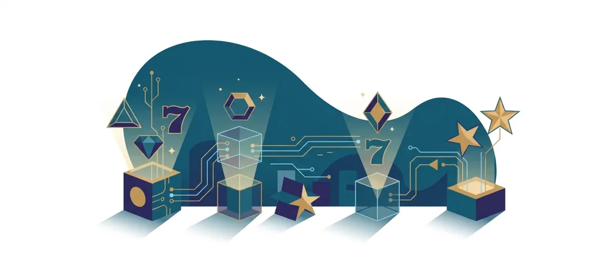

Title tag: GameArt: профил на доставчика, механики и топ слотове
Meta description: Кой е GameArt, какви слотове и механики прави и кои са известните му заглавия. Защо сертификатът не маха домашното предимство и защо RTP се проверява в инфо-панела.

---

# GameArt: профил на доставчика, механики и топ слотове

GameArt е разработчик на казино софтуер, основан около 2013 г. [VERIFY], с централен офис в Малта и екипи за дизайн и разработка в Словения, Сърбия и Италия. Игрите му се срещат в много български онлайн казина, обикновено без играчът да се замисля кой ги е направил. GameArt не е казино, а доставчик, който продава заглавията си на оператори.

## Кой стои зад игрите

GameArt е B2B компания. Това значи, че не приема залози и не държи твоите пари, а разработва слотове и ги лицензира на онлайн и наземни оператори в регулирани пазари. За няколко години порасна от малък екип до познато име в бранша, а каталогът му надхвърля 130 заглавия [VERIFY], като различни бази данни изброяват и над 200. Кой точен брой ще видиш зависи от казиното и от това колко от портфолиото е интегрирало. Освен самите игри GameArt дава на операторите и система за управление, отчети и инструменти за бонуси, но всичко това е насочено към казиното, не към играча.

## Не само класически ротативки

Основата на GameArt са HTML5 слотовете, оптимизирани за телефон, таблет и десктоп. Темите се въртят около познати за жанра мотиви: египетски и азиатски сюжети, митология, плодове в класически стил и приказни светове. Освен обикновените заглавия компанията прави и игри с многостепенни джакпоти, тематични серии и по няколко нови слота месечно. За оператора това значи постоянно ново съдържание, а за теб, че каталогът се обновява често и е лесно да ти попадне поредното непознато заглавие от същия доставчик. Разнообразието от теми обаче не мени основната логика на игрите, а само облеклото им.

## Какво значат сертификатите

GameArt е доставчик, а не оператор, затова говорим за сертифициране на игрите, не за лиценз на казино. Заглавията му се тестват от независими лаборатории, които проверяват генератора на случайни числа и потвърждават, че обявеният RTP отговаря на реалната математика на играта. Практическият смисъл е ограничен: сертификатът гарантира, че играта е честна спрямо собствените си правила, не че тези правила са в твоя полза. Домашното предимство си остава вградено, а тестът просто потвърждава, че то е точно такова, каквото пише. Голям или известен доставчик не подобрява шансовете ти, а самото присъствие на сертификат не е причина да залагаш повече.

## Основни слот механики

GameArt използва няколко повтарящи се механики. Уайлд символите заместват другите и често идват в разширен или залепващ (sticky) вариант, който остава на барабаните за няколко завъртания. Множителите обикновено се появяват в безплатните завъртания и умножават събраното там, а ретригерите могат да удължат бонуса. Част от заглавията са в стил „book", където един символ е едновременно скатер и уайлд и се разширява върху целия барабан. Добавят се респини и по избор gamble игра на червено или черно, която е чисто хвърляне на монета и не мени дългосрочната математика.

## Популярни слот игри на GameArt

Няколко заглавия направиха GameArt разпознаваем. Book of Alchemy е сред по-известните му слотове в стил „book", а Atlantis World, Royal Gems, 88 Riches и Bushido Code се срещат често в каталозите. Част от тях залагат на високата волатилност и на едрите бонуси, които привличат вниманието, но същите тези функции значат и по-редки печалби. Полезно е да ги познаваш, но популярността на едно заглавие говори повече за темата и маркетинга, отколкото за шансовете ти. Известната игра не ти връща повече от другите само защото е известна.

## RTP: проверявай, не приемай

Обявените RTP стойности на слотовете на GameArt обикновено са около 96%, което при €1000 оборот означава средно връщане от порядъка на €960 в дългосрочен план и около €40 за казиното, тоест около 4% домашно предимство. Това е илюстративен пример, а не обещание: реалната стойност се колебае и зависи от конкретното заглавие. Много слотове при това се доставят в няколко версии с различен RTP и операторът избира коя да пусне, така че една и съща игра може да ти връща различен процент в различни казина. Заради това в [методологията ни](/kak-ocenyavame/) гледаме реалния RTP на конкретното казино, а не рекламния. Отвори инфо-панела на играта и провери кое число работи там, преди да заложиш.

*Илюстративен пример при обявен RTP ~96%: €1000 оборот връща средно ~€960, ~€40 остават за казиното. Реалният RTP зависи от заглавието и от версията, която операторът е пуснал, затова се проверява в инфо-панела.*

## Демо режим, лимити и реален RTP

[Слот игрите](/slot-igri/) на GameArt обикновено имат демо режим, в който да видиш механиката и темпото, без да залагаш, а ако искаш да сравниш доставчици, [прегледът ни на доставчиците](/blog/games-providers/) стъпва на същата логика. Задай си лимит за загуба и за време, преди да отвориш която и да е игра, и провери реалния RTP на конкретното казино. 18+ Хазартът може да пристрасти. Играйте отговорно. Ако усетите, че играта излиза извън контрол, вижте [инструментите за отговорна игра](/otgovorna-igra/).

---

**Георги Тодоров**
Публикувано: 23.09.2026 · Последна редакция: 23.09.2026

[About Всички Казина boilerplate]

**Отговорна игра.** 18+ Хазартът може да пристрасти. Играйте отговорно. Ако усетиш, че играта излиза извън контрол или искаш да я ограничиш, виж [инструментите за отговорна игра](/otgovorna-igra/) и възможността за самоизключване чрез националния регистър на уязвимите лица към НАП (подава се писмено само от засегнатото лице). Национална информационна линия за наркотиците, алкохола и хазарта („Солидарност") 0888 99 18 66, делнични дни 10:00–17:00.

**Разкриване на партньорства.** Всички Казина съдържа партньорски (афилиейт) връзки; когато отвориш оферта през такава връзка, това може да финансира сайта, без да променя цената за теб и без да влияе на оценките ни. От 1 август 2026 г. дейността на афилиейт оператори в България се лицензира съгласно Закона за държавния бюджет за 2026 г. (ДВ, бр. 69 от 31.07.2026 г.). Всички Казина е подало заявление за лиценз пред Националната агенция по приходите и очаква издаването му.
