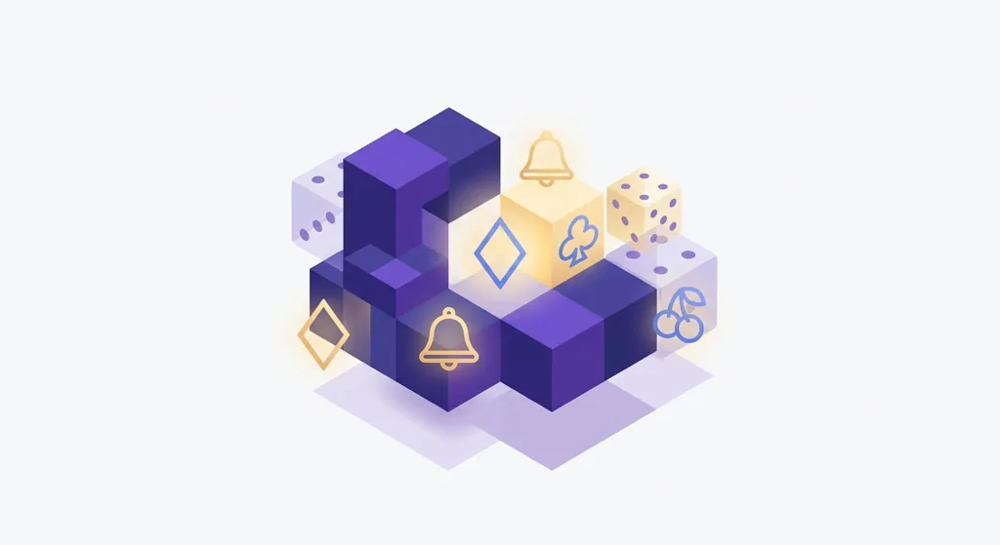
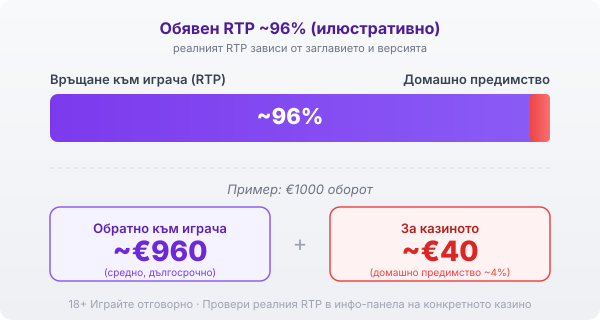

Title tag: Mancala Gaming: профил на доставчика, механики и топ слотове
Meta description: Кой е Mancala Gaming, какви слотове и dice игри прави и кои са топ заглавията. Защо сертификатът не маха домашното предимство и защо RTP се проверява в инфо-панела.

---

# Mancala Gaming: профил на доставчика, механики и топ слотове

Основана през 2019 г. със седалище в Прага, Чехия, Mancala Gaming е сравнително млад студиен доставчик на казино съдържание. Работи като B2B студио: не приема залози и не държи сметки на играчи, а разработва игрите и ги дистрибутира към операторите, най-често през агрегатори като SoftSwiss. Затова заглавията ѝ се срещат в различни казина, без марката на студиото винаги да е на видно място.

## Не само класически слотове

Портфолиото на Mancala Gaming е сравнително компактно за индустрията: над 90 заглавия [VERIFY], разделени грубо на около петдесет традиционни слота и двадесетина dice (зарови) слота, като студиото обявява по няколко нови игри годишно. Dice слотовете са разпознаваемата ниша на доставчика: вместо класически барабани част от игрите използват зарова механика и бонус кръгове с хвърляне на зар. Темите клонят към хорър, приключения и фентъзи, с ярка визия, насочена към по-млада публика. Компактният каталог значи по-малко заглавия от гигантите, но и по-разпознаваем почерк.

Разпространението минава основно през агрегатори и платформи като SoftSwiss, а игрите се интегрират в казината с единен API, така че за оператора е лесно да добави няколко заглавия наведнъж. Една и съща игра на Mancala Gaming може да се появи в различни казина, но условията около нея (бонуси, лимити, дори версията на RTP) зависят от конкретния оператор, а не от студиото.

## Какво значат сертификатите

Като B2B доставчик Mancala Gaming предава игрите си за тестване от независими лаборатории, преди те да тръгнат по регулираните пазари, а самите оператори работят под лицензите на съответните регулатори. Генераторът на случайни числа е проверен и обявеният RTP отговаря на реалната математика на играта. Тестът обаче гарантира, че играта е честна спрямо обявените си правила, не че тези правила са в твоя полза. Домашното предимство си остава вградено; сертификатът просто потвърждава, че то е точно такова, каквото пише.

## Основни слот механики

Mancala Gaming използва няколко повтарящи се механики. Освен заровите бонус кръгове в dice слотовете, каталогът разчита на скатер символи, които задействат безплатни завъртания, на wild символи и на разпадащи се (exploding) символи, при които печелившата комбинация изчезва и отваря място за нови. Част от заглавията ползват печалби на клъстери вместо фиксирани линии, а множителите обикновено се появяват в бонус кръговете и растат на нива с всяко следващо завъртане. Срещат се и картови бонус игри и пъзел механики. Всяка от тези добавки прави играта по-динамична, но не мени обявения RTP на конкретното заглавие.

## Популярни заглавия

Няколко игри направиха студиото разпознаваемо. Braindead е сред най-известните му dice слотове, с хорър темата и бонуса с хвърляне на зар, а Book of Wealth е египетското книга-заглавие в познатия жанр. Crystal Mine, Rage of Zeus, Monster Thieves и Coco Tiki допълват каталога с различни теми и механики. Полезно е да ги познаваш, но популярността на едно заглавие казва повече за темата и за визията, отколкото за шансовете ти.

## RTP: проверявай, не приемай

Обявените RTP стойности при слотовете на Mancala Gaming обикновено са около 95% [VERIFY], тоест малко под средните за индустрията, а волатилността по заглавия често е средна до висока. Ниският RTP значи по-малко средно връщане в дългосрочен план, а по-високата волатилност води до по-редки, но по-едри резултати; двете заедно правят колебанията по-силни, отколкото подсказва самият процент. При обявен RTP около 96% и €1000 общ оборот илюстративната сметка дава средно връщане от порядъка на €960 в дългосрочен план и около €40 за казиното, тоест около 4% домашно предимство. Едно и също заглавие обаче може да се доставя в няколко версии с различен RTP и операторът избира коя да пусне, така че процентът в различни казина може да се разминава. Заради това в [методологията ни](/kak-ocenyavame/) гледаме реалния RTP на конкретното казино, а не рекламния. Отвори инфо-панела на играта и провери кое число работи там, преди да заложиш.

*Илюстративен пример при обявен RTP ~96%: €1000 оборот връща средно ~€960, ~€40 остават за казиното. Реалният RTP зависи от заглавието и от версията, която операторът е пуснал, затова се проверява в инфо-панела.*

## Демо режим, лимити и реален RTP

[Слот игрите](/slot-igri/) на Mancala Gaming обикновено имат демо режим, в който да видиш механиката и темпото, без да залагаш, а ако искаш да сравниш доставчици, [прегледът ни на доставчиците](/blog/games-providers/) стъпва на същата логика. Задай си лимит за загуба и за време, преди да отвориш която и да е игра, и провери реалния RTP на конкретното казино. 18+ Хазартът може да пристрасти. Играйте отговорно. Ако усетите, че играта излиза извън контрол, вижте [инструментите за отговорна игра](/otgovorna-igra/).

---

**Георги Тодоров**
Публикувано: 23.09.2026 · Последна редакция: 23.09.2026

[About Всички Казина boilerplate]

**Отговорна игра.** 18+ Хазартът може да пристрасти. Играйте отговорно. Ако усетиш, че играта излиза извън контрол или искаш да я ограничиш, виж [инструментите за отговорна игра](/otgovorna-igra/) и възможността за самоизключване чрез националния регистър на уязвимите лица към НАП (подава се писмено само от засегнатото лице). Национална информационна линия за наркотиците, алкохола и хазарта („Солидарност") 0888 99 18 66, делнични дни 10:00–17:00.

**Разкриване на партньорства.** Всички Казина съдържа партньорски (афилиейт) връзки; когато отвориш оферта през такава връзка, това може да финансира сайта, без да променя цената за теб и без да влияе на оценките ни. От 1 август 2026 г. дейността на афилиейт оператори в България се лицензира съгласно Закона за държавния бюджет за 2026 г. (ДВ, бр. 69 от 31.07.2026 г.). Всички Казина е подало заявление за лиценз пред Националната агенция по приходите и очаква издаването му.
