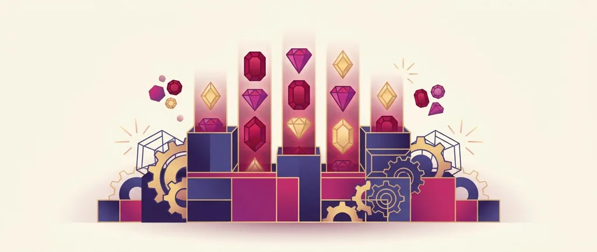

Title tag: RubyPlay: профил на доставчика, механики и топ слотове
Meta description: Кой е RubyPlay, какви слотове и механики прави и кои са разпознаваемите заглавия. Защо сертификатът не маха домашното предимство и защо RTP се проверява в инфо-панела.

---

# RubyPlay: профил на доставчика, механики и топ слотове

RubyPlay е сравнително млад разработчик на онлайн слотове, основан около 2017–2018 г. [VERIFY] и базиран в Гзира, Малта, с второ студио в Киев. Работи на B2B принцип: прави слотовете, но ги пуска през чужди казина, не на собствен сайт. Ако си играл слот с диаманти, които се сливат в по-голяма фигура, вероятно вече си виждал негова игра, без да си обърнал внимание на името.

## Студио, а не казино

RubyPlay работи като екосистема от няколко студия, които правят серии слотове около обща механика. Каталогът стига до десетки заглавия и продължава да расте, но акцентът не е върху количеството, а върху разпознаваемата идея: една игрова система се повтаря в няколко тематични варианта. За оператора това значи готов пакет от свързани игри, а за теб, че различни заглавия често се държат по сходен начин, дори когато визията им е различна. На практика студиото се разпространява чрез трети платформи и агрегатори, затова една и съща игра може да се появи в няколко казина с различни настройки. Затова е добре да гледаш не само името на доставчика, а какво пише в самата игра.

## Какво значат сертификатите

RubyPlay притежава B2B лиценз от Malta Gaming Authority от 2021 г. и дава игрите си за тестване в независими лаборатории. Тук има важна разлика спрямо казино лиценза: това е сертификация на доставчика, която проверява дали генераторът на случайни числа работи коректно и дали обявеният RTP отговаря на реалната математика на играта. Тестът гарантира, че играта е честна спрямо собствените си правила, не че тези правила са изгодни за теб. Домашното предимство си остава вградено в математиката; сертификатът само потвърждава, че то е точно такова, каквото е обявено.

## Основни слот механики

RubyPlay стъпва на няколко повтарящи се механики. Всяка добавя движение на екрана, но всички се въртят в рамките на един и същ обявен RTP. Hold & Win заключва символи с монети и магнити, върти няколко респина и всеки нов символ рестартира брояча, а наградите се събират в края на кръга. При каскадите печелившите символи изчезват и отгоре падат нови, така че едно завъртане понякога носи няколко печалби подред. Immortal Ways отваря повече активни начини за печалба в бонуса. Link It Up, в серията с диаманти, слива съседни символи в една по-голяма фигура. Затова по-често задействана функция средно носи по-малко на всяко пускане.

## Разпознаваеми заглавия

Няколко серии направиха студиото разпознаваемо. Diamond Explosion 7s е сред флагманските му слотове и събира класическите седмици и барове с механиката на сливащите се диаманти. Серията Immortal Ways, с заглавия като Buffalo и Sweet Coin, е изградена изцяло около разширяващите се начини за печалба, а Mad Hit и J Mania покриват респин и джакпот форматите. Популярността на едно заглавие обаче говори повече за темата и маркетинга, отколкото за реалните ти шансове.

## RTP: проверявай, не приемай

Обявените RTP стойности на слотовете на RubyPlay обикновено са около 96%, което при €1000 оборот означава средно връщане от порядъка на €960 в дългосрочен план и около €40 за казиното. Това е илюстративна средна стойност за много завъртания, не обещание за конкретна сесия, а отделните заглавия се движат нагоре или надолу около нея. Част от игрите се доставят и в няколко версии с различен RTP, а операторът избира коя да пусне, така че една и съща игра може да връща различен процент в различни казина. Заради това в [методологията ни](/kak-ocenyavame/) гледаме реалния RTP на конкретното казино, а не рекламния. Отвори инфо-панела на играта и провери кое число работи там, преди да заложиш.

*Илюстративен пример при обявен RTP ~96%: €1000 оборот връща средно ~€960, ~€40 остават за казиното (~4% домашно предимство). Реалният RTP зависи от заглавието и от версията, която операторът е пуснал, затова се проверява в инфо-панела.*

## Демо режим, лимити и реален RTP

[Слот игрите](/slot-igri/) на RubyPlay обикновено имат демо режим, в който да видиш механиката и темпото, без да залагаш, а ако искаш да сравниш доставчици, [прегледът ни на доставчиците](/blog/games-providers/) стъпва на същата логика. Задай си лимит за загуба и за време, преди да отвориш която и да е игра, и провери реалния RTP на конкретното казино. 18+ Хазартът може да пристрасти. Играйте отговорно. Ако усетите, че играта излиза извън контрол, вижте [инструментите за отговорна игра](/otgovorna-igra/).

---

**Георги Тодоров**
Публикувано: 23.09.2026 · Последна редакция: 23.09.2026

[About Всички Казина boilerplate]

**Отговорна игра.** 18+ Хазартът може да пристрасти. Играйте отговорно. Ако усетиш, че играта излиза извън контрол или искаш да я ограничиш, виж [инструментите за отговорна игра](/otgovorna-igra/) и възможността за самоизключване чрез националния регистър на уязвимите лица към НАП (подава се писмено само от засегнатото лице). Национална информационна линия за наркотиците, алкохола и хазарта („Солидарност") 0888 99 18 66, делнични дни 10:00–17:00.

**Разкриване на партньорства.** Всички Казина съдържа партньорски (афилиейт) връзки; когато отвориш оферта през такава връзка, това може да финансира сайта, без да променя цената за теб и без да влияе на оценките ни. От 1 август 2026 г. дейността на афилиейт оператори в България се лицензира съгласно Закона за държавния бюджет за 2026 г. (ДВ, бр. 69 от 31.07.2026 г.). Всички Казина е подало заявление за лиценз пред Националната агенция по приходите и очаква издаването му.
