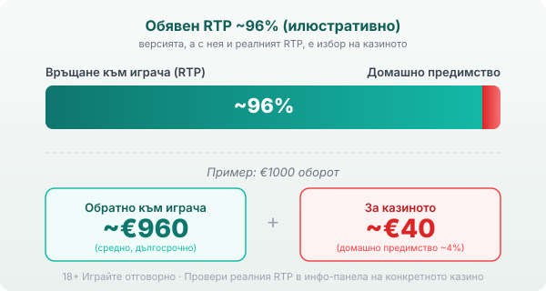

Title tag: Tom Horn Gaming: профил на доставчика и слотовете
Meta description: Кой е Tom Horn Gaming, какви слотове и платформа прави и защо RTP версията е избор на казиното. Провери реалния процент в инфо-панела преди залог.

---

# Tom Horn Gaming: профил на доставчика, механики и топ слотове

Tom Horn Gaming не е име, което играчът вижда на входа на казиното, но заглавията му се въртят в немалко български сайтове. Компанията е B2B доставчик: прави слот игри и същевременно продава на казината платформата, върху която те вървят. Тази двойна роля обяснява защо една и съща игра може да изглежда и да плаща различно от казино на казино.

## Кой е Tom Horn и какво прави (слотове и платформа)

Tom Horn Gaming работи от 2008 г., с корени в Братислава, Словакия, и регистрация в Малта. Ядрото на каталога са ротативки: класически барабани с плодове и седмици, до които стоят по-модерни видео слотове с безплатни завъртания, разширяващи се символи от типа Book of, wild-ове и респини. Компанията предлага и няколко настолни игри и видео покер. Сред по-разпознаваемите заглавия са 243 Crystal Fruits (обявен RTP 96.55%, пуснат през 2017 г.), Book of Spells (96.13%) и Frozen Queen (96%); класическите плодови барабани стоят до по-нови серии с разширяващи се символи и респини. Каталогът е сравнително компактен, около 90 заглавия [VERIFY: точният брой варира по източници]. Второто, което Tom Horn продава, е отдалечен игрален сървър (remote gaming server): самата платформа, върху която казиното пуска игрите. Играта я прави една компания, а залозите приема и парите държи казиното, съвсем друга.

## Версията, която играеш, е избор на казиното

Tom Horn описва математиката на игрите си като конфигурируема: операторът може да поръча версия с различен RTP, а също различни езици и валути. Публично посочваният диапазон стига от около 94% до 98.83% за различните заглавия и версии. Thrones of Persia например се обявява с 98.83%, докато други заглавия седят под 96%. Едно и също заглавие се среща и в различни издания: 243 Crystal Fruits Deluxe се обявява с 95.02% срещу 96.55% за оригинала, тоест по-скъп вариант за играча под познато име. Рекламният RTP на дадена игра не ти казва какво върти конкретното казино, а размерът и репутацията на доставчика не менят това. Коя версия е пусната, решава операторът.

## Лиценз и сертификати: какво всъщност значат

Tom Horn държи доставчически лицензи за регулирани пазари, сред които Малта (от 2016 г.) и Великобритания (от 2017 г.), а игрите му минават през независими лаборатории като Gaming Laboratories International и iTech Labs. Тези тестове проверяват, че генераторът на случайни числа работи честно и че играта плаща според обявените си правила. Сертификатът обаче не значи, че правилата са в твоя полза. Правилата на всеки слот са писани така, че казиното да печели в дългосрочен план, а тестът само потвърждава, че е точно така. Лицензът на доставчика пък не е лицензът, който защитава теб: за българския играч значение има лицензът на самото казино от НАП. Сертификацията на съдържанието и лицензът на оператора са отделни неща.

## RTP: проверявай, не приемай

RTP е дългосрочна статистика върху милиони завъртания и не обещава нищо за конкретната ти сесия. При обявен RTP около 96% всеки €1000 оборот се връща средно към €960, а към €40 остават за казиното. Точното число зависи от версията, а нея я избира операторът.

*Илюстративен пример при обявен RTP ~96%: €1000 оборот връща средно ~€960, ~€40 остават за казиното. Реалният RTP зависи от версията, която операторът е пуснал, затова се проверява в инфо-панела.* Затова отвори инфо-панела на играта, намери реда за RTP и виж коя стойност работи там, преди да заложиш. Ако версията е чувствително по-ниска, плащаш по-скъпо за същата игра и си струва да потърсиш казино с по-добрия вариант. Как претегляме реалния RTP на конкретното казино е описано в [методологията ни](/kak-ocenyavame/).

## Демо, лимити и реален RTP

[Слот игрите](/slot-igri/) на Tom Horn обикновено имат демо режим, в който да усетиш темпото и волатилността, без да залагаш реални пари. Ако искаш да сравниш доставчици един до друг, [прегледът ни на доставчиците](/blog/games-providers/) стъпва на същата логика: гледаме реалния процент, не рекламния. Задай си лимит за загуба и за време преди първото завъртане и провери коя версия ти пуска казиното. По-добрият RTP сваля цената на играта; голямото име на доставчика не. 18+ Хазартът може да пристрасти. Играйте отговорно. Ако усетите, че играта излиза извън контрол, вижте [инструментите за отговорна игра](/otgovorna-igra/).

---

**Георги Тодоров**
Публикувано: 23.09.2026 · Последна редакция: 23.09.2026

[About Всички Казина boilerplate]

**Отговорна игра.** 18+ Хазартът може да пристрасти. Играйте отговорно. Ако усетиш, че играта излиза извън контрол или искаш да я ограничиш, виж [инструментите за отговорна игра](/otgovorna-igra/) и възможността за самоизключване чрез националния регистър на уязвимите лица към НАП (подава се писмено само от засегнатото лице). Национална информационна линия за наркотиците, алкохола и хазарта („Солидарност") 0888 99 18 66, делнични дни 10:00–17:00.

**Разкриване на партньорства.** Всички Казина съдържа партньорски (афилиейт) връзки; когато отвориш оферта през такава връзка, това може да финансира сайта, без да променя цената за теб и без да влияе на оценките ни. От 1 август 2026 г. дейността на афилиейт оператори в България се лицензира съгласно Закона за държавния бюджет за 2026 г. (ДВ, бр. 69 от 31.07.2026 г.). Всички Казина е подало заявление за лиценз пред Националната агенция по приходите и очаква издаването му.
