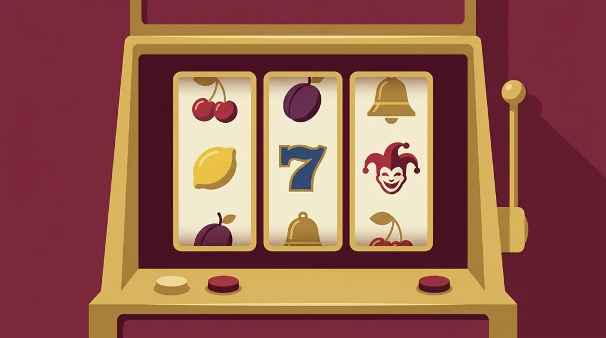
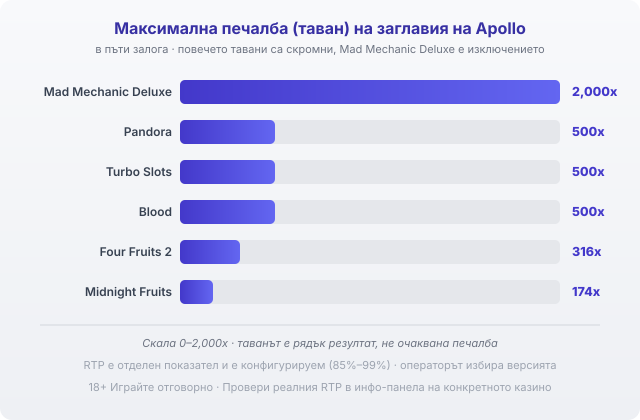

Title tag: Apollo Games: профил на доставчика, механики и топ слотове
Meta description: Кой е Apollo Games (чешкото студио), какви игри прави и кои са топ слотовете. Защо макс печалбите са скромни и как да проверите RTP версията.

---

# Apollo Games: профил на доставчика, механики и топ слотове

Apollo Games прави слотове, които изглеждат така, сякаш са слезли право от машината в залата. Никакъв излишен блясък, плодове и жокери на прости барабани. Чешко студио с наземни корени, което не се преструва на нещо друго.

## Чешко студио с корени в залата

Компанията е основана през 2007 г. в Прага и работи под името Apollo Soft. Първо прави физически машини за залите, така наречените VLT кабинети, а по-късно пренася заглавията си и онлайн. Наземният произход си личи във всичко: игрите ѝ повтарят усещането на автомата от казиното на ъгъла, не на модерния видео слот с кино-интро. Най-силна е у дома, в Чехия, както и в Словакия и Белгия, където този стил още има публика.

## Сертифициран за много пазари, включително България

Apollo посочва, че е сертифициран и лицензиран в над 10 юрисдикции, сред които Чехия, Словакия, Гърция, Латвия, Литва, България, Румъния, Словения, Малта и Италия. Държи и B2B лиценз от малтийския регулатор (MGA/CRP/523/2018, издаден на 29.03.2019 г.), плюс сертификат ISO/IEC 27001 за информационна сигурност.

Всичко това обаче сертифицира софтуера на Apollo, тоест че игрите му са тествани и отговарят на правилата в тези пазари. Не е операторски лиценз и не значи, че конкретно казино с игри на Apollo е вписано в регистъра на НАП. Едното е за производителя на играта, другото за казиното, което я предлага. Ако искаш да си сигурен за конкретен сайт, [как да провериш лиценза на казино](/blog/proverka-licenz-kazino/) е отделна стъпка.

## Съзнателно старомодни

Каталогът е около 100 заглавия [VERIFY: източниците се разминават за точния брой, от около 60 до над 100]. Почти всички са слотове в класически стил: плодове, жокери, седмици, прости мрежи от типа 4×3 или 5×3 с малко линии. Няма да намериш тук мегауейс с милиони начини за печалба или тежки бонус купувания. Това е нарочен избор, а не мързел, и работи за играчи, които искат автомат без наръчник. Любителите на [ротативки с плодове](/blog/rotativki-s-plodove/) ще се почувстват у дома.

## Механики: wild-ове и множители, без прогресиви

При механиките обичайното са разширяващи се или верижни wild-ове, които покриват символи, и множители, които понякога хващат цял барабан. Blood например ползва разширяващ wild с множител на целия барабан, а Pandora верижни wild-ове и мистерии с ключ. Прогресивни джакпоти обаче почти не се срещат при Apollo, при цялата му наземна история. Каквото падне, пада от самата игра, не от общ фонд, който се пълни от всички играчи.

## Топ слотове и техните RTP

Ето обявените стойности на едни от по-известните заглавия на Apollo:

| Заглавие | RTP | Макс печалба |
|---|---|---|
| Mad Mechanic Deluxe | 95% | до 2,000x |
| Pandora | 95% | до 500x |
| Turbo Slots | 95% | до 500x |
| Blood | 92% | до 500x |
| Four Fruits 2 | 92% | до 316x |
| Midnight Fruits | 92% | до 174x |

*Максимални печалби (таван, в пъти залога) на шест заглавия на Apollo. Mad Mechanic Deluxe с 2,000x е изключението; повечето свършват между 174x и 500x. Таванът е рядък резултат, не очаквана печалба.*

Обявените RTP седят под средното за модерните слотове, което често започва от 96%: класиките с плодове са около 92%, а по-новите заглавия стигат до 95%. Таваните на печалбата пък са скромни. Mad Mechanic Deluxe с неговите 2,000x е изключението, докато повечето игри свършват някъде между 174x и 500x. Ако гониш заглавие, което по реклама обещава хиляди пъти залога, Apollo рядко е адресът.

## RTP се настройва между 85% и 99%, проверявай версията

Числата по-горе са стандартни, но не са заковани. Apollo, като доста производители, доставя игрите си с настройваем RTP, а обявеният диапазон стига от 85% чак до 99%. Операторът избира коя версия да качи, така че една и съща игра може да ти връща 95% в едно казино и доста по-малко в друго. В [методологията ни](/kak-ocenyavame/) затова гледаме реалния процент на конкретния сайт. Отвори инфо-панела на играта и виж кое число работи там, преди да заложиш; при разлика от няколко пункта плащаш чувствително повече за същите барабани.

Демо режимът върши работа, за да усетиш темпото на тези семпли игри без реални пари, а определен предварително лимит за загуба и за време пази сесията ти. Как се подреждат другите студия виж в [прегледа на доставчиците](/blog/games-providers/). 18+ Хазартът може да пристрасти. Играйте отговорно. Ако усетиш, че играта излиза извън контрол, виж [инструментите за отговорна игра](/otgovorna-igra/).

---

**Георги Тодоров**
Публикувано: 24.09.2026 · Последна редакция: 24.09.2026

[About Всички Казина boilerplate]

**Отговорна игра.** 18+ Хазартът може да пристрасти. Играйте отговорно. Ако усетиш, че играта излиза извън контрол или искаш да я ограничиш, виж [инструментите за отговорна игра](/otgovorna-igra/) и възможността за самоизключване чрез националния регистър на уязвимите лица към НАП (подава се писмено само от засегнатото лице). Национална информационна линия за наркотиците, алкохола и хазарта („Солидарност") 0888 99 18 66, делнични дни 10:00–17:00.

**Разкриване на партньорства.** Всички Казина съдържа партньорски (афилиейт) връзки; когато отвориш оферта през такава връзка, това може да финансира сайта, без да променя цената за теб и без да влияе на оценките ни. От 1 август 2026 г. дейността на афилиейт оператори в България се лицензира съгласно Закона за държавния бюджет за 2026 г. (ДВ, бр. 69 от 31.07.2026 г.). Всички Казина е подало заявление за лиценз пред Националната агенция по приходите и очаква издаването му.
