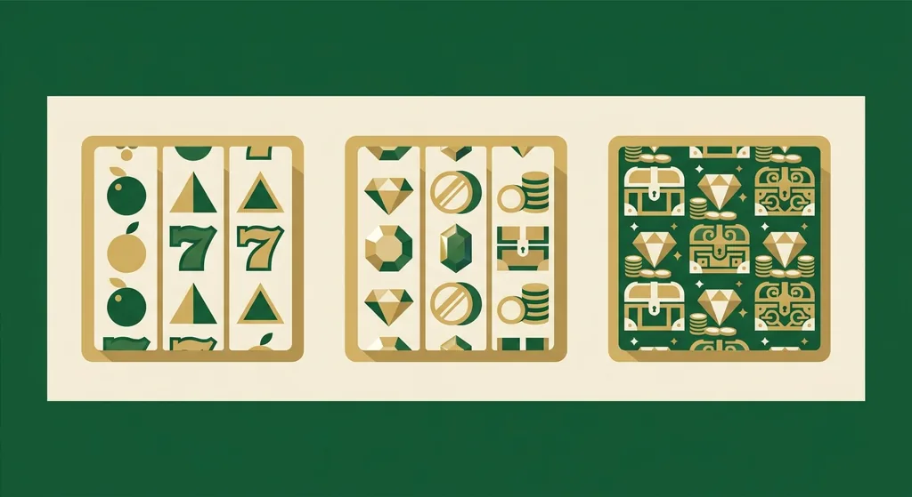
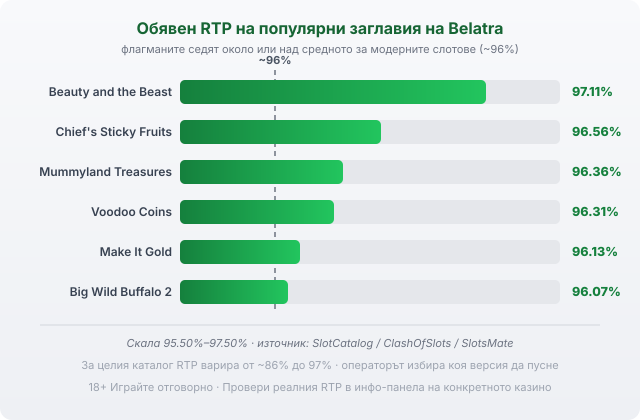

Title tag: Belatra Games: профил на доставчика, механики и топ слотове
Meta description: Кой е Belatra Games, какви игри прави и кои са топ слотовете. Защо RTP варира силно между версиите и как да проверите реалния процент в казиното.

---

# Belatra Games: профил на доставчика, механики и топ слотове

Плодовите барабани и приключенските слотове в доста български онлайн казина идват от Belatra. Компанията прави слотове от 1993 г. По-стара е от почти всичко, което днес наричаме онлайн хазарт.

## Студио от 1993 г. с корени в залата

Belatra не започва от уебсайт. Първите ѝ машини са с един екран, в дървени кабинети, а сред ранните видео слотове са заглавия като Lucky Drink и Piggy Bank. Още тогава компанията разработва собствена джакпот система, преди повечето хора изобщо да имат интернет вкъщи. Онлайн дивизията идва доста по-късно, някъде след 2011 г., когато студиото вече е правило и машини с по три екрана за наземните зали. По произход се свързва с Източна Европа [VERIFY: точната държава и седалище днес се посочват различно от източниците], но същественото за играча е друго. Това е студио с трийсет години зад гърба си в правенето на слотове, не поредната фабрика за бързи заглавия.

## Не само плодове

Ядрото на каталога са видео слотовете, между 130 и 150 заглавия според това кой ги брои. До тях стоят покер, рулетка, Plinko, Sic Bo, crash игри, бинго и разни instant заглавия. Каталогът се люшка от съвсем голата класика с плодове и седмици, за играчи, които искат прости барабани без много обяснения, до тематични приключения с египетски гробници, буфало прерии и малко хорър, където механиките са повече, а математиката по-агресивна.

## Какво значи GLI сертификатът (и какво не значи)

Игрите на Belatra се тестват от Gaming Laboratories International, една от независимите лаборатории в бранша. Проверката значи, че генераторът на случайни числа работи както трябва и че обявеният RTP отговаря на реалната математика на играта. Само че сертификатът потвърждава единствено, че играта спазва собствените си правила, а тези правила са писани в полза на казиното. Домашното предимство си остава вградено; тестът просто гарантира, че то е точно такова, каквото пише. Belatra при това прави игрите, но не ги предлага. Тя е доставчик на софтуер, а операторът е казиното, което приема залозите и държи парите ти.

## Механиките, които ще срещнеш

В модерните им заглавия Hold & Win заключва символи на място и ги върти отново за фиксирани награди или мини джакпоти. Разширяващите се wild-ове носят множители по позиция, а част от игрите отварят реда и стигат до стотици хиляди начини за печалба. Има и Bonus Buy: срещу по-голям залог си купуваш бонус рунда директно, вместо да го чакаш. Big Wild Buffalo 2 например предлага няколко нива за купуване, най-скъпото стига до 500 пъти залога само за да влезеш. Само че купуването на бонус не подобрява математиката. Плащаш предварително за шанс, който иначе идва рядко, и в дълъг период това обикновено те изяжда по-бързо.

## Топ слотове и техните RTP

Ето обявените RTP стойности на заглавията, които изникват най-често под името Belatra:

| Заглавие | RTP | Бележка |
|---|---|---|
| Beauty and the Beast | 97.11% | над средното за модерните слотове |
| Chief's Sticky Fruits | 96.56% | плодова класика |
| Mummyland Treasures | 96.36% | висока волатилност; до 5,000x (25,000x чрез bonus buy) |
| Voodoo Coins | 96.31% | висока волатилност; до 10,000x |
| Make It Gold | 96.13% | висока волатилност; до 25,000x |
| Big Wild Buffalo 2 | 96.07% | Hold & Win; до 5,000x |

*Обявени RTP на шест популярни заглавия на Belatra спрямо ориентира ~96%. За целия каталог диапазонът стига от ~86% до 97%, а операторът избира коя версия да пусне, затова провери реалния процент в казиното.*

Повечето от тези числа седят около или малко над средното за модерните слотове, което често започва от 96%. Волатилността на приключенските заглавия обаче е висока, а рекламните макс печалби от рода на 25,000x почти винаги минават през bonus buy или рядък бонус рунд, не през обикновено завъртане.

## RTP варира силно, проверявай версията

За целия каталог на Belatra обявените RTP стойности се движат от около 86% до 97%, а това е разлика, която мнозина пропускат. Едно и също заглавие често излиза в няколко версии с различен процент, а операторът избира коя да пусне. Затова числото в таблицата е ориентир за играта, не гаранция какво върти конкретното казино. В [методологията ни](/kak-ocenyavame/) гледаме реалния RTP на казиното, а не рекламния, и същото можеш да направиш и ти: отвори инфо-панела на играта, намери реда за RTP и виж кое число работи там. Ако версията е с чувствително по-нисък процент, плащаш повече за същата игра.

При високата волатилност на приключенските заглавия и постоянно менящите се версии демо режимът върши работа: пускаш го, усещаш темпото и виждаш колко бързо гори банката, без да залагаш реални пари. По RTP заглавията се сравняват най-честно, така че [слот игрите с висок RTP](/slot-igri/visok-rtp/) и класическите [ротативки](/kazino-igri/rotativki/) стъпват на едно и също число.

Ако те интересува как се подреждат другите студия, [прегледът на доставчиците](/blog/games-providers/) е мястото да започнеш. Задай си лимит за загуба и за време още преди първото завъртане. 18+ Хазартът може да пристрасти. Играйте отговорно. Ако усетиш, че играта излиза извън контрол, виж [инструментите за отговорна игра](/otgovorna-igra/).

---

**Георги Тодоров**
Публикувано: 24.09.2026 · Последна редакция: 24.09.2026

[About Всички Казина boilerplate]

**Отговорна игра.** 18+ Хазартът може да пристрасти. Играйте отговорно. Ако усетиш, че играта излиза извън контрол или искаш да я ограничиш, виж [инструментите за отговорна игра](/otgovorna-igra/) и възможността за самоизключване чрез националния регистър на уязвимите лица към НАП (подава се писмено само от засегнатото лице). Национална информационна линия за наркотиците, алкохола и хазарта („Солидарност") 0888 99 18 66, делнични дни 10:00–17:00.

**Разкриване на партньорства.** Всички Казина съдържа партньорски (афилиейт) връзки; когато отвориш оферта през такава връзка, това може да финансира сайта, без да променя цената за теб и без да влияе на оценките ни. От 1 август 2026 г. дейността на афилиейт оператори в България се лицензира съгласно Закона за държавния бюджет за 2026 г. (ДВ, бр. 69 от 31.07.2026 г.). Всички Казина е подало заявление за лиценз пред Националната агенция по приходите и очаква издаването му.
