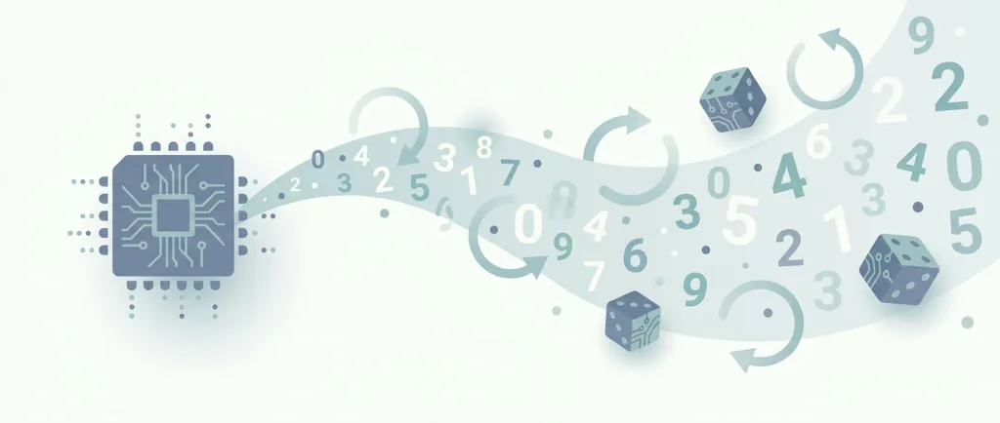
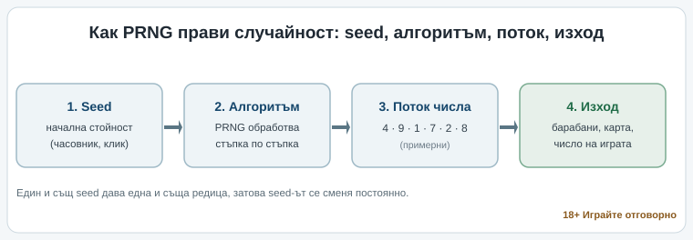
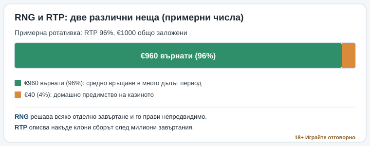

Title tag: Генератор на случайни числа (RNG) в казино игрите
Meta description: Какво е генератор на случайни числа (RNG), защо всяко завъртане е независимо и защо сертификатът за честна игра не сваля предимството на казиното.

---

# Генератор на случайни числа (RNG): как казино игрите постигат случайност

Зад всяко завъртане на ротативка и всяка раздадена карта в онлайн казиното стои една програма: генераторът на случайни числа, или RNG (random number generator). Тя произвежда непрекъснат поток от стойности, а играта превръща поредната стойност в конкретен изход, позицията на барабаните, изтеглената карта, числото на рулетката. Резултатът се решава в частицата от секундата, в която натискаш бутона.

Точно това свойство прави честната игра възможна. Ако някой, включително операторът, можеше да предскаже следващата стойност, играта нямаше да е хазарт, а нагласена сцена. RNG-то не обещава, че ще спечелиш. Пази нещо по-скромно: никой на масата не знае какво следва, ти включително.

## Псевдослучайно и истински случайно: откъде идват числата

Има два основни начина машината да произвежда случайност, и разликата между тях си струва да се разбере, макар да е техническа.

Псевдослучайният генератор (PRNG) тръгва от една начална стойност, наречена seed, и я прекарва през математически алгоритъм, който при всяка стъпка обновява вътрешното си състояние и изважда следващата стойност. „Псевдо" значи, че при един и същ seed алгоритъмът би върнал една и съща редица. Затова seed-ът се взема от нещо, което не можеш да наместиш: системния часовник до милисекундата, точния момент на клика, микродвижения на мишката, и се подменя периодично. Бърз е, лек и мащабируем до хиляди едновременни игри, което го прави стандарта за онлайн ротативките.

*Схема на процеса seed → алгоритъм → поток → изход. Числата са примерни и илюстрират само реда на стъпките.*

Истинският генератор (TRNG) не смята. Той измерва физически шум, електронен шум в схема, атмосферни колебания, и превръща непредвидимостта на природата в числа. По-бавен е и иска специализиран хардуер, затова в чист вид рядко върти обикновена ротативка. Обикновено се появява в хибридна схема, където TRNG подава истински случаен seed, а бързият PRNG поема нататък.

За играча изводът е един и е практичен. Генераторът работи постоянно, дори когато никой не залага, стойностите текат непрекъснато, а ти хващаш тази, която минава точно когато натиснеш. Няма „подходящ момент" за хващане и няма ритъм за разчитане.

## Всяко завъртане започва от нулата

Оттук идва най-скъпо струващото недоразумение в казиното. Ротативка, която не е плащала цяла вечер, не е „назряла". Слот, който току-що раздаде голям удар, не е „изстинал". Всеки кръг стъпва върху нова стойност от потока и не помни предишния.

Заблудата на комарджията е усещането, че миналото дължи нещо на бъдещето. Пет пъти червено на рулетката не прави черното по-вероятно на шестото завъртане; вероятността си остава същата. Барабаните нямат памет, нито сметка да изравнят, нито съчувствие към сесията ти. Стратегиите „изчакай слота да се загрее" и „сменяй залога по схема" се борят срещу система, построена така, че схема да няма.

Тук минава и границата на самото понятие честна игра. Честно значи непредвидимо и непроменено. Дали е изгодно за теб е съвсем отделен въпрос, и отговорът рядко е в твоя полза.

## Кой проверява, че генераторът наистина е случаен

Твърдението „нашият RNG е случаен" не тежи, ако го казва самият, който печели от играта. Заради това съществуват независими лаборатории за тестване, които не са нито операторът, нито студиото, направило играта.

Имена, които се срещат често, са Gaming Laboratories International (GLI), eCOGRA, iTech Labs, BMM Testlabs. Работата им изглежда така: вземат генератора, пускат милиони резултати през него и ги прекарват през серия статистически тестове. Разпределят ли се стойностите равномерно по целия диапазон, крие ли потокът повторения или отклонения, които издават предвидимост. Мине ли тестовете, лабораторията издава сертификат. eCOGRA например работи по методология, призната от регулатори като британския, нидерландския и испанския. iTech Labs пък е акредитирана по международните стандарти ISO/IEC за изпитвателни и инспекционни органи.

Сертификатът казва точно това и нищо повече: към момента на теста генераторът е бил случаен, реалният процент на връщане е съвпадал с декларирания математически модел, механиките са работили по замисъл. Той проверява инструмента. Какво ще падне при теб следващия път остава отворено, точно както трябва да бъде.

## RNG не е RTP: две неща, които постоянно се бъркат

RNG-то решава кой изход пада в един конкретен кръг. RTP (return to player, процент на връщане) описва колко от заложеното една игра връща средно за огромен брой завъртания. Двете се проектират и сертифицират поотделно и отговарят на различни въпроси.

Числата нататък са примерни. Ротативка с RTP 96% при €1000 общо заложени връща средно около €960 в много дълъг период, а другите €40, тоест 4%, са домашното предимство на казиното. Това не е такса, платима на една сесия. За една вечер можеш да излезеш нагоре или да загубиш всичко доста по-бързо от тези 4%, защото RTP се сбъдва чак върху милиони завъртания, не върху твоите петдесет. RNG-то се грижи всяко отделно завъртане да е непредвидимо, а RTP описва накъде клони сборът, когато завъртанията станат достатъчно много. Нисък RTP не значи „нагласена" игра, а по-скъпа за игра. Ако подбираш точно по този признак, събрали сме [слот игрите с висок RTP](/slot-igri/visok-rtp/) на едно място.

*Числата са примерни: RTP 96%, €1000 заложени, €960 средно върнати, €40 (4%) домашно предимство.*

## Сертификатът не сваля предимството на казиното

Ето къде честната игра се разминава с изгодната. Сертифициран, тестван, доказано случаен генератор пак върти игра, чиято математика е нагласена операторът да печели в дългосрочен план. Това не е дефект и не е измама. То е определението на хазарта: плащаш за развлечение с известна предварителна цена.

Сертификацията пази едно нещо, домашното предимство да е точно това, което пише в математиката на играта, и никой да не го мести тайно в движение. Не го премахва. Игра без предимство за казиното няма да срещнеш, защото никой не би я предложил. Затова генераторът на случайни числа е гаранция за процеса; гаранция за печалба няма и не може да има.

Студиото, направило играта, стои от другата страна на същото уравнение: то пише математиката и подава сертифицирания генератор. Кои са тези студиа и по какво се различават сме описали в прегледа на [доставчиците на казино игри](/blog/games-providers/), а по-непознатите думи оттук, волатилност, домашно предимство и останалите, са обяснени в [речника на казино термините](/blog/rechnik-kazino-termini/).

## Какво остава за играча

Разбирането на RNG-то не носи предимство на масата, защото такова няма. Но маха две илюзии, които струват пари: че идва момент, в който слотът „трябва" да плати, и че сертификатът обръща математиката в твоя полза.

Играй с пари, които можеш да загубиш изцяло, и си сложи лимит за депозит и загуба преди първото завъртане, не след третото. 18+ Хазартът може да пристрасти. Играйте отговорно. Усетиш ли, че гониш минала загуба или чакаш „назрелия" удар, това е моментът да спреш и да отвориш [инструментите за отговорна игра](/otgovorna-igra/).

---

**Георги Тодоров**
Публикувано: 24.09.2026 · Последна редакция: 24.09.2026

[About Всички Казина boilerplate]

**Отговорна игра.** 18+ Хазартът може да пристрасти. Играйте отговорно. Ако усетиш, че играта излиза извън контрол или искаш да я ограничиш, виж [инструментите за отговорна игра](/otgovorna-igra/) и възможността за самоизключване чрез националния регистър на уязвимите лица към НАП (подава се писмено само от засегнатото лице). Национална информационна линия за наркотиците, алкохола и хазарта („Солидарност") 0888 99 18 66, делнични дни 10:00–17:00.
