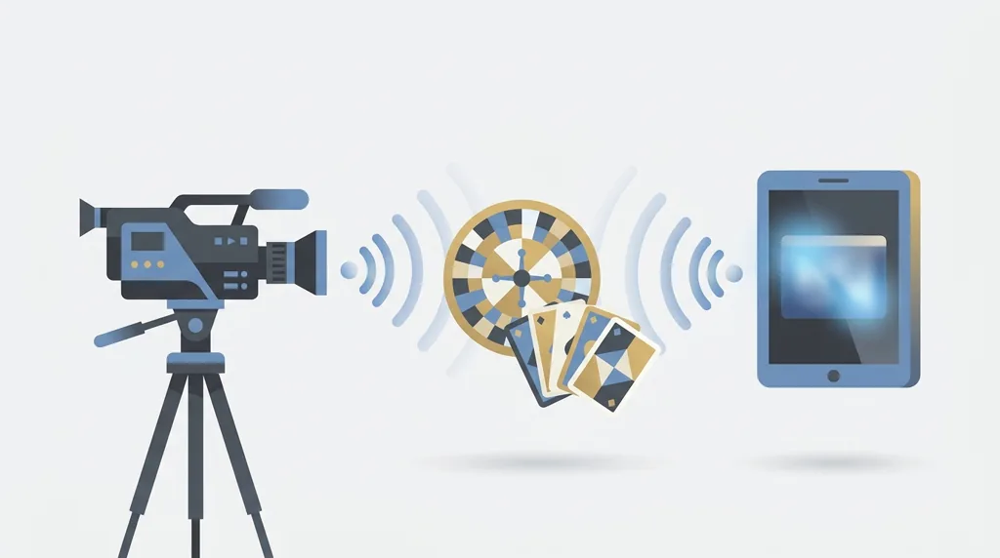
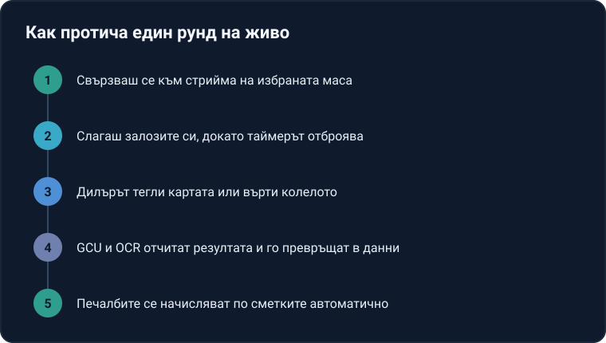

Title tag: Как работи казино на живо: технология и дилъри
Meta description: Казино на живо: как работи технологията. Реален дилър в студио, видео в реално време, GCU и OCR отчитат картите и числата. Технология и честна игра.

---

# Как работи казино на живо: технология, дилъри и честна игра

Казино на живо е форматът, при който истински дилър раздава картите или върти рулетката в студио, а ти гледаш видеото в реално време и залагаш през екрана си. Реалният човек насреща променя усещането, но не и математиката: домашното предимство стои там, където беше и при ротативките, защото играта пак е построена така, че операторът да печели в дългосрочен план. Затова и тук парите за игра са бюджет за забавление с известна цена, не начин да си докараш доход.

## Какво всъщност е казино на живо

Разликата с обикновените слот игри е откъде идва резултатът. При ротативките числата ги избира генератор на случайни числа в софтуера. При казино на живо изходът идва от физическо действие: дилърът тегли карта от истинско тесте, топчето пада в истинско колело. Ти не си в стаята, но виждаш всичко през видеовръзка и подаваш залозите си през интерфейс, наложен върху видеото. Масата, столовете и чиповете на дилъра са реални; бутоните ти за залог са слоят софтуер отгоре.

## Камерите и студиото

Зад една маса обикновено стоят няколко камери. Една отгоре показва цялата маса, друга е близък план върху картите или колелото, трета хваща по-широк кадър с дилъра. Студиото е телевизионно по устройство: осветление, режисьор, който сменя кадрите, и екип, който следи няколко маси наведнъж. Големите студиа събират десетки маси под един покрив, всяка със свой дилър, камери и GCU. Дилърите минават обучение по правилата на играта и по протоколите на студиото, а достъпът до залата е ограничен и записван. Толкова ъгли има една проста причина: на масата не бива да остане движение, което да не се вижда.

## GCU: устройството, което свързва масата с екрана

На всяка маса е закачено малко устройство, наречено Game Control Unit (GCU). Работата му е да кодира видеото и данните от играта и да ги прати към платформата, така че картината и резултатът да пристигат при теб синхронизирано. Без него видеопотокът и отчетеният изход биха могли да се разминат.

## OCR: как софтуерът разчита картите и числата

Резултатът трябва да стане цифров, за да ти се изплати автоматично, и това го върши OCR, оптичното разпознаване на символи. Когато дилърът обърне карта, камерата я хваща, а софтуерът разчита стойността и боята ѝ; при рулетката същата технология отчита в кой номер е спряло топчето. Разчитането става за части от секундата и без дилърът да въвежда каквото и да е на ръка, което маха един източник на грешки. При част от масите картите носят и RFID чип, който служи за допълнителна проверка на разчетеното. Данните пътуват криптирано, за да не могат да бъдат подменени по пътя от студиото до екрана ти.

## Кои маси ще намериш

Класиките са налице: рулетка, блекджек и бакара са гръбнакът на всяко казино на живо. Към тях се добавят покер маси и game shows, хибрид между телевизионно шоу и залагане, воден от истински водещ. За самите game shows има отделно ръководство при [live game shows водачите](/blog/live-game-shows/).

## Как протича един рунд на живо

Свързваш се към стрийма на избраната маса и виждаш дилъра и таймера. Докато таймерът отброява, слагаш залозите си през интерфейса. Той затваря, дилърът тегли картата или върти колелото, а камерите подават всичко на живо. GCU-то и OCR отчитат изхода и го превръщат в данни, по които платформата смята кой печели. Накрая печалбите се начисляват по сметките автоматично и таймерът за следващия рунд тръгва. Целият кръг отнема по-малко от минута на повечето маси.

*Пет стъпки на един рунд на живо, от свързването към стрийма до автоматичното изплащане.*

## Защо има таймер за залозите

Между действието в студиото и екрана ти има малко закъснение, обикновено под секунда до няколко секунди в зависимост от връзката. Заради това всеки рунд има таймер: залозите се приемат само докато той отброява и се заключват, преди дилърът да завърти колелото или да изтегли картата. Прозорецът за залог затваря по-рано именно за да не може никой да залага, след като изходът вече е тръгнал да се случва. Когато интернетът ти куца, платформата обикновено сваля качеството на видеото, вместо да го замрази, за да не изпуснеш момента за залог.

## Честна ли е играта на живо

Тук честността стъпва на нещо физическо. Изходът не се решава от софтуер, а от истинско колело и истинско тесте: топчето спира там, където го отвежда физиката, а картите се разбъркват на случаен принцип. Технологията само отчита резултата, не го определя. Сесиите се записват за проверка, картите и колелата се оглеждат и подменят по график, а софтуерът минава през независими одити. Всичко това работи под лицензионен надзор, така че при спор има запис и правила, към които да се допиташ. Реалното колело обаче не сменя математиката: домашното предимство е вградено в правилата на всяка маса и си остава, колкото и прозрачен да е рундът. Ако не си сигурен как се броят ръцете на конкретна маса, виж [правилата на бакара](/blog/bakara-pravila/), преди да сядаш с истински пари.

## Впечатляваща технология, същият риск

Реалният дилър прави преживяването по-топло, но не ти дава предимство; темпото на масата е по-бавно от ротативките, което помага да броиш какво залагаш, стига да си решил бюджета предварително. Играй с пари, които можеш да загубиш изцяло, и си сложи лимити преди първия залог, не по средата на губеща вечер. 18+ Хазартът може да пристрасти. Играйте отговорно. Ако усетиш, че играта излиза извън контрол, спри и виж [инструментите за отговорна игра](/otgovorna-igra/). А ако просто искаш да видиш къде се играе на живо, това е работа на [казино на живо секцията](/kazino-igri/kazino-na-zhivo/), не на тази страница.

---

**Георги Тодоров**
Публикувано: 24.09.2026 · Последна редакция: 24.09.2026

[About Всички Казина boilerplate]

**Отговорна игра.** 18+ Хазартът може да пристрасти. Играйте отговорно. Ако усетиш, че играта излиза извън контрол или искаш да я ограничиш, виж [инструментите за отговорна игра](/otgovorna-igra/) и възможността за самоизключване чрез националния регистър на уязвимите лица към НАП (подава се писмено само от засегнатото лице). Национална информационна линия за наркотиците, алкохола и хазарта („Солидарност") 0888 99 18 66, делнични дни 10:00–17:00.

**Разкриване на партньорства.** Всички Казина съдържа партньорски (афилиейт) връзки; когато отвориш оферта през такава връзка, това може да финансира сайта, без да променя цената за теб и без да влияе на оценките ни. От 1 август 2026 г. дейността на афилиейт оператори в България се лицензира съгласно Закона за държавния бюджет за 2026 г. (ДВ, бр. 69 от 31.07.2026 г.). Всички Казина е подало заявление за лиценз пред Националната агенция по приходите и очаква издаването му.
