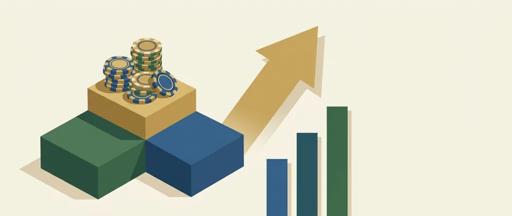
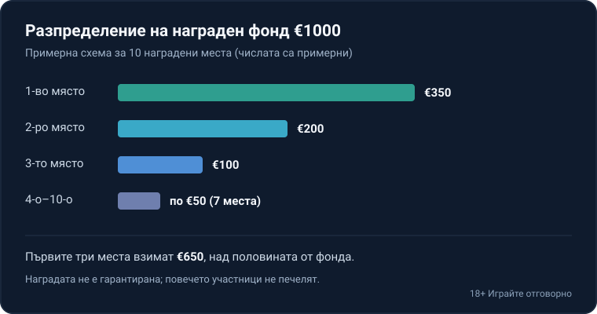

Title tag: Казино турнири: точки, лидерборд и награден фонд
Meta description: Казино турнирите са временни състезания с класиране по точки. Как се печелят точки, как се дели наградният фонд и какво да провериш преди участие.

---

# Казино турнири: как работят точките, лидербордът и наградният фонд

Казино турнирът е временно състезание: за определен период играчите се класират по точки, а най-предните места делят награден фонд. Това не е бонус. Бонусът са пари или завъртания, добавени към твоята сметка; турнирът е надпревара срещу останалите участници, в която повечето не печелят нищо. Наградата не е гарантирана, класирането зависи и от това какво правят другите, а самите игри запазват вграденото си предимство за оператора през цялото време. Турнирът добавя състезателен слой върху обичайната игра, но не променя математиката ѝ, затова към него си струва да се подхожда като към платено забавление с известна цена, не като към начин да се спечели.

## Какво всъщност е казино турнир

Операторът обявява период, от няколко минути до няколко дни, и списък с игри, които участват. Всеки, който играе тези игри през периода, трупа точки и се появява в класирането. Когато времето изтече, наградите отиват при най-предните позиции по предварително обявена схема.

Влизането понякога е свободно, така наречените freeroll турнири без такса. Друг път има бай-ин, тоест такса за участие, или изискване за минимален залог, под който спиновете не се броят за точки. При freeroll рискуваш само времето си. При формат с такса или минимален залог започваш да залагаш реални пари само за да присъстваш в класирането.

## Как се събират точки

Начинът, по който се начисляват точките, определя кой печели, а моделите се различават чувствително. Най-често точките вървят по заложен оборот: за всеки €1 залог получаваш определен брой точки, независимо дали печелиш. Друг модел брои нетната печалба за периода или общата сума спечелени пари от фиксиран брой спинове. Трети, доста разпространен при ротативките, гледа само най-големия единичен множител (win multiplier): ако на един спин удариш печалба 120 пъти залога, това е резултатът ти, а всичко останало е без значение.

Оборотният модел тласка към повече и по-големи залози, защото точките растат с изиграната сума. Моделът по най-голям множител награждава по-скоро късмета на един спин, отколкото обема. Преди да се включиш, прочети точно как се смятат точките: това е единственото, което ти казва дали изобщо имаш шанс, без да наливаш пари.

## Лидербордът и как се дели награден фонд

Лидербордът е класирането в реално време. Обновява се, докато играеш, показва позицията ти спрямо останалите и именно то прави турнира състезание, а не самотна игра.

Награден фонд е общата сума, заделена за наградите, разделена по позиции. Обикновено първите места взимат непропорционално голям дял, а надолу сумите бързо намаляват. Наградата невинаги е кеш. Често са бонус пари или безплатни завъртания, а те идват със собствени условия, най-важното от които е разиграването.

Например (числата са примерни): награден фонд от €1000 се разпределя между първите 10 места: първото взима €350, второто €200, третото €100, а местата от 4-о до 10-о получават по €50. Така над половината фонд отива при първите три позиции, а долната част на класирането дели остатъка на малки суми.

*Примерно разпределение на награден фонд от €1000. Всички числа са примерни.*

## Слот турнири, маси на живо и sit & go

Най-разпространени са слот турнирите, защото ротативките се играят бързо и трупат точки лесно. Има и турнири на маси на живо, например блекджек или рулетка със състезателен елемент, където класирането следва резултатите на реалните маси. При формата sit & go турнирът не тръгва по часовник, а стартира в момента, в който се съберат достатъчно участници, и приключва, когато свършат местата или спиновете.

Времето или броят спинове са ограничени при всички тях, затова темпото натиска: за да се изкачиш, трябва да играеш повече и по-бързо от другите, а това изпразва бюджета бързо.

## Капаните, които да провериш преди да влезеш

Няколко неща решават дали турнирът е безобидно забавление, или скрит начин да похарчиш повече.

Ако печелиш бонус или завъртания вместо кеш, те почти винаги носят изискване за разиграване, минимален залог и срок; докато не ги изпълниш, наградата не е реални пари в джоба ти. Как работи този механизъм разглеждаме отделно в [ръководството за разиграването](/blog/kak-raboti-razigravaneto/).

Ако моделът възнаграждава оборот, самата структура те тласка да залагаш повече и по-често, отколкото би залагал иначе. Това пълни фонда и радва оператора, но не задължително теб.

В повечето турнири печелят само първите няколко процента от класирането; останалите не получават нищо освен изиграните пари. Наградата не е гарантирана и не бива да се планира като приход.

Турнирът не променя вградената математика на игрите. RTP и предимството на казиното остават същите, каквито са извън състезанието. Турнирът е слой отгоре, не отстъпка от правилата.

## Кога турнирът си струва и кога не

За играча турнирът е най-безобиден, когато е freeroll и го гледаш като игра със страничен приз: играеш каквото и без него, а класирането е просто добавка върху забавлението. Стане ли форматът с такса или с точки по оборот, който те кара да увеличаваш залозите заради позиция в класация, сметката се обръща бързо не в твоя полза. Турнирът не е [бонус при регистрация](/blog/bonus-pri-registraciya/), който добавя стойност към сметката ти, а надпревара, в която повечето участници излизат на минус.

Затова подходът е същият като към всяка друга игра: реши предварително колко си готов да похарчиш за вечерта, и се придържай към сумата независимо от позицията в лидерборда. 18+ Хазартът може да пристрасти. Играйте отговорно. Ако усетиш, че гониш място в класирането с пари, които не си планирал да заложиш, спри и виж [инструментите за отговорна игра](/otgovorna-igra/). Понятията оттук, като множител и волатилност, са събрани в [речника с казино термини](/blog/rechnik-kazino-termini/).

---

**Георги Тодоров**
Публикувано: 24.09.2026 · Последна редакция: 24.09.2026

[About Всички Казина boilerplate]

**Отговорна игра.** 18+ Хазартът може да пристрасти. Играйте отговорно. Ако усетиш, че играта излиза извън контрол или искаш да я ограничиш, виж [инструментите за отговорна игра](/otgovorna-igra/) и възможността за самоизключване чрез националния регистър на уязвимите лица към НАП (подава се писмено само от засегнатото лице). Национална информационна линия за наркотиците, алкохола и хазарта („Солидарност") 0888 99 18 66, делнични дни 10:00–17:00.

**Разкриване на партньорства.** Всички Казина съдържа партньорски (афилиейт) връзки; когато отвориш оферта през такава връзка, това може да финансира сайта, без да променя цената за теб и без да влияе на оценките ни. От 1 август 2026 г. дейността на афилиейт оператори в България се лицензира съгласно Закона за държавния бюджет за 2026 г. (ДВ, бр. 69 от 31.07.2026 г.). Всички Казина е подало заявление за лиценз пред Националната агенция по приходите и очаква издаването му.
