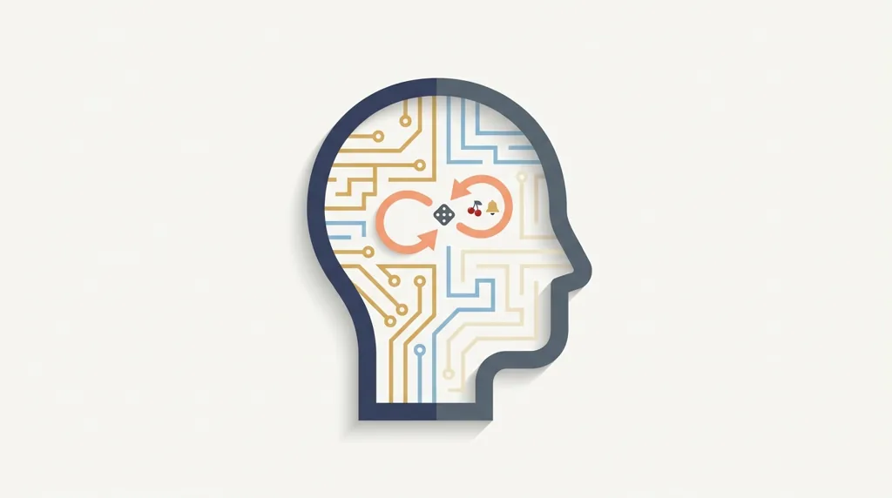
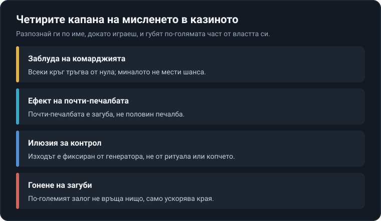

Title tag: Психология на хазарта: капаните на ума
Meta description: Психология на хазарта: защо заблудата на комарджията, ефектът на почти-печалбата и илюзията за контрол карат играта да изглежда печеливша.

---

# Психология на хазарта: заблудата на комарджията, ефектът на почти-печалбата и илюзията за контрол

В казиното умът търси ред, дължимо и близка развръзка там, където има само вероятност. Всеки резултат идва от случаен генератор, а математиката е нагласена така, че в дълъг период операторът остава напред. Играта създава усещането, че може да бъде спечелена, докато числата казват друго. Точно този разрив между усещане и математика държи живи няколко капана на мисленето. Хазартът си остава платено забавление с известна цена, не финансова стратегия.

## Заблудата на комарджията: миналото не дължи нищо на бъдещето

На 18 август 1913 г. на една рулетка в Монте Карло топчето спира на черно двадесет и шест пъти подред. Шансът за такава серия е около едно на 66 милиона, но не това е интересното. Още след дванадесетото завъртане залата решава, че червеното „закъснява", и играчите започват да трупат залози върху него. Губят цяло състояние, защото рулетката няма памет. Оттам идва и името „заблуда на Монте Карло".

Заблудата на комарджията (на английски gambler's fallacy) е убеждението, че минали независими резултати променят шанса на следващия. „Почервеня пет пъти, сега е ред на черното" звучи разумно, но е грешно: всяко завъртане, всяко раздаване, всеки спин на ротативка е самостоятелно събитие със същата вероятност като предишното. Топчето, картите и случайният генератор не помнят какво се е случило преди секунда. Таблото с последните числа над рулетката, а и историята на завъртанията на екрана на ротативката, съществуват отчасти именно за да подхранват това усещане за „закъснял" резултат, при положение че то не носи никаква информация за следващия. Всеки резултат се тегли независимо, а понятия като RTP и волатилност са разгледани в [речника с казино термини](/blog/rechnik-kazino-termini/).

## „Дължи ми се" е същата грешка, само насочена към теб

Има един личен вариант на тази заблуда, който хваща и хора, които иначе не биха заложили на „закъсняло" число. Звучи като „толкова вечери губя, време е да ми се върне". Балансът обаче не води сметка кой колко е внесъл и колко дълго е издържал. Никоя серия загуби не създава задължение да последва печалба. Всеки нов кръг тръгва от нула, със същото вградено предимство за оператора, независимо колко тежка е била вечерта дотук.

## Ефектът на почти-печалбата: загуба, която мозъкът чете като успех

Две от трите символа за джакпот се подреждат, а третият спира едно деление встрани. Формално това е загуба, точно толкова, колкото и три несъвпадащи символа. Мозъкът обаче реагира различно. Изследвания с образна диагностика показват, че ефектът на почти-печалбата (near-miss) активира същите свързани с наградата зони, които светват при истинска печалба (Clark и колектив, 2009 г.). Играчите дори оценяват почти-печалбите като по-неприятни от чистата загуба, и въпреки това те засилват желанието да продължат.

Барабаните и линиите се подреждат така, че почти-печалбите да се появяват по-често, отколкото би подсказвала чистата случайност на самата печалба, защото усещането „бях на косъм" държи ръката върху копчето. Почти-печалбата не е половин печалба и не приближава следващата. Още е стопроцентова загуба, само че лъже мозъка, че за малко не си спечелил.

## Илюзията за контрол: копчето, спирането на барабана, ритуалът

Ротативките с бутон „стоп", избирането на числа, подухването преди хвърляне на зара, любимият стол и часът на игра. Всичко това създава усещане за майсторлък върху нещо, което е чиста случайност. Психологът Елън Лангер описва илюзията за контрол още през седемдесетте: щом една игра ни дава избор или действие, започваме да надценяваме влиянието си върху резултата, макар той да е предрешен. В класически неин експеримент хората ценят по-високо лотариен билет, който сами са избрали, отколкото раздаден им наслуки, при абсолютно еднакъв шанс. Изборът не мести вероятността, а само усещането за собственост върху нея.

Спирането на барабана в точния момент не мести нищо, защото изходът е фиксиран от генератора в мига на завъртането. Ритуалите менят настроението, темпото и увереността, но не и вероятностите. Това е и разликата между игрите: при блекджек с вярна базова стратегия решенията наистина местят домашното предимство, докато при ротативка контролът е само сценичен. Генераторът не забелязва нито стола, нито часа, нито колко решително натискаш копчето.

## Гоненето на загуби: илюзията, че ще си върнеш

Гоненето на загуби е вдигане на залога или на честотата с идеята изгубеното да се върне бързо. При него едновременно вярваш, че ти се дължи връщане, поддаваш се на поредната почти-печалба и си повтаряш, че този път ще налучкаш момента. Изгубеното вече е факт, а следващият залог е нова независима случка със същото предимство за оператора. По-големият залог не поправя нищо и само ускорява темпото, с което свършват парите. Усилва го и усещането за вече вложеното: колкото повече е похарчено, толкова по-трудно е да се стане от масата, сякаш спирането прави загубата окончателна, макар тя да е окончателна така или иначе. Специалистите разглеждат гоненето на загуби като един от най-ясните белези, че играта се измества от забавление към проблем. Ако усетиш, че залагаш, за да си върнеш, а не за да се забавляваш, това е моментът да спреш и да погледнеш [инструментите за отговорна игра](/otgovorna-igra/).

*Четирите капана и истината срещу всеки от тях.*

## Защо да ги познаваш е най-добрата защита

Домашното предимство е постоянно и никой от тези капани не го отменя. Те не правят играта печеливша, а само я карат да изглежда такава. Разпознаването обаче върши работа: в мига, в който можеш да си кажеш „това е почти-печалба, тоест загуба" или „никой не ми дължи връщане", капанът губи по-голямата част от властта си. Така е устроена машината, и е по-добре да го знаеш, отколкото да го научаваш с парите си.

На самата маса това се превежда в няколко навика: играеш в рамките на пари, които можеш да загубиш изцяло, наричаш капаните с имената им, докато се случват, и следиш кога усещането води, а не разумът. 18+ Хазартът може да пристрасти. Играйте отговорно. Ако усетиш, че играта излиза извън контрол, виж [инструментите за отговорна игра](/otgovorna-igra/) и [повече за границите и самоконтрола](/blog/responsible-gambling/).

---

**Георги Тодоров**
Публикувано: 24.09.2026 · Последна редакция: 24.09.2026

[About Всички Казина boilerplate]

**Отговорна игра.** 18+ Хазартът може да пристрасти. Играйте отговорно. Ако усетиш, че играта излиза извън контрол или искаш да я ограничиш, виж [инструментите за отговорна игра](/otgovorna-igra/) и възможността за самоизключване чрез националния регистър на уязвимите лица към НАП (подава се писмено само от засегнатото лице). Национална информационна линия за наркотиците, алкохола и хазарта („Солидарност") 0888 99 18 66, делнични дни 10:00–17:00.

**Разкриване на партньорства.** Всички Казина съдържа партньорски (афилиейт) връзки; когато отвориш оферта през такава връзка, това може да финансира сайта, без да променя цената за теб и без да влияе на оценките ни. От 1 август 2026 г. дейността на афилиейт оператори в България се лицензира съгласно Закона за държавния бюджет за 2026 г. (ДВ, бр. 69 от 31.07.2026 г.). Всички Казина е подало заявление за лиценз пред Националната агенция по приходите и очаква издаването му.
