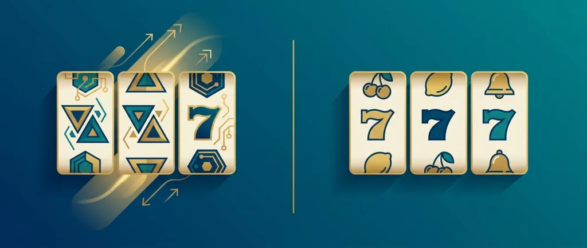
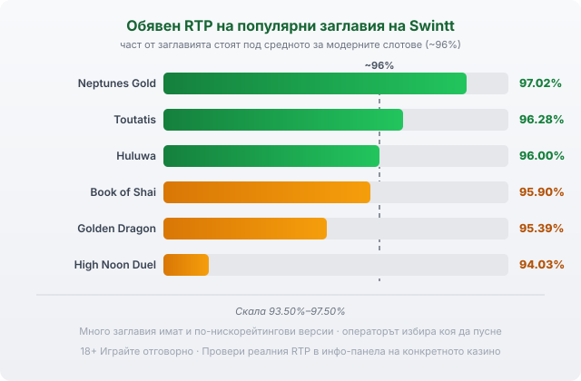

Title tag: Swintt: профил на доставчика, механики и топ слотове
Meta description: Кой е Swintt, какви игри прави (SwinttSelect, SwinttPremium, SwinttLive) и кои са топ слотовете. Защо RTP често е свален и как да проверите версията.

---

# Swintt: профил на доставчика, механики и топ слотове

Swintt е сред новите имена в бранша, стартирало едва през 2019 г. Въпреки това е минало през регулатори, които бракуват доста кандидати, а игрите му вече се въртят в лобитата на регулирани европейски казина.

## Младо студио от Малта

Компанията е базирана в Малта, в Слийма, и е основана някъде около 2018–2019 г. (източниците се разминават за точната дата). За няколко години си вади доставчически лицензи от Malta Gaming Authority, британската Gambling Commission и шведската Spelinspektionen, тоест от едни от по-строгите режими в Европа. Свързва се с групата Glitnor, преименувана на LCKY Group, макар източниците да се разминават дали Swintt е придобит от нея, или е част от структурата ѝ. През януари 2024 г. Swintt купува стокхолмското студио ELYSIUM Studios и добавя още едно ателие към портфолиото си.

## Две лица и една маса на живо

Swintt не прави един тип игри. Серията SwinttSelect са модерните видео слотове с по-агресивна математика и разни бонус функции. SwinttPremium е другото ателие, наземно-стилни класики, направени по вкуса на германския и нидерландския пазар, където играчите още харесват усещането на машините от залата. Отделно има SwinttLive, продуктът за казино на живо с истински дилъри, който през 2024 г. взе наградата на EGR за доставчик на живо казино за годината. Три доста различни неща под едно име.

## Лицензът не вдига RTP

Лицензите от MGA и UKGC звучат сериозно и наистина значат нещо: игрите се тестват, отчитат се, а операторите, които ги пускат, подлежат на контрол. Само че този контрол пази честността и съответствието, не връщаемостта към играча. Лицензиран доставчик не значи по-щедра игра. И тук важи същото разграничение като при всеки друг производител: Swintt прави софтуера, а казиното е операторът, който приема залозите и държи парите.

## Механики без излишни завъртулки

Игрите на Swintt рядко те затрупват с механики. Обичайното меню са безплатни завъртания, wild-ове и по някоя функция за разкриване на символи, плюс геймификация отгоре: турнири и постижения, които операторът пуска, за да те задържи по-дълго. Наземно-стилните заглавия от SwinttPremium са още по-семпли, почти нарочно старомодни. Това не е недостатък само по себе си, стига да знаеш какво получаваш, преди да седнеш.

## Топ слотове и техните RTP

Ето обявените RTP стойности на едни от по-разпознаваемите заглавия на Swintt:

| Заглавие | RTP | Бележка |
|---|---|---|
| Neptunes Gold | 97.02% | над средното за модерните слотове |
| Toutatis | 96.28% | висока волатилност; до 10,000x (има и версия 85.74%) |
| Huluwa | 96.00% | около средното |
| Book of Shai | 95.90% | висока волатилност; до 10,325x |
| Golden Dragon | 95.39% | под средното |
| High Noon Duel | 94.03% | висока волатилност; до 27,000x |

*Обявени RTP на шест популярни заглавия на Swintt спрямо ориентира ~96%. Част от заглавията стоят под средното, а много игри имат и по-нискорейтингови версии, затова провери реалния процент в казиното.*

Разпределението казва много: флагманските видео слотове клонят към висока волатилност, тоест дълги сухи серии и резки редки удари, а рекламните макс печалби от рода на 27,000x идват точно от тази волатилност, не от всяко завъртане. Част от заглавията стоят под средното за модерните слотове, което често започва от 96%.

## RTP често е свален, проверявай версията

Тук е капанът, който повечето играчи не виждат. Swintt пуска доста от игрите си в няколко версии с различен RTP, а операторът избира коя да качи. Toutatis например го има като 96.28%, но и като 85.74%, а Master of Books се върти в четири варианта: 95.91%, 92.31%, 90.05% и 87.76%. Разликата между най-високата и най-ниската версия е повече от седем процентни пункта, при една и съща на вид игра. В [методологията ни](/kak-ocenyavame/) затова гледаме реалния RTP на конкретното казино, а не рекламния. Отвори инфо-панела на играта, намери реда за RTP и виж кое число работи там, преди да заложиш.

При тази волатилност демо режимът си струва: усещаш темпото и виждаш колко бързо се движи банката, без реални пари. По RTP заглавията се сравняват най-честно, така че [слот игрите с висок RTP](/slot-igri/visok-rtp/) си заслужават сравнението едно до друго, а любителите на дилър на живо могат да пробват [казино на живо](/kazino-igri/kazino-na-zhivo/), където SwinttLive е един от вариантите. Как се подреждат другите студия виж в [прегледа на доставчиците](/blog/games-providers/). Определи си лимит за загуба и за време, преди да завъртиш за пръв път. 18+ Хазартът може да пристрасти. Играйте отговорно. Ако усетиш, че играта излиза извън контрол, виж [инструментите за отговорна игра](/otgovorna-igra/).

---

**Георги Тодоров**
Публикувано: 24.09.2026 · Последна редакция: 24.09.2026

[About Всички Казина boilerplate]

**Отговорна игра.** 18+ Хазартът може да пристрасти. Играйте отговорно. Ако усетиш, че играта излиза извън контрол или искаш да я ограничиш, виж [инструментите за отговорна игра](/otgovorna-igra/) и възможността за самоизключване чрез националния регистър на уязвимите лица към НАП (подава се писмено само от засегнатото лице). Национална информационна линия за наркотиците, алкохола и хазарта („Солидарност") 0888 99 18 66, делнични дни 10:00–17:00.

**Разкриване на партньорства.** Всички Казина съдържа партньорски (афилиейт) връзки; когато отвориш оферта през такава връзка, това може да финансира сайта, без да променя цената за теб и без да влияе на оценките ни. От 1 август 2026 г. дейността на афилиейт оператори в България се лицензира съгласно Закона за държавния бюджет за 2026 г. (ДВ, бр. 69 от 31.07.2026 г.). Всички Казина е подало заявление за лиценз пред Националната агенция по приходите и очаква издаването му.
