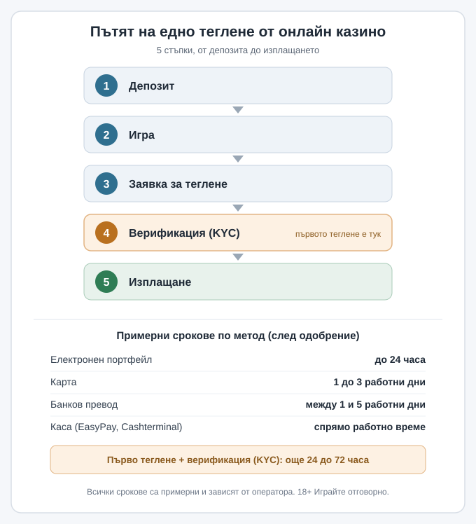

Title tag: Как да изтеглиш печалба от казино: KYC и срокове
Meta description: Теглене на пари от казино стъпка по стъпка: какво е верификация (KYC), какви документи искат, правилото за същия метод, примерни срокове и лимити.

---

# Как да изтеглиш печалба от онлайн казино: верификация (KYC), лимити и срокове

Печалбата в баланса и парите в банковата ти сметка не са едно и също нещо. Между тях стои една процедура, която повечето играчи срещат чак когато натиснат „теглене" за пръв път: проверката на самоличността, или верификация (KYC). През нея минава всяко законно казино. Когато знаеш какво те чака, първото теглене на пари върви гладко, вместо да увисне за дни.

*Стъпките на едно теглене и примерни срокове по метод. Всички срокове са примерни и зависят от оператора.*

## Пътят на едно теглене, стъпка по стъпка

Едно теглене не започва в момента, в който поискаш парите. Пътят изглежда така:

1. **Депозит.** Захранваш сметката с избран метод, обикновено дебитна карта, електронен портфейл, Revolut или каса. Как работят депозитите в евро описваме отделно в [ръководството за депозити](/blog/evro-hazart-depoziti/).
2. **Игра.** Играеш, докато в баланса се събере сума, която искаш да изтеглиш.
3. **Заявка за теглене.** През касата на сайта избираш метод и сума и подаваш заявката за теглене.
4. **Верификация (KYC).** Операторът проверява самоличността ти, ако още не го е направил.
5. **Изплащане.** След одобрението парите тръгват към метода и пристигат според неговата скорост.

Първата заявка почти винаги е по-бавна от следващите, защото верификацията се случва точно тогава. Веднъж потвърден, при повечето следващи тегления прескачаш тази стъпка: KYC на едно казино обикновено е еднократна проверка на акаунта.

## Защо изобщо има верификация (KYC)

Верификацията не е прищявка на казиното. В България, както в целия лицензиран пазар, тя е законово изискване срещу изпирането на пари (AML) и част от контрола, който упражнява действащата институция, Националната агенция за приходите (НАП). Същата проверка спира играта на непълнолетни и опитите някой да ползва чужда самоличност или чужд платежен инструмент. Затова операторът проверява дали си този, за когото се представяш, дали живееш на посочения адрес и дали платежният метод е твой. При по-големи или необичайни суми може да поиска и произход на средствата (source of funds).

## Какви документи ще поискат

Обикновено искат да покриеш самоличност, адрес и платежен метод. За самоличност служи лична карта или паспорт, валиден и четлив. За адрес трябва скорошен документ на твое име, който показва адреса: сметка за ток или банково извлечение отпреди не повече от няколко месеца върши работа. За платежния метод се иска снимка на картата с прикрити цифри в средата или извлечение от електронния портфейл, което показва, че сметката е твоя. Понякога към това се добавя и селфи, за да съпостави операторът лицето с документа.

Едно нещо бави хората повече от всичко друго. Ако името или адресът в акаунта не съвпадат буквално с документите, проверката спира, докато оправиш разликата.

## Теглиш по метода, с който си депозирал

Обикновено връщаш парите там, откъдето са влезли. Депозираш ли с карта, печалбата се връща по същата карта, поне до размера на депозита; същото важи за електронен портфейл или Revolut. Това е още една анти-AML мярка. Ако си захранвал по няколко начина, операторът често разпределя тегленето пропорционално или следва собствените си правила за приоритет, описани в общите условия.

## Колко време отнема (сроковете са примерни)

Скоростта опира до обработката от страна на казиното и до скоростта на самия метод. За ориентир, с примерни срокове: електронните портфейли обикновено са най-бързи, до 24 часа след одобрението; картата отнема 1 до 3 работни дни, а банковият превод между 1 и 5 работни дни. Тегленето на каса (EasyPay, Cashterminal, ePay.bg) зависи от работното време на самата каса.

Към това добави периода на изчакване (pending), в който заявката стои преди обработка, и еднократното забавяне от верификацията при първото теглене, обикновено 24 до 72 часа. Искаш €200 по електронен портфейл при първо теглене: реално може да минат около 3 дни за одобрението на KYC и още до 24 часа за самия превод. Второто теглене на същите €200 после може да е готово за под ден. [VERIFY: реалните срокове се определят от конкретния оператор и метод; проверявай ги в общите условия, не по банера]

## Лимити и капани

Тегленето често има таван: дневен, седмичен или месечен. Да речем €2,000 на седмица означава, че печалба от €5,000 излиза на няколко транша. Има и минимална сума за теглене, около €10 или €20, под която касата не приема заявка. Отделен таван важи върху печалбите от бонус, стига да си играл с активен бонус.

Има и по-незабележим капан. Докато заявката е в pending, много каси позволяват да я върнеш в баланса и да продължиш да играеш. Това удобство лесно връща спечеленото обратно в игра.

## Защо се бавят тегленията

Повечето забавяния идват от няколко ясни причини: непълни или нечетливи документи, име или адрес в акаунта, които не съвпадат с документите, непотвърден платежен метод, по-голяма или необичайна сума, която задейства допълнителна проверка (enhanced due diligence), или активен бонус с неизпълнено превъртане, заради което печалбата стои заключена. Всяка от тях се решава по един и същ начин: изряден комплект документи, в който данните съвпадат с акаунта.

## Защо лицензът от НАП значи защита за теб

При лицензиран от НАП оператор проверката, лимитите и сроковете стъпват върху правила, които операторът е длъжен да спазва, и при спор за теглене имаш към кого да се обърнеш в България. При нелицензиран сайт „условията" са каквото сайтът реши в момента, а откаже ли да плати, нямаш реален адрес за жалба. Как да провериш лиценза, докато още избираш казино, а не когато тегленето вече е заседнало, показваме в [проверката на лиценза на казино](/blog/proverka-licenz-kazino/).

## Данъци върху изтеглената печалба

Облагането на изтеглена печалба от хазарт зависи от конкретния случай. Събрали сме какво да имаш предвид в [темата за данъците върху печалбите](/blog/danaci-pechalbi-onlajn-kazino/). [VERIFY: данъчно третиране на печалбите от хазарт; не се посочва ставка или праг. За твоя случай питай счетоводител или НАП.]

## Преди първата заявка

Провери предварително дали името и адресът в акаунта съвпадат с документите ти, по кой метод ще теглиш обратно и какви са лимитите и сроковете в общите условия. Изрядните документи и съвпадащите данни свалят точно онези дни забавяне, които иначе се приписват на казиното. 18+ Хазартът може да пристрасти. Играйте отговорно. Тегли печалба, която приемаш като приятен резултат от развлечение, и ако усетиш, че играеш само за да върнеш загубено, спри и виж [инструментите за отговорна игра](/otgovorna-igra/).

---

**Георги Тодоров**
Публикувано: 24.09.2026 · Последна редакция: 24.09.2026

[About Всички Казина boilerplate]

[Author bio: Георги Тодоров тества лицензирани казина за Всички Казина от 2024 г. със собствен бюджет; проверява лиценза в публичния регистър на НАП преди регистрация и публикува тегленията си с точни дати и часове.]

**Отговорна игра.** 18+ Хазартът може да пристрасти. Играйте отговорно. Ако усетиш, че играта излиза извън контрол или искаш да я ограничиш, виж [инструментите за отговорна игра](/otgovorna-igra/) и възможността за самоизключване чрез националния регистър на уязвимите лица към НАП (подава се писмено само от засегнатото лице). Национална информационна линия за наркотиците, алкохола и хазарта („Солидарност") 0888 99 18 66, делнични дни 10:00–17:00.
