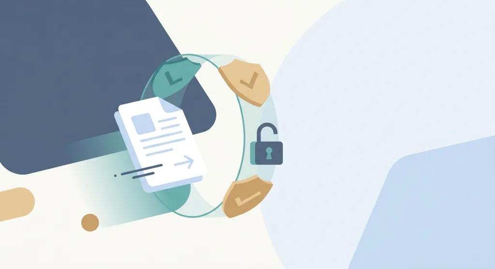

Title tag: Как да изтеглиш печалба от казино: KYC и срокове
Meta description: Теглене на пари от казино стъпка по стъпка: какво е верификация (KYC), какви документи искат, правилото за същия метод, примерни срокове и лимити.

---

# Как да изтеглиш печалба от онлайн казино: верификация (KYC), лимити и срокове

Преди изтеглената печалба да стигне до сметката ти, всяко законно казино минава през проверка на самоличността, наречена верификация (KYC). Повечето играчи я срещат чак при първото си теглене на пари, и точно тогава тя отнема най-много време.

## Пътят на едно теглене, стъпка по стъпка

*Стъпките на едно теглене и примерни срокове по метод. Всички срокове са примерни и зависят от оператора.*

Дотук вече си захранил сметката с избран метод (обикновено дебитна карта, електронен портфейл, Revolut или каса) и си събрал в баланса сума, която искаш да изтеглиш. Как работят депозитите в евро описваме отделно в [ръководството за депозити](/blog/evro-hazart-depoziti/). Самото теглене върви така:

1. Подаваш заявка през касата на сайта: избираш метод и сума.
2. Минаваш верификация (KYC), ако операторът още не е проверил самоличността ти.
3. След одобрението парите тръгват към метода и пристигат според неговата скорост.

Първата заявка почти винаги е по-бавна от следващите, защото верификацията се случва точно тогава. Веднъж потвърден, при следващите тегления прескачаш тази стъпка: KYC на едно казино е еднократна проверка на акаунта.

## Защо изобщо има верификация (KYC)

Казиното иска тези документи, защото е длъжно: верификацията е законово изискване срещу изпирането на пари (AML), а Националната агенция за приходите (НАП) го следи при всеки лицензиран оператор. Същата проверка спира играта на непълнолетни и опитите някой да ползва чужда самоличност или чужд платежен инструмент. Затова операторът проверява дали си този, за когото се представяш, дали живееш на посочения адрес и дали платежният метод е твой. При по-големи или необичайни суми може да поиска и произход на средствата (source of funds).

## Какви документи ще поискат

За самоличността стига валидна и четлива лична карта или паспорт. Адресът се покрива със скорошен документ на твое име, например сметка за ток или банково извлечение отпреди не повече от няколко месеца. Платежният метод се потвърждава със снимка на картата с прикрити цифри в средата или с извлечение от електронния портфейл, което показва, че сметката е твоя. Понякога към това се добавя и селфи, за да съпостави операторът лицето с документа. Снимай документите цели и на светло, без отблясък от лампата или телефона. Изрязан или премного тъмен кадър се връща за нов.

Най-честата причина за забавяне е несъответствие: ако името или адресът в акаунта не съвпадат буквално с документите, проверката спира, докато оправиш разликата.

## Теглиш по метода, с който си депозирал

Правилото е да върнеш парите там, откъдето са влезли. Депозираш ли с карта, печалбата се връща по същата карта, поне до размера на депозита; същото важи за електронен портфейл или Revolut. Това е още една анти-AML мярка. Ако си захранвал по няколко начина, операторът разпределя тегленето пропорционално или следва собствените си правила за приоритет, описани в общите условия. Печалба над внесената сума излиза по банков превод, дори да си захранвал с карта.

## Колко време отнема (сроковете са примерни)

Електронните портфейли са най-бързи, до 24 часа след одобрението; картата отнема 1 до 3 работни дни, а банковият превод между 1 и 5 работни дни. Тегленето на каса (EasyPay, Cashterminal, ePay.bg) зависи от работното време на самата каса. Заявка, пусната в петък вечер, често тръгва чак в понеделник.

Към тези срокове се прибавя периодът на изчакване (pending), в който заявката стои преди обработка, плюс еднократното забавяне от верификацията при първото теглене, 24 до 72 часа. Например при €200 по електронен портфейл и първо теглене реално може да минат около 3 дни за одобрението на KYC и още до 24 часа за самия превод. Второто теглене на същите €200 после може да е готово за под ден. Реалните срокове обаче се определят от конкретния оператор и метод, затова ги проверявай в общите условия, а не по банера.

## Лимити и капани

Тегленето често е ограничено от дневен или седмичен таван, понякога и месечен. При седмичен таван от €2,000 печалба от €5,000 излиза на няколко транша. При седмичен лимит последният транш идва седмици след първата заявка, което е добре да заложиш в очакванията си. Има и минимална сума за теглене, около €10 или €20, под която касата не приема заявка. Отделен таван важи върху печалбите от бонус, стига да си играл с активен бонус.

Докато заявката е в pending, много каси позволяват да я върнеш в баланса и да продължиш да играеш, което лесно връща спечеленото обратно в игра.

## Защо се бавят тегленията

Начело са непълните или нечетливи документи, както и име и адрес в акаунта, които не съвпадат с тях. Добавят се непотвърден платежен метод и по-големите, необичайни суми, които задействат допълнителна проверка (enhanced due diligence). А активен бонус с неизпълнено превъртане държи печалбата заключена, докато не завършиш оборота.

## Защо лицензът от НАП значи защита за теб

При лицензиран от НАП оператор проверката, лимитите и сроковете стъпват върху правила, които операторът е длъжен да спазва, и при спор за теглене имаш към кого да се обърнеш в България. При нелицензиран сайт „условията" са каквото сайтът реши в момента, а откаже ли да плати, нямаш реален адрес за жалба. Как да провериш лиценза, докато още избираш казино, а не когато тегленето вече е заседнало, показваме в [проверката на лиценза на казино](/blog/proverka-licenz-kazino/).

## Данъци върху изтеглената печалба

За данъците върху хазартните печалби сме събрали какво да имаш предвид в [темата за данъците върху печалбите](/blog/danaci-pechalbi-onlajn-kazino/); за своя случай провери със счетоводител или в НАП.

## Преди първата заявка

Чистото първо теглене се урежда още преди да подадеш заявката, не след като е заседнала. Тегли печалба, която приемаш като приятен резултат от развлечение, и ако усетиш, че играеш само за да върнеш загубено, спри и виж [инструментите за отговорна игра](/otgovorna-igra/).

18+ Хазартът може да пристрасти. Играйте отговорно.

---

**Георги Тодоров**
Публикувано: 24.09.2026 · Последна редакция: 24.09.2026

*Георги Тодоров тества лицензирани казина за Всички Казина от 2024 г. със собствен бюджет; проверява лиценза в публичния регистър на НАП преди регистрация и публикува тегленията си с точни дати и часове.*

**Отговорна игра.** 18+ Хазартът може да пристрасти. Играйте отговорно. Ако усетиш, че играта излиза извън контрол или искаш да я ограничиш, виж [инструментите за отговорна игра](/otgovorna-igra/) и възможността за самоизключване чрез националния регистър на уязвимите лица към НАП (подава се писмено само от засегнатото лице). Национална информационна линия за наркотиците, алкохола и хазарта („Солидарност") 0888 99 18 66, делнични дни 10:00–17:00.
