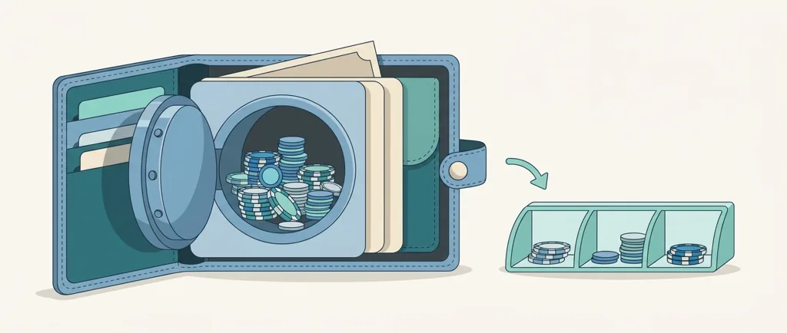
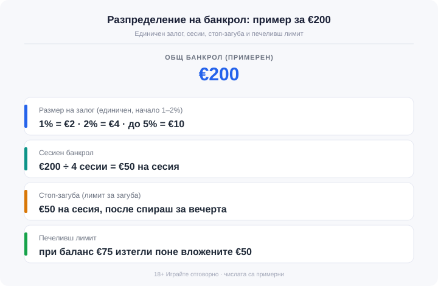

Title tag: Управление на банкрол: бюджет, лимити, размер на залог
Meta description: Банкролът са парите за игра, които можеш да загубиш докрай. Как да зададеш бюджет, размер на залог като процент от банкрола и лимити преди първия депозит.

---

# Управление на банкрол в онлайн казино: бюджет, лимити и размер на залога

Банкролът е сумата, която заделяш за игра в онлайн казино и която можеш да загубиш докрай, без да се разклати кой да е разход за месеца. Спестяванията, парите за сметките и сумата, с която се надяваш да си върнеш нещо, стоят извън него. Загубата на целия банкрол не бива да засяга наема, тока или храната; ако ги засяга, сумата е твърде голяма и трябва да слезе. Всяка игра в казиното дава дългосрочно предимство на оператора, затова банкролът е бюджет за забавление с известна цена, горе-долу като парите за кино или вечеря навън. Хазартът е платено забавление, не финансова стратегия.

## Откъде идва сумата

Бюджетът за казино тръгва от разполагаемия доход, тоест от това, което остава след наем, сметки, храна и заделеното за спестяване. От този остатък отделяш малка част за забавление. Разумният диапазон е между 1% и 5% от месечния разполагаем доход, като начинаещите започват от долния край. При €800 разполагаем доход 3% правят €24 месечен банкрол за казино (числата тук и нататък са примерни). Сумата си я определяш сам, стига да идва от свободните пари за забавление, докато парите за живот остават непокътнати.

## Отдели парите, не само наум

Банкрол, който стои в същата сметка като заплатата, е само добро намерение. Дръж парите за игра отделно: втора сметка, електронен портфейл или предплатена карта само за тази цел. Когато играта тегли от отделен баланс, границата се вижда и надхвърлянето ѝ иска съзнателно действие вместо един разсеян депозит. В края на месеца виждаш точно колко е останало там, без да ровиш през разходите за наем и храна, за да сметнеш какво е отишло за игра.

## Размерът на залога като процент от банкрола

Тук се къса най-често: залага се сума, която звучи добре в момента, вместо дял от банкрола. По-здравото решение е единичен залог (unit betting), фиксиран процент от банкрола на всяко залагане. При банкрол €200 залог от 1% е €2, а 2% са €4; консервативното начало е 1–2%, а горната разумна граница е около 5%, тоест €10 на този банкрол. По-малкият дял държи банкрола жив по-дълго и прави една лоша серия поносима. Голям залог спрямо банкрола стопява бюджета бързо и не оставя място за променливостта, която всяка игра носи. При игри с висока волатилност сухите серии са дълги и малкият залог остава основната защита банкролът да не свърши преди добър момент, който между другото никой не ти дължи.

## Сесиен банкрол срещу общ банкрол

Банкрол от €200 за месеца, разделен на 4 сесии по €50, пази целия бюджет от една лоша вечер. Общата сума покрива периода, а сесийната е само парчето за едно сядане: влизаш с €50 в джоба, не с €200, и щом парчето свърши, вечерта приключва. Останалите €150 просто не са на масата.

## Кога да спреш: стоп-загуба и печеливш лимит

Стоп-загубата, или лимитът за загуба, е предварително решената сума, при която спираш без изключения. При сесия от €50 самото парче е и таванът на загубата: изгубиш ли €50, приключваш и не добавяш още €50 „за да се върнеш". Лимитът работи само защото е избран на трезва глава преди първия залог, не по средата на губеща серия.

Печалбата на екрана става твоя чак когато е изтеглена. Затова таванът за печалба е също толкова полезен, колкото стоп-загубата, макар да се споменава по-рядко. Влизаш с €50 и при баланс €75 изтегляш поне вложените €50 обратно, така една добра сесия остава добра, вместо да се разлее обратно в казиното залог по залог.

*Примерно разпределение на банкрол от €200: единичен залог, сесии и лимити. Всички числа са примерни.*

## Защо гоненето на загуби е капан

Гоненето на загуби е вдигане на залога или на честотата след загуба с идеята изгубеното да се върне. Това е един от най-опасните капани в казино. Изгубеното вече е факт, а следващият залог е нова и независима случка със същото вградено предимство за оператора. По-големият залог не поправя нищо и само ускорява темпото, с което банкролът намалява. Твърд таван на загубата за деня или седмицата прекъсва тази верига, преди да е набрала инерция.

## Лимитите като инструмент, зададен предварително

Лицензираните оператори дават три лимита, които струват най-много, когато са зададени преди първия депозит. Депозитният лимит слага таван колко можеш да вкараш в сметката за ден, седмица или месец. Загубеният покрива същия период, но брои колко можеш да изгубиш. Сесийният ограничава колко дълго можеш да останеш в един сеанс.

Понижаването на лимит обикновено влиза в сила веднага, а вдигането му често изчаква между 24 и 72 часа. Забавянето е защита: пречи ти да вдигнеш тавана точно в разгара на губеща серия.

Напомнянето за реалност (reality check) е изскачащо съобщение през зададен интервал, което показва колко време играеш и те кара да спреш за момент. Отчетът за играта пък събира на едно място депозитите, залозите, печалбите и загубите за период, така че сметката да е пред очите ти, а не по памет. И двата пазят от играта на автопилот, при която часовете и залозите текат, без да ги броиш.

## Самоизключване, когато лимитите не стигат

Когато лимитите вече не стигат, самоизключването спира достъпа до сметката за избран период. Прави се при отделния оператор или, за всички лицензирани в България казина наведнъж, чрез националния регистър на уязвимите лица към НАП. Регистърът се подава писмено и само от засегнатото лице, и не се маха с обаждане до поддръжката преди края на срока. Това е начин да си върнеш контрола и нормална част от отговорната игра.

## Правилата важат само ако ги спазиш

Правилата ги решаваш предварително: сумата, лимитите и малкият дял на всеки залог се фиксират отрано, за да работят вместо теб в онази вечер, в която ти се иска да ги прескочиш. 18+ Хазартът може да пристрасти. Играйте отговорно. Играй с пари, които можеш да загубиш изцяло, и ако усетиш, че гониш загуба, спри и виж [инструментите за отговорна игра](/otgovorna-igra/).

Понятията оттук, като волатилност и RTP, са събрани в [речника с казино термини](/blog/rechnik-kazino-termini/), а как заключените бонус пари се вписват в реалния ти бюджет, разглеждаме в [ръководството за разиграването](/blog/kak-raboti-razigravaneto/).

---

**Георги Тодоров**
Публикувано: 24.09.2026 · Последна редакция: 24.09.2026

[About Всички Казина boilerplate]

**Отговорна игра.** 18+ Хазартът може да пристрасти. Играйте отговорно. Ако усетиш, че играта излиза извън контрол или искаш да я ограничиш, виж [инструментите за отговорна игра](/otgovorna-igra/) и възможността за самоизключване чрез националния регистър на уязвимите лица към НАП (подава се писмено само от засегнатото лице). Национална информационна линия за наркотиците, алкохола и хазарта („Солидарност") 0888 99 18 66, делнични дни 10:00–17:00.

**Разкриване на партньорства.** Всички Казина съдържа партньорски (афилиейт) връзки; когато отвориш оферта през такава връзка, това може да финансира сайта, без да променя цената за теб и без да влияе на оценките ни. От 1 август 2026 г. дейността на афилиейт оператори в България се лицензира съгласно Закона за държавния бюджет за 2026 г. (ДВ, бр. 69 от 31.07.2026 г.). Всички Казина е подало заявление за лиценз пред Националната агенция по приходите и очаква издаването му.
