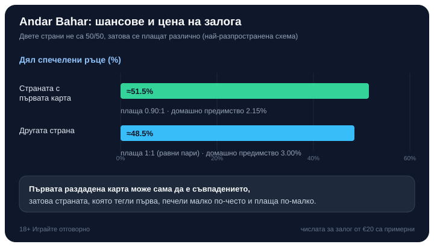

Title tag: Andar Bahar: правила, залози и шансове | Всички Казина
Meta description: Andar Bahar на живо: как средната карта задава съвпадението, защо двете страни не са 50/50, колко плащат Andar и Bahar и какво е домашното предимство на всеки залог.

---

# Andar Bahar: правила, залози и шансове

Andar Bahar е една от най-простите игри, които ще срещнете в [казиното на живо](/kazino-igri/kazino-na-zhivo/): едно тесте, една карта в средата и залог върху това коя от двете страни ще извади нейно съвпадение първа. Няма събиране на точки като в блекджек, нито сравняване на две ръце като в [бакара](/blog/bakara-pravila/). Има само една карта, която трябва да се повтори, и въпросът от коя страна ще излезе.

Простотата обаче крие една несиметрия, която мнозина подминават: двете страни не печелят по равно, а изплащанията са нагласени точно заради това.

## Как тече една ръка

Дилърът обръща една карта в средата на масата. Тя задава съвпадението и в различните студиа я наричат средна карта или картата за игра (не е жокер и не е коз, само еталонът, който търсим). После започва да раздава карти една по една, последователно към двете позиции: Andar (отвътре) и Bahar (отвън).

Раздаването продължава, докато излезе карта със същата стойност като средната, независимо от боята. Страната, на която падне това съвпадение, печели. Ако средната карта е например седмица, търси се първата следваща седмица; щом тя се появи от страната Andar, печели заложилият на Andar. Средно една ръка се решава за около 13 раздадени карти след средната, макар че понякога съвпадението идва още с първата.

## Защо двете страни не са 50 на 50

Изглежда като чисто хвърляне на ези-тура, но не е. Страната, която получава първата карта след средната, печели в около 51.5% от ръцете; другата остава с около 48.5%. Причината е тясна: първата раздадена карта сама по себе си може да е съвпадението и приключи ръката веднага, така че страната, която тегли първа, има едно допълнително попадение в редицата.

На практика Andar печели, когато съвпадението дойде на нечетна позиция в раздаването, а Bahar, когато е на четна, точно защото Andar обикновено тегли първа. Тази малка разлика от три процентни пункта е цялата математика на играта, и тя движи изплащанията. Не търсете система отвъд нея: тестето няма памет, а всяка нова ръка тръгва от същите шансове, независимо колко пъти преди това е печелила едната страна.

## Коя страна тегли първа

Тук има подробност, която се различава по казина. При част от версиите коя страна получава първата карта зависи от цвета на средната карта; при други първа тегли винаги Andar. Практическото остава същото при всяка маса: предимството от около 51.5% е на страната, която получава първата карта, каквато и да е тя в конкретната версия. Затова първото за проверка на нова маса е кой тегли пръв и как е платена тази страна.

## Изплащания: по-вероятната страна плаща по-малко

Понеже едната страна печели по-често, тя плаща по-малко от другата. Точните числа се различават по казина, но най-разпространената схема плаща на страната с първата карта около 0.90:1, а на другата равни пари, 1:1.

| Залог | Типично изплащане | Домашно предимство |
|---|---|---|
| Страната с първата карта (≈51.5%) | 0.90:1 | 2.15% |
| Другата страна (≈48.5%) | 1:1 (равни пари) | 3.00% |

Срещат се и по-стиснати варианти, при които страната с първата карта плаща 0.85:1 (предимство около 4.72%), а другата 0.95:1 (около 5.43%). Разликата между 2.15% и 5.43% е чувствителна, затова таблицата на масата казва повече от името на играта.

## Страничните залози

Освен основния избор Andar или Bahar, повечето онлайн версии предлагат странични залози: колко карти ще се раздадат до съвпадението, каква е средната карта, нейната боя или цвят. Изплащанията им са примамливи, но домашното предимство обикновено е по-високо от основния залог и се мени от доставчик до доставчик. Залогът „между 1 и 5 карти до съвпадението" например се плаща около 2.50:1 при предимство от порядъка на 5%, а по-редките изходи носят по-щедри коефициенти при по-голямо предимство. Залогът върху цвета на средната карта често плаща около 0.90:1, а познаването на точна стойност се плаща едро, но и с домашно предимство над 7%. Тези таблици са специфични за конкретния софтуер, така че всяко число е версия на един оператор, не универсално правило.

## Онлайн, на живо и в демо

Andar Bahar идва в два вида. Версията с генератор на случайни числа раздава от разбъркано тесте при всяка ръка и върви бързо, сам срещу софтуера. Версията на живо ви свързва със студио, в което истински дилър тегли картите пред камера, а вие залагате в реално време заедно с други хора; там играта има корени в Южна Индия и често се води на маса с двете полета Andar и Bahar, изписани от двете страни на средната карта. Правилата и изплащанията са едни и същи в двата вида; разликата е в темпото и усещането. Много студиа предлагат и демо режим, в който може да изиграете няколко ръце безплатно и да усетите колко бързо тече една маса, преди да заложите реални пари.

## Един пример за цяла ръка

Числата тук са примерни. Залагате €20 на страната с първата карта при изплащане 0.90:1. Средната карта е дама. Дилърът тегли карти последователно и петата поред дама пада на вашата страна: печелите 0.90 × €20 = €18 плюс връщането на залога. Ако бяхте на другата страна при равни пари, същата спечелила ръка щеше да върне €20 печалба, но тя печели по-рядко. Разликата в изплащането не е каприз: тя изравнява по-честите победи на едната страна.

## Колко ти струва играта

При най-разпространената схема Andar Bahar е сравнително евтина маса: около 2.15% домашно предимство на страната с първата карта и около 3.00% на другата. RTP тук е същата монета от другата страна: около 97.85% при залога с по-ниско предимство и около 97.00% при равните пари, изчислено върху хиляди ръце, а не върху една вечер.

*Шансове и домашно предимство на двете страни при най-разпространената схема (числата за залог от €20 са примерни).*

Ниското предимство важи само за основния залог и само при по-щедрата таблица. Страничните залози и по-стиснатите изплащания местят числото нагоре, а бързото темпо на раздаването, по няколко ръце в минута на живо, има навика да свие банката по-бързо, отколкото усещате.

## Струва си като маса

Andar Bahar е лесна за научаване и приятна за гледане, но точно тази лекота я прави и подвеждаща: няма решение, което да свие предимството, както основната стратегия при блекджек. Избирате страна и после гледате. Затова я третирайте като платено забавление с известна цена, не като начин за печелене на пари. Заложете само това, което можете да загубите изцяло, сложете си лимит за депозит и загуба преди първата ръка, и ако усетите, че играта излиза извън контрол, вижте [инструментите за отговорна игра](/otgovorna-igra/). 18+ Хазартът може да пристрасти. Играйте отговорно.

Ако седнете на такава маса, стойте на основния залог, проверете коя страна тегли първа и колко плаща, и подминавайте страничните залози, освен за настроение. А честният начин да изберете къде да играете минава през [публична методика, а не през усещане](/kak-ocenyavame/). Простата игра не е задължително евтината; таблицата на масата решава кое от двете е.

---

**Георги Тодоров**
Публикувано: 25.09.2026 · Последна редакция: 25.09.2026

[About Всички Казина boilerplate]

**Отговорна игра.** 18+ Хазартът може да пристрасти. Играйте отговорно. Ако усетиш, че играта излиза извън контрол или искаш да я ограничиш, виж [инструментите за отговорна игра](/otgovorna-igra/) и възможността за самоизключване чрез националния регистър на уязвимите лица към НАП (подава се писмено само от засегнатото лице). Национална информационна линия за наркотиците, алкохола и хазарта („Солидарност") 0888 99 18 66, делнични дни 10:00–17:00.

**Разкриване на партньорства.** Всички Казина съдържа партньорски (афилиейт) връзки; когато отвориш оферта през такава връзка, това може да финансира сайта, без да променя цената за теб и без да влияе на оценките ни. От 1 август 2026 г. дейността на афилиейт оператори в България се лицензира съгласно Закона за държавния бюджет за 2026 г. (ДВ, бр. 69 от 31.07.2026 г.). Всички Казина е подало заявление за лиценз пред Националната агенция по приходите и очаква издаването му.
