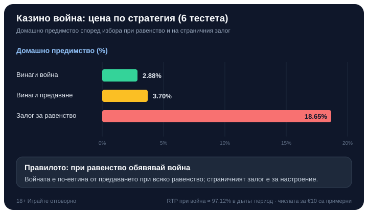

Title tag: Casino War (Казино война): правила и домашно предимство | Всички Казина
Meta description: Казино война на живо: една карта срещу дилъра, какво да правиш при равенство, защо предаването е по-скъпо от войната, страничният залог за равенство и колко струва играта.

---

# Casino War (Казино война): правила и домашно предимство

Casino War е може би най-простата игра в казиното: една карта на теб, една на дилъра, по-високата печели. Никакви комбинации, никаква стратегия по време на ръката, само сравнение. Затова е любима за начало и се среща често в [казиното](/kazino-igri/) на живо и онлайн. Цялата игра се събира в едно решение, и то се появява само когато двете карти се вържат.

Именно там, при равенството, се крие сметката, която отделя евтината версия на играта от скъпата.

## Как тече една ръка

Играе се обикновено с шест тестета. Залагаш, дилърът раздава по една открита карта на теб и на себе си, и по-високата взема. Асото е най-високо, а боята няма значение изобщо. Спечелиш ли, залогът се плаща равни пари, 1:1. Загубиш ли, отива при казиното. Всичко приключва за секунди, без нито едно решение, ако картите не са равни.

При шест тестета ти и дилърът печелите на първата карта в около 46.3% от случаите всеки, а останалите близо 7.4% са равенства. Точно тези равенства правят играта интересна, защото при тях получаваш избор.

## Войната: единственото решение в играта

Вържат ли се двете карти, спираш и избираш едно от две неща. Можеш да се предадеш и да загубиш половината от залога. Или да обявиш война: слагаш втори залог, равен на първоначалния, дилърът изгаря три карти отгоре на тестето и раздава по още една на всеки.

Развръзката на войната е характерна и лесна за пропускане. Ако твоята втора карта е равна или по-висока от тази на дилъра, вторият залог печели равни пари, а първоначалният ти се връща непокътнат. По-висока ли е неговата карта, губиш и двата залога. Тоест печелиш дори при ново равенство на войната, но печалбата идва само от втория залог; първоначалният просто оцелява.

## Защо предаването е капан

На пръв поглед предаването изглежда разумно: губиш само половин залог, вместо да рискуваш втори. Числата казват друго. При шест тестета, ако винаги отиваш на война, домашното предимство е около 2.88% спрямо първоначалния залог. Ако винаги се предаваш, то скача до около 3.70%.

Разликата не е дребна и посоката ѝ е постоянна: войната е по-евтиният ход при всяко равенство. Предаването се усеща като предпазливост, а е по-скъпият избор в дълъг период. Простото правило за тази маса е едно: при равенство обявявай война.

## Бонусът при война

Някои маси добавят бонус, който променя сметката. При по-щедрите правила ново равенство на самата война (равен срещу равен втори път) носи допълнителна печалба, равна на първоначалния залог; това сваля домашното предимство при шест тестета от 2.88% на около 2.33%. Има и по-редки онлайн версии, които плащат тройно на такова второ равенство и свеждат предимството до около 1.24%. Бонусът за второ равенство е рядък изход, но когато е наличен, е чиста печалба за играча, затова провери правилата на масата за него.

## Страничният залог за равенство

Освен основната игра, повечето маси предлагат отделен залог върху това, че първите две карти ще се вържат. Плаща примамливо, обикновено 10:1, но домашното предимство е брутално: около 18.65% при шест тестета. Някои казина плащат 11:1 и свалят предимството до около 11.25%, което пак е далеч над основната игра. Този залог е за настроение, не за сметка; ако търсиш по-поносима цена на времето на масата, стой на основната война.

## Един пример за цяла ръка

Числата тук са примерни. Залагаш €10 и получаваш осмица, дилърът също вади осмица: равенство. Обявяваш война и добавяш втори залог €10, общо €20 на масата. Дилърът изгаря три карти и раздава по нова: твоята е дама, неговата седмица. Твоята е по-висока, така че вторият залог €10 печели равни пари и добавя €10, а първоначалните €10 ти се връщат непокътнати. Ако правилата на масата включваха бонус за второ равенство, а ти беше извадил пак осмица срещу неговата осмица, щеше да получиш и допълнителната бонус печалба.

## Онлайн, на живо и в демо

Casino War идва в два вида. Версията с генератор на случайни числа раздава от разбъркани тестета при всяка ръка и върви бързо, сам срещу софтуера. Версията на живо те свързва със студио, в което истински дилър обръща картите пред камера, а ти залагаш заедно с други хора в реално време. Правилата и изплащанията са едни и същи; разликата е в темпото и усещането. Много казина дават и демо режим, в който може да изиграеш няколко ръце безплатно и да видиш колко бързо приключва една раздаване, преди да заложиш реални пари. Каквато и версия да избереш, броят тестета и правилата за бонуса при второ равенство са изписани в информацията на масата, и точно те определят цената.

## Колко ти струва играта

Casino War е сред по-скъпите прости маси, но само ако играеш дисциплинирано. При шест тестета и последователна война домашното предимство е около 2.88% спрямо първоначалния залог. Спрямо всичко, което реално рискуваш (по-често залагаш и втори път при войната), тежестта е около 2.70%, число, което математиците наричат element of risk. Броят тестета мести цифрата съвсем леко: с повече тестета основното предимство расте с части от процента, докато предимството на страничния залог за равенство пада, но и в двата случая остава далеч над основната игра.

*Домашно предимство по стратегия при шест тестета и цената на страничния залог за равенство (числата за залог от €10 са примерни).*

RTP тук е същата монета от другата страна: около 97.12% при последователна война, изчислено върху хиляди ръце, а не върху твоята вечер. Предаването сваля връщането към около 96.30%, а страничният залог за равенство е в съвсем друга, много по-скъпа категория.

## Струва си като маса

Простотата на Casino War е и капанът ѝ: няма умение, което да свие предимството, както основната стратегия при [блекджек](/kazino-igri/blakdzhak/), а бързото темпо кара ръцете да текат по няколко в минута. Затова я приемай като платено забавление с известна цена, не като начин за печелене на пари. Заложи само това, което можеш да загубиш изцяло, сложи си лимит за депозит и загуба преди първата ръка, и ако усетиш, че играта излиза извън контрол, виж [инструментите за отговорна игра](/otgovorna-igra/). 18+ Хазартът може да пристрасти. Играйте отговорно.

Ако седнеш на такава маса, правилото е кратко: при равенство обявявай война, подминавай страничния залог и провери дали има бонус за второ равенство. А честният начин да избереш къде да играеш минава през [публична методика, а не през усещане](/kak-ocenyavame/). По-простата игра рядко е и по-евтината; при войната цената се решава от един-единствен ход.

---

**Георги Тодоров**
Публикувано: 25.09.2026 · Последна редакция: 25.09.2026

[About Всички Казина boilerplate]

**Отговорна игра.** 18+ Хазартът може да пристрасти. Играйте отговорно. Ако усетиш, че играта излиза извън контрол или искаш да я ограничиш, виж [инструментите за отговорна игра](/otgovorna-igra/) и възможността за самоизключване чрез националния регистър на уязвимите лица към НАП (подава се писмено само от засегнатото лице). Национална информационна линия за наркотиците, алкохола и хазарта („Солидарност") 0888 99 18 66, делнични дни 10:00–17:00.

**Разкриване на партньорства.** Всички Казина съдържа партньорски (афилиейт) връзки; когато отвориш оферта през такава връзка, това може да финансира сайта, без да променя цената за теб и без да влияе на оценките ни. От 1 август 2026 г. дейността на афилиейт оператори в България се лицензира съгласно Закона за държавния бюджет за 2026 г. (ДВ, бр. 69 от 31.07.2026 г.). Всички Казина е подало заявление за лиценз пред Националната агенция по приходите и очаква издаването му.
