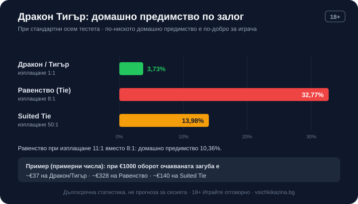

Byline: Editorial Team | Market: bg — how-it-works guide, no testing angle, no operator → editorial lane (published signature Георги Тодоров)

# Дракон Тигър (Dragon Tiger): правила, залози и шансове

Дракон Тигър е бакара, свита до най-простото си ядро. Раздават се две ръце, Дракон и Тигър, всяка получава по една карта, и по-високата печели. Няма правило за трета карта, няма събиране на сборове, няма решения за вземане. Основният залог струва около 3,73% домашно предимство, което е поносимо, но залогът на равенство крие цели 32,77% и точно той примамва новите играчи. Заради това темпо и заради едно единствено правило играта се учи за трийсет секунди и се играе почти изцяло по рефлекс.

## Как протича един кръг

Дилърът обръща една карта за Дракон и една за Тигър. Сравнявате ги, по-високата взема ръката, и кръгът приключва още там. Да речем, че Дракон получи дама, а Тигър седмица. Дамата е по-висока, Дракон печели, всичко свършва за секунди. Вие не теглите, не се отказвате и не докосвате нищо след като залогът е потвърден; единственото ви действие се случва преди раздаването, с избора върху коя клетка да сложите чиповете. Тъкмо тази голота на играта позволява десетки кръгове на час, много по-бързо от бакара с нейната процедура за трета карта, и точно скоростта е онова, което трупа оборот, без да усетите.

## Как се подреждат картите

Стойността се чете като в покера, с една разлика, която обърква мнозина: асото е най-ниската карта, не най-високата. Редът от слабо към силно е асо, двойка, тройка и така до десетка, вале, дама и накрая поп. Поп бие седмица, седмица бие тройка, асо губи от всичко останало. Значение има само рангът, не боята. Ако Дракон извади поп каро, а Тигър поп пика, двете ръце са равни, макар боите да са различни; попада се равенство. Боята влиза в сметката единствено при един специален залог, до който стигаме след малко. Анализите на играта приемат осем тестета, макар точният брой да се различава по казино, а при толкова карти повторенията на един и същ ранг не са рядкост.

## Залозите на масата

Печеливш залог на Дракон плаща 1:1, същото важи и за Тигър. Равенството, когато двете карти излязат с еднакъв ранг, обикновено плаща 8:1, а на някои маси и варианти 11:1. Има и четвърти залог, Suited Tie, който иска двете карти да съвпаднат по ранг и по боя едновременно и плаща 50:1. Едно правило променя цялата сметка на основния залог: заложите ли на Дракон или Тигър и се падне равенство, губите половината от залога, а не целия. Банерът рядко изтъква този детайл, но той е договорът и именно там казиното изгражда предимството си.

## Колко ви струва всеки залог

*Домашно предимство по залог в Дракон Тигър при стандартни осем тестета. Числата в примера за €1000 оборот са примерни.*

Домашното предимство на Дракон и Тигър е 3,73%, тоест около 3,8%. Причината да е толкова ниско седи в правилото за равенството. Победата и загубата на основния залог се компенсират в дългосрочен план, а единственото, което остава за казиното, е половината залог, който прибира всеки път когато картите излязат равни. Вероятността за равенство при осем тестета е около 7,47%, а половината от нея дава точно 3,73%. Равенството като отделен залог е съвсем друга сметка: при 8:1 домашното предимство е 32,77%, при по-щедрите 11:1 пада до 10,36%, но и там остава скъпо. Suited Tie при 50:1 крие 13,98%. За да видите разликата в пари, заложете €20 петдесет пъти, което прави €1000 общ оборот. На Дракон или Тигър средната очаквана загуба в дългосрочен план излиза към €37. Същият оборот, залаган на равенство при 8:1, води до около €328, а на Suited Tie около €140. Тези проценти са дългосрочна статистика от милиони раздавания, не прогноза за вашата вечер, и как ги превръщаме в реална оценка на играта е описано в [методологията ни](/kak-ocenyavame/).

## Защо равенството и Suited Tie са капан

Изплащанията 8:1 и 50:1 изглеждат като начин да умножите залога наведнъж. Цената им е скрита в рядкостта: равенство пада средно веднъж на около четиринайсет ръце, а точното съвпадение по ранг и боя е още по-рядко. Разликата между €37 и €328 върху един и същ оборот е цялата причина опитните играчи да не докосват тези клетки.

## Онлайн, на живо и в демо

Онлайн Дракон Тигър се среща в два вида. Версията с генератор на случайни числа разбърква тестето наново при всяка ръка и върви бързо, сам срещу софтуера. При казино на живо истински дилър раздава пред камера от студио, а вие залагате в реално време заедно с други хора, обикновено с таймер от няколко секунди за всеки кръг. Правилата, изплащанията и домашното предимство са едни и същи; сменят се само темпото и усещането. Ако версията предлага демо режим, изиграйте няколко кръга без пари, преди да заредите баланс, колкото да видите колко бързо се нижат ръцете и колко рядко всъщност пада равенството.

## Има ли стратегия за Dragon Tiger

Стратегията се изчерпва с избора на залог, и нищо друго не помага. Няма карти за теглене, значи няма умение, с което да свалите предимството, за разлика от блекджек, където правилната игра го стопява под 1%. Ръцете нямат памет: осем поредни победи на Дракон не правят Тигър по-вероятен на деветата, така че прогресиите тип Мартингейл само уголемяват залозите, без да пипат математиката. Броенето на карти, което дава смисъл при блекджек, тук е безполезно, защото една карта на ръка не носи достатъчно информация, а тестетата се разбъркват често. Ако търсите същата спокойна маса с по-евтина сметка, бакара предлага Банко около 1,06%, а как работи тя сме разписали в [гайда за бакара](/blog/bakara-pravila/); Дракон Тигър жертва част от тази стойност в замяна на по-бързото темпо. Сред [казино игрите](/kazino-igri/) това е една от най-лесните за разбиране маси и една от най-безмилостните към играча, който гони изплащането на равенството.

## Струва си като бърза маса, не като план

Дракон Тигър е приятна тъкмо защото е бърза и не иска нищо от вас освен избор между две клетки. Стойте на Дракон или Тигър, подминавайте равенството и Suited Tie, и ще плащате едно от по-разумните домашни предимства на пода. Ниските 3,73% обаче не значат предимство за вас; казиното пак печели в дългосрочен план, а бързото темпо трупа много ръце за кратко и има навика да ви задържи по-дълго от планираното. Задайте си лимит за депозит и за загуба преди да седнете, играйте с пари, които можете да загубите изцяло, и приемете 3,73% за това, което е: цената на времето на масата, а не план за печалба. 18+ Хазартът може да пристрасти. Играйте отговорно. Ако усетите, че играта излиза извън контрол, вижте [инструментите за отговорна игра](/otgovorna-igra/).

---

[AUTHOR BIO BLOCK] [BRAND BOILERPLATE] [18+ / RG LINE + affiliate disclosure footer]

CANON ADDITIONS: none.
[DATA NEEDED]: none.
