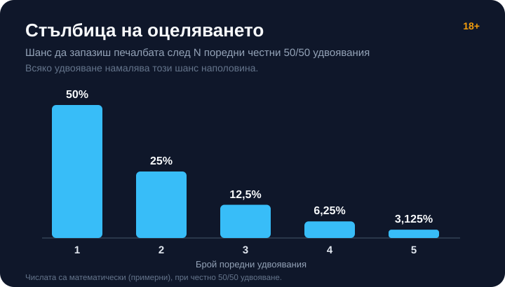

# 03 — HUMANISER (Step 3) · vk-0177

Byline: editorial voice, signed Георги Тодоров. Persona: none — editorial.

## PHASE 1 — AI-FINGERPRINT REPORT
Overall verdict: MIXED
Overall score: 44/60
Layer scores: Lexical 8/10 | Syntactic 7/10 | Structural 8/10 | Density 8/10 | Experiential 6/10 | Rhythm 7/10

CRITICAL FLAGS (must fix):
- „Може, и оттук тръгва сметката, която си струва да знаеш." → false-climax / signposting before delivering the point (BG tell family „И точно тук…") → open the section with the fact itself.
- „Уговорката е проста и честната сметка не я крие." → confirmed BG revealing-signal tell (sibling of „Правилото е просто:" / „Причината е проста:") → state the caveat directly, drop the label.
- „Практиката е ясна и не е утешителна:" → announces a conclusion before delivering it (signposting) → deliver the observation directly.

MODERATE FLAGS:
- Two consecutive sentences in the volatility section open with the same rhythm („Две поредни: 25%. Три: 12.5%…") — this is a deliberate ladder enumeration and reads as data, kept, but the surrounding prose should breathe more around it.
- „Разликата не е в математиката, тя е в…" borders on the „не A, а B" mic-drop; softened.

WHAT ALREADY WORKS (preserve): the €20→€40/€0 worked example; the 0.5^N ladder; the honest „fair = 100%, any deviation is against the player" logic; asymmetric close; native slot vocabulary; zero em-dashes.

MIXED (< 48) → rewrite.

## PHASE 2 — HUMANISED ARTICLE

---

# Gamble/Double функция в слотовете: как работи рисковата игра

Печелившото завъртане приключва и на екрана изскачат два бутона. Единият прибира парите, другият ги залага наведнъж срещу шанс да ги удвоиш. Това е gamble функцията, позната още като double или рискова игра, и приема три форми: обръщане на монета, познаване на цвета на скрита карта, или стъпаловидна стълбица нагоре. Прибирането е винаги възможно. До бутона за риск почти всяка игра слага и „Collect", а натискането му е напълно легитимен избор, не пропусната възможност.

## Как изглежда една рискова стъпка

Най-често се показва обърната карта и два варианта: червено или черно. Познаеш ли цвета, заложената печалба се удвоява до x2; сбъркаш ли, тя пада до нула. Шансът е около 50 на 50, колкото хвърляне на монета. Част от игрите ползват буквално монета или предлагат по-стръмен залог: познай боята на картата, тоест купа, каро, спатия или пика. Там вероятността е около 25%, а наградата съответно x4. Срещат се и междинни варианти, например по-висока или по-ниска карта, но принципът е един и същ: рискуваш спечеленото срещу приблизително известна вероятност. Изходът се тегли от същия генератор на случайни числа, който върти и барабаните, така че няма умение или четене на картите, което да наклони резултата в твоя полза.

Стълбицата е другата разновидност. Изкачваш се стъпало по стъпало, всяко с по-висока стойност, и сам решаваш дали да продължиш, да задържиш или да слезеш. Отдолу лежи същата механика: залагаш вече спечеленото срещу шанс да го увеличиш. Тези форми се срещат в най-различни заглавия и когато разглеждаме [отделните слот игри](/kazino-igri/), рисковата стъпка е една от първите неща, които проверяваме как е реализирана.

## Може ли да веригаш удвоявания

Печелившото познаване обикновено ти позволява да заложиш новата, по-голяма сума отново. Две поредни верни познавания правят 4x, три правят 8x, множителят расте по две с всяка стъпка. Много игри показват този множител и натрупаната сума на екрана, за да те подканят към следващата стъпка. Пет поредни верни хода се падат в около 3% от опитите, а числото само по себе си вече подсказва накъде клони веригата.

## Ключовата математика: честното удвояване нито помага, нито вреди

Заложиш ли печалба от €20 на честна 50/50 стъпка, в половината случаи излизаш с €40, в другата половина с €0. Средното от тези два изхода е точно €20, тоест толкова, колкото си заложил. Ето защо коректно направената double функция има нулево предимство за казиното и 100% връщане на тази конкретна стъпка. Wizard of Odds я описва като една от малкото истински честни залози в казиното, наред с odds залога на barbut, и добавя, че самото удвояване не променя дългосрочния RTP на основната игра. (Числата в примера са примерни; аритметиката важи за всяка сума.)

Същото важи и за по-стръмния залог. Познаването на боя при около 25% шанс и награда x4 отново връща заложеното средно: 0,25 от печалбата, умножени по четири, пак дават самата печалба. По-голямата награда точно компенсира по-малкия шанс, така че и тук няма скрито предимство за играча, нито допълнителен данък върху него, стига залогът да е честен.

Тук се крие уговорка, която сметката не замазва. „Честно" значи точно 100% връщане на стъпката. Реализация, която по някаква причина не е идеално честна, може да е само по-лоша за играча, никога по-добра. Доставчиците и юрисдикциите понякога свиват функцията: част от заглавията слагат таван на броя поредни удвоявания, други допускат риск само за печалби под определена стойност, трети я изключват напълно. Конкретен процент на връщане на gamble функцията при конкретна игра не бива да се приема наизуст, а да се проверява в помощните страници на самия доставчик.

## Какво прави рисковата игра с волатилността

Дори при идеално честни 50/50 шансове всяко следващо удвояване намалява наполовина вероятността да задържиш печалбата. Едно удвояване запазва печалбата в 50% от случаите. Две поредни: 25%. Три: 12.5%. Четири: 6.25%. Пет: 3.125%. Формулата е 0.5 на степен броя удвоявания, а числата са математически, при допускане за честни 50/50 шансове.

*Вероятност да запазиш печалбата след 1–5 поредни честни 50/50 удвоявания (числата са математически, примерни при честно 50/50).*

Дългосрочната очаквана стойност не мърда, но разсейването около нея се пръсва широко. Функцията не ти отнема пари средно, а рязко вдига шанса да напуснеш завъртането без нищо. Печалба от €20 при четири поредни удвоявания би стигнала €320, защото всяко удвояване я умножава по две и €20 по шестнайсет прави €320. Вероятността да се качиш дотам обаче е 6.25%, тоест около веднъж на всеки шестнайсет опита; през останалите петнайсет пъти веригата се къса някъде по пътя и печалбата пада до нула. (Стойностите са примерни.) Ако въртиш на [автоматично завъртане](/blog/avtomatichno-zavartane-autoplay/), имай предвид, че то обикновено прибира печалбите автоматично и подминава рисковата стъпка.

## Струва ли си да натиснеш копчето за риск

Ако функцията е честна, тя не е капан по очаквана стойност, а усилвател на волатилност. За играч, който търси спокойна дълга сесия, всяко удвояване работи срещу тази цел. За играч, който съзнателно иска рядка голяма люлка и приема, че най-често ще излезе с нула, една-две стъпки в умерени граници са разбираем избор. Разликата тук не е в математиката. Тя е в това какво изживяване искаш и какъв бюджет можеш да загубиш изцяло.

Повечето играчи, които веригат удвоявания, докато „усетят" момента, накрая връщат цялата печалба обратно на екрана. Стълбицата е направена да те задържи още едно стъпало, а още едно стъпало е поредното хвърляне на монета. Усещането, че си „на печеливша серия", няма как да ти помогне, защото всяко ново завъртане на картата не помни предишните и пак е около 50 на 50. Колко всъщност плаща едно завъртане и какво пише в [таблицата с изплащания](/blog/paytable-tablica-izplashtania/) казва повече за играта от лъскавото копче за риск.

Ротативката е платено забавление с предварително известна дългосрочна цена, а рисковата игра само разтяга обхвата на възможните резултати около тази цена. Задай си лимит на депозита и на загубата преди първото завъртане, а не след третото. Третирай печалбата като вече твоя в мига, в който светне, и реши трезво дали изобщо да я хвърлиш обратно на масата. Ако все пак натиснеш копчето за риск, направи го рано и спри рано, докато залозите са малки и загубата на веригата не боли. Функцията не е нито измама, нито пряк път към по-големи пари; тя е доброволна доза допълнителна волатилност, която е разумно да дозираш сам. 18+ Хазартът може да пристрасти. Играйте отговорно. Усетиш ли, че рискуваш повече, отколкото ти е приятно, виж [инструментите за отговорна игра](/otgovorna-igra/).

[AUTHOR BIO BLOCK or EDITORIAL] [BRAND BOILERPLATE] [18+ / RG LINE]

## CHANGE LOG
- De-machined 3 signposting/false-climax openers: „оттук тръгва сметката" removed (section now opens on the fact); „Уговорката е проста…" → „Тук се крие уговорка, която сметката не замазва."; „Практиката е ясна и не е утешителна:" label removed, observation delivered directly.
- Softened one „не A, а B" borderline into two sentences („Разликата тук не е в математиката. Тя е в…").
- Added 1 substantive universal sentence (RNG decides the gamble outcome, no skill helps) for density and rhythm; no numbers introduced.
- Preserved: every number, the €20/€40/€0 and €320/×16/6.25% examples, the 0.5^N ladder, suit-EV math, all internal links, RG line, image reference, asymmetric ending.
- [VERIFY]/[DATA NEEDED]/[CONFLICT] remaining: 0 (no named game, no specific game number asserted; caps sourced to VSO). No Version A/B structure present.
- NUMBER DIFF 02 → 03: identical, none changed/added/dropped. Body words: ~1010. Em-dashes in body: 0.
