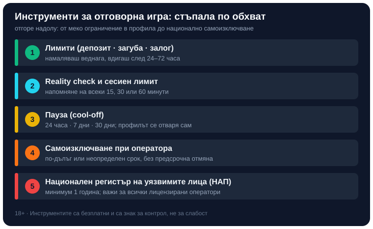

Title tag: Инструменти за отговорна игра: лимити и самоизключване | Всички Казина
Meta description: Кои са инструментите за отговорна игра при лицензираните казина: депозитни лимити, сесийни ограничения, reality check, пауза, самоизключване и националният регистър на уязвимите лица към НАП.

---

# Инструменти за отговорна игра: лимити, пауза и регистърът на НАП

Отговорната игра не е лозунг, а набор от конкретни бутони, повечето от които стоят в профила ти и чакат да бъдат натиснати. Всяко лицензирано казино е длъжно да предлага инструменти, с които сам ограничаваш колко, колко често и колко дълго играеш, а извън отделния оператор в България работи и национален механизъм за самоизключване през НАП. Тези инструменти са безплатни и ползването им е знак за контрол, не за слабост. Най-важното за тях се казва в едно изречение: настройваш ги, когато мислиш трезво, за да те пазят в момент, в който не мислиш. Затова добрият момент да ги погледнеш е сега, преди следващия депозит, а не след поредната лоша вечер.

## Лимити, които слагаш преди да депозираш

Първата линия на защита са лимитите. Депозитният лимит определя колко можеш да внесеш за ден, седмица или месец; лимитът на загубите спира играта, щом изгубеното достигне избрана от теб граница; лимитът на залозите ограничава общата заложена сума за период, независимо дали печелиш, или губиш. Общото при тях е дизайн, който работи в твоя полза: намаляването на лимит влиза в сила почти веднага, докато вдигането му се задейства чак след изчаквателен период, обикновено между 24 и 72 часа. Целта е проста и умна. В разгара на лоша серия импулсът да вдигнеш тавана е най-силен, а точно тогава решението е най-лошо; забавянето ти дава време да изтрезнееш. Затова лимитът има смисъл само ако го зададеш предварително, като част от бюджета за забавление, а не като спирачка, за която се сещаш, когато вече летиш надолу.

## Инструменти за времето: сесиен лимит и reality check

Парите не са единственото, което си струва да измерваш. Сесийният лимит ограничава колко дълго можеш да останеш в играта, след което системата те отписва автоматично. Reality check, или напомнянето за игрово време, е изскачащо съобщение на зададен от теб интервал, обикновено на 15, 30 или 60 минути, което ти показва колко време играеш и какво си заложил, и те пита дали да продължиш. Звучи дребно, но точно загубата на усещане за време е един от механизмите, чрез които казиното те задържа. Прекъсването, което те връща в реалността за секунда, често е достатъчно да решиш да станеш. Тези две настройки са особено полезни, ако забелязваш, че „едно последно завъртане" редовно се превръща в час.

## Пауза и самоизключване при оператора

Когато лимитите не стигат, следва по-твърда мярка. Паузата, наричана още cool-off или time-out, е кратко самоналожено спиране: за времето ѝ не можеш да влизаш, да депозираш или да залагаш, а профилът се отваря сам, щом изтече. Типичните опции са 24 часа, 7 дни или 30 дни, добри за момент, в който усещаш, че губиш контрол за кратко. Самоизключването при оператора е по-сериозната стъпка: блокира профила ти за по-дълъг или неопределен срок и обикновено не може да се отмени предсрочно, точно за да не отстъпиш в слаб момент. Разликата между двете е в намерението. Паузата е глътка въздух, самоизключването е решение да спреш за дълго с конкретното казино.

## Националният регистър на уязвимите лица

Самоизключването при един оператор не пречи да играеш при друг, затова в България съществува и национален регистър. От 2020 г. хазартът се регулира от Националната агенция за приходите (НАП), която пое функциите на закритата Държавна комисия по хазарта. По чл. 10г от Закона за хазарта НАП води регистър на уязвимите лица, наричан и регистър на хазартно уязвимите лица. Вписването е доброволно и се подава писмено от самото засегнато лице чрез искане до изпълнителния директор на НАП, лично в офис на агенцията или по електронен път на nap@nra.bg с квалифициран електронен подпис. Услугата е безплатна. Към момента минималният срок на вписване е една година и не може да бъде прекратен по-рано. Ефектът е важното: всички лицензирани в България оператори са длъжни да проверяват регистъра и да не допускат вписаните лица до залози, тоест едно вписване покрива целия легален пазар наведнъж, а не само едно казино. Ако търсиш и по-широк контекст за законността, той е обяснен в [законно ли е](/zakonno-li-e/).

## Кога е време да ги използваш

Инструментите имат смисъл само ако разпознаеш кога ти трябват. Няколко сигнала се повтарят при почти всеки, който е загубил контрол: гониш загубите с все по-големи залози, за да се върнеш на нула; заемаш пари или пипаш средства за сметки, за да играеш; криеш играта или размера на загубите от близките си; сядаш да играеш, за да избягаш от стрес или лошо настроение, а не за забавление. Един такъв сигнал е повод да зададеш лимит; няколко заедно са повод за пауза или самоизключване. Ако усещаш, че сам не се справяш, потърси помощ. Националната информационна линия за наркотиците, алкохола и хазарта („Солидарност") приема анонимни обаждания на 0888 99 18 66 в делнични дни от 10:00 до 17:00 часа.

## Контролът е в твои ръце

*Инструментите подредени по обхват: от меки ограничения в профила до национално самоизключване през НАП.*

Тези инструменти работят като стъпала: започваш с лимити и напомняния, минаваш през пауза, ако усетиш нужда, а при по-сериозен проблем стигаш до самоизключване при оператора или до националния регистър. Не е нужно да минеш през всички; изборът е спрямо това колко здраво ти трябва спирачката. Хазартът не е финансова стратегия, а платено забавление с известна цена, и точно затова заслужава същото планиране като всеки друг разход. Как гледаме на казината и техните условия е описано в [начина ни на оценяване](/kak-ocenyavame/), а практичната страна на вноските и тегленията, включително историята на транзакциите ти за самонаблюдение, е в [депозити и тегления](/depoziti-i-teglenia/). Онлайн [казино игрите](/kazino-igri/) са построени операторът да печели в дългосрочен план, така че единственото, което наистина контролираш, е колко залагаш и кога спираш. 18+ Хазартът може да пристрасти. Играйте отговорно. Инструментите по-горе не искат нищо в замяна и не питат защо; достатъчно е да решиш, че искаш да ги ползваш.

---

**Георги Тодоров**
Публикувано: 25.09.2026 · Последна редакция: 25.09.2026

[About Всички Казина boilerplate]

**Отговорна игра.** 18+ Хазартът може да пристрасти. Играйте отговорно. Ако усетиш, че играта излиза извън контрол или искаш да я ограничиш, виж [инструментите за отговорна игра](/otgovorna-igra/) и възможността за самоизключване чрез националния регистър на уязвимите лица към НАП (подава се писмено само от засегнатото лице). Национална информационна линия за наркотиците, алкохола и хазарта („Солидарност") 0888 99 18 66, делнични дни 10:00–17:00.

**Разкриване на партньорства.** Всички Казина съдържа партньорски (афилиейт) връзки; когато отвориш оферта през такава връзка, това може да финансира сайта, без да променя цената за теб и без да влияе на оценките ни. От 1 август 2026 г. дейността на афилиейт оператори в България се лицензира съгласно Закона за държавния бюджет за 2026 г. (ДВ, бр. 69 от 31.07.2026 г.). Всички Казина е подало заявление за лиценз пред Националната агенция по приходите и очаква издаването му.
