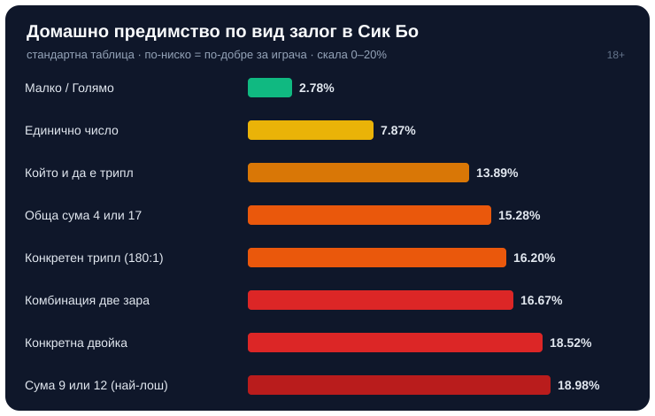

Title tag: Сик Бо (Sic Bo): правила, залози и шансове | Всички Казина
Meta description: Как се играе Сик Бо (Sic Bo): три зара, залагане преди отварянето, видовете залози с техните изплащания и домашно предимство, и защо ярките 180:1 са капан.

---

# Сик Бо (Sic Bo): правилата, залозите и реалните шансове

Сик Бо е древна китайска игра с три зара, чието име се превежда като „ценни зарове". Играеш срещу казиното, не срещу други хора на масата: залагаш върху възможни резултати, преди заровете да бъдат разкрити, и печелиш, ако познаеш. Дилърът разклаща три зара в затворена купа или кутия и я отваря чак след като залозите приключат. Именно тази смес от прости правила и много възможни залози я направи любима на масите с [казино игри](/kazino-igri/) на живо, където камерата показва разклащането в реално време. Изглежда екзотична, но под повърхността е чиста математика на зарове, и точно нея си струва да разбереш, преди да сложиш чип.

## Как протича един рунд

Пред теб стои маса с много полета: числа, суми, двойки, триплове и залозите „малко" и „голямо". Слагаш чипове върху полетата, които според теб ще паднат, докато тече таймерът за залози. Щом времето свърши, дилърът разкрива трите зара и масата плаща само залозите, които съвпадат с резултата; всичко останало изгаря. Можеш да покриеш няколко полета в един рунд, но всяко от тях е отделен облог със собствено изплащане и собствени шансове, а не част от обща стратегия. Рундът отнема секунди и това е част от притегателната сила: бърз, шумен и с усещане, че всеки момент може да удари голямото.

## Малко и голямо: залозите с най-добра стойност

Най-простите залози са и най-разумните. „Малко" печели, когато сумата от трите зара е между 4 и 10, а „голямо", когато е между 11 и 17. И двата плащат 1:1, тоест удвояват залога. Уловката е една: и двата губят, ако паднат три еднакви зара (трипл), независимо от сумата. Точно тази малка вратичка дава на казиното предимство от около 2.78% на тези залози. Звучи като дреболия, но това са единствените залози на масата под 3% домашно предимство. Всеки друг облог в Сик Бо е чувствително по-скъп за играча в дългосрочен план.

## Защо всичко опира до 216 изхода

Три зара с по шест страни дават 6 по 6 по 6, тоест 216 еднакво вероятни комбинации. Всяко изплащане на масата излиза именно от тази сметка: колко от 216-те изхода печелят даден залог. Конкретен трипл, например три петици, се пада само в 1 от 216 изхода, тоест около 0.46% от рундовете. Който и да е трипл покрива и шестте възможни числа, затова печели в 6 от 216 изхода, тоест 1 на 36 рунда, около 2.78%. Конкретна двойка, да речем две тройки, се появява точно в 15 от 216 изхода, а ако броим и трипъла от същото число, стават 16 от 216. Тези числа не са мнение, а самата дефиниция на играта; изплащанията просто им слагат цена, обикновено малко по-ниска от честната, и разликата остава у казиното.

## Видовете залози и техните изплащания

Таблицата по-долу е стандартната; конкретните изплащания се различават по казино и по вариант на играта, затова винаги проверявай масата, на която сядаш.

| Залог | Изплащане (стандартно) | Домашно предимство |
|---|---|---|
| Малко (4–10) / Голямо (11–17) | 1:1 | 2.78% |
| Единично число (1, 2 или 3 зара с него) | 1:1 / 2:1 / 3:1 | 7.87% |
| Който и да е трипл | 30:1 | 13.89% |
| Обща сума (напр. 4 или 17) | 60:1 | 15.28% |
| Конкретен трипл (напр. 5-5-5) | 180:1 | 16.20% |
| Комбинация от две зара | 5:1 | 16.67% |
| Конкретна двойка | 10:1 | 18.52% |

При единичното число залагаш на конкретна цифра: ако тя се падне на един зар, плаща 1:1, на два зара 2:1, а на трите 3:1. Изглежда щедро, но дългосрочното домашно предимство е около 7.87%. Залозите на обща сума варират силно: сумите 4 и 17 са най-редки и плащат 60:1, докато сумите около средата, 9, 10, 11 и 12, са най-чести и плащат по-малко. Комбинацията от две зара печели, ако паднат два конкретни различни числа, и при стандартно изплащане 5:1 носи около 16.67% предимство за казиното; някои маси плащат 6:1 за същия залог, което сваля предимството драстично, затова именно този залог си струва да сравниш между казината.

## Кой залог си струва и кой е капан

Числата подреждат играта ясно. Най-добрата стойност са Малко и Голямо с около 2.78% предимство, следвани от единичното число със 7.87%. От там нагоре всичко става скъпо. Най-примамливият залог, конкретният трипл с изплащане 180:1, е и един от най-лошите: домашното предимство е около 16.20%, защото шансът е едва 1 на 216. Голямото число до полето е реклама, не стойност. А най-скъпият залог на стандартната маса всъщност е сума 9 или 12 при изплащане 6:1, с около 18.98% предимство за казиното. Общо взето предимството в Сик Бо се простира от около 2.78% при простите залози до близо 19% при екзотичните, а разликата между двете е цяло състояние за дълга вечер.

## Развлечение, не система

*Домашно предимство по вид залог при стандартна таблица (по публични данни; конкретните изплащания варират по казино).*

Важното при Сик Бо е, че казиното има математическо предимство на всеки залог без изключение; няма поле, което да е в твоя полза. Голямото изплащане не значи добра стойност, а обикновено точно обратното: колкото по-рядко се пада един резултат, толкова по-примамливо е числото до него и толкова повече предимство е скрито вътре. Домашното предимство е дългосрочна статистика над много рундове, не прогноза за твоята вечер; в кратък сеанс заровете може да те гледат с добро око или да мълчат с часове. Ако сравняваш маси, гледай изплащанията по същия начин, по който гледаме и ние условията около игрите в [начина ни на оценяване](/kak-ocenyavame/), а не колко голямо свети числото на трипла. Като чиста игра на шанс Сик Бо е роднина на [кено](/blog/keno-pravila/): забавна, бърза и изцяло зависима от късмета.

Ако ще сядаш на маса със Сик Бо, задай си лимит за депозит и загуба преди първия залог, придържай се към Малко и Голямо, ако те интересува стойността, и залагай само със суми, които можеш да загубиш изцяло. Хазартът не е финансова стратегия, а платено забавление с известна цена. 18+ Хазартът може да пристрасти. Играйте отговорно. Ако усетиш, че гониш трипла повече, отколкото си планирал, виж [инструментите за отговорна игра](/otgovorna-igra/). Заровете нямат памет и не ти дължат нищо; единственото, което можеш да контролираш, е колко залагаш и кога спираш.

---

**Георги Тодоров**
Публикувано: 25.09.2026 · Последна редакция: 25.09.2026

[About Всички Казина boilerplate]

**Отговорна игра.** 18+ Хазартът може да пристрасти. Играйте отговорно. Ако усетиш, че играта излиза извън контрол или искаш да я ограничиш, виж [инструментите за отговорна игра](/otgovorna-igra/) и възможността за самоизключване чрез националния регистър на уязвимите лица към НАП (подава се писмено само от засегнатото лице). Национална информационна линия за наркотиците, алкохола и хазарта („Солидарност") 0888 99 18 66, делнични дни 10:00–17:00.

**Разкриване на партньорства.** Всички Казина съдържа партньорски (афилиейт) връзки; когато отвориш оферта през такава връзка, това може да финансира сайта, без да променя цената за теб и без да влияе на оценките ни. От 1 август 2026 г. дейността на афилиейт оператори в България се лицензира съгласно Закона за държавния бюджет за 2026 г. (ДВ, бр. 69 от 31.07.2026 г.). Всички Казина е подало заявление за лиценз пред Националната агенция по приходите и очаква издаването му.
