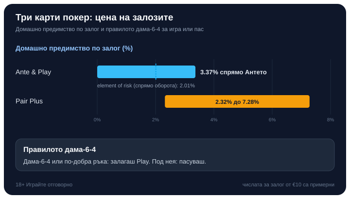

# 03 — HUMANISER · vk-0176

## AI-FINGERPRINT REPORT (Phase 1)
Overall verdict: MIXED (rewrite)
Overall score: 43/60
Layer scores: Lexical 8/10 | Syntactic 7/10 | Structural 8/10 | Density 9/10 | Experiential 6/10 | Rhythm 5/10

CRITICAL FLAGS:
- „Затова си заслужава да се разгледа отделно" → sibling of banned „заслужава да се отбележи" throat-clearing → state it directly.
- „Причината не е каприз на правилата, а честота." → the top BG „не A, а B" antithesis mic-drop → state the affirmative.
- „Рядко правило, което работи в полза на играча." → aphoristic wrap-up (wrap-up syndrome) → end on the payouts / detail instead.
MODERATE FLAGS:
- „По-рядкото стои по-високо, така работи всяка покер стълбица." → mild aphorism close; keep but soften.
- A couple of paragraphs drift toward a polished closing line each (wrap-up syndrome across sections). Vary two endings.
WHAT WORKS (preserve): every number, the two-paytable comparison table (genuine side-by-side), the €10 example marked примерни, the asymmetric final verdict, the 4 internal links.

## HUMANISED ARTICLE

Byline: Editorial Team (signed Георги Тодоров) | Market: bg

# Три карти покер (Three Card Poker): правила, залози и стратегия

Три карти покер се играе срещу самото казино, а не срещу другите на масата. Тесте от 52 карти, три карти за теб, три за дилъра, и няколко залога, които не се държат по един и същ начин. Който сяда с усещането, че вече познава покера от [по-общия поглед върху казино покера](/blog/kak-se-igrae-poker-kazino/), се спъва в два обрата: подредбата на ръцете е разместена, а страничният залог струва в пъти повече от основната игра.

Точно тези две неща я правят по-интересна от реда в общото описание. Играта е бърза, но под скоростта стои сметка, която мнозина не поглеждат.

## Как тече една ръка

Всичко започва със залог, наречен Анте. Слагаш го, преди да видиш каквото и да било, и получаваш трите си карти открити. Оттук имаш едно решение: пасуваш и губиш Антето, или добавяш втори залог, Play, равен по размер на Антето, за да се мериш с дилъра. Като една от [игрите на маса в казиното](/kazino-igri/), Три карти покер стъпва на този избор „продължавам или спирам", вместо на наддаване срещу хора.

След като заложиш Play, дилърът обръща своите три карти. Тук е квалификацията. Ръката на дилъра трябва да е дама-висока или по-добра, за да играе изобщо. Не се ли квалифицира, Антето плаща 1:1, а залогът Play няма действие и ти се връща. Квалифицира ли се и ръката ти е по-силна, Антето и Play плащат по 1:1. По-силна ли е неговата, губиш и двата залога.

Отделно от този цикъл стои Pair Plus, който слагаш едновременно с Антето, но той се брои сам за себе си. Можеш да играеш основната игра без него, само него, или и двете; те не си влияят.

## Защо кентата бие флъша

При три карти кентата бие флъша, обратно на всичко, което петкартовият покер те е учил. Зад това стои честотата. От всички 22,100 възможни ръце с три карти, кента се пада 720 пъти, а флъш излиза 1,096 пъти, така че по-рядката ръка получава по-високо място в стълбицата.

Пълната подредба от най-силна към най-слаба ръка изглежда така: стрейт флъш, трипс, кента, флъш, пара, висока карта. И трипсът тук бие кентата по същата логика: три еднакви карти се падат само 52 пъти от същите 22,100.

## Pair Plus: залогът само за твоите карти

Pair Plus е отделен, незадължителен залог, който изобщо не поглежда картите на дилъра. Печелиш, ако държиш пара или по-добра ръка, и толкова. Затова е примамлив: усеща се като чист залог на късмет, без сметки за квалификация.

Изплащането зависи изцяло от таблицата, а таблиците се различават по казина. Ето двете най-разпространени:

| Ръка | Оригинална таблица | По-нова таблица |
|---|---|---|
| Пара | 1:1 | 1:1 |
| Флъш | 4:1 | 3:1 |
| Кента | 6:1 | 6:1 |
| Трипс | 30:1 | 30:1 |
| Стрейт флъш | 40:1 | 40:1 |
| Домашно предимство | 2.32% | 7.28% |

Единствената променена стъпка е флъшът, но тя мести домашното предимство от 2.32% на 7.28%. Затова първото за проверка на всяка маса е точно колко плаща флъшът в Pair Plus.

## Ante Bonus: бонусът, който не пита за дилъра

Отделно от основната игра, силна ръка носи допълнителен бонус върху Антето. Не изисква отделен залог: начислява се автоматично, стига да си заложил Анте. Плаща се независимо дали дилърът се квалифицира и дори независимо дали печелиш ръката. Честа таблица дава кента 1:1, трипс 4:1 и стрейт флъш 5:1.

## Един пример за цяла ръка

Числата тук са примерни. Залагаш Анте €10 и получаваш кента. По правилото дама-6-4 добавяш Play €10. Дилърът обръща слаба ръка и не се квалифицира. Резултатът: Антето печели €10, залогът Play ти се връща непокътнат, а Ante Bonus за кента добавя още €10 отгоре. Тоест силната ти ръка се плаща дори когато дилърът пасува, точно заради бонуса. Ако дилърът се беше квалифицирал и ти беше загубил ръката, пак щеше да получиш само бонуса от €10 за кентата, а Антето и Play щяха да отпаднат.

## Кога да играеш и кога да пасуваш: правилото дама-6-4

Почти цялата стратегия на Три карти покер се събира в едно решение: кога да добавиш Play и кога да пасуваш след Антето. Прагът е дама-6-4. Държиш ли тази ръка или нещо по-силно от нея, залагаш Play. Всичко под нея пасуваш.

Прочита се така: погледни най-високата си карта. Ако е дама или по-висока, продължи да проверяваш; ако втората ти карта е поне шестица, а третата поне четворка, ръката минава прага. Под дама-6-4 добавянето на Play губи в дълъг период повече, отколкото спестява отказът от Антето, затова пасуването е по-евтиният ход.

Числово, при Анте от €10 (примерни числа): пасуваш ли слаба ръка, губиш €10; играеш ли под прага, средно губиш повече от тези €10, защото залагаш втори път там, където шансът вече е срещу теб. Прагът просто маркира къде втората €10 спира да си струва.

## Колко ти струва всеки залог

Основната игра Ante & Play, изиграна по правилото дама-6-4, носи домашно предимство около 3.37% спрямо Антето. Спрямо всичко, което реално слагаш на масата (Анте плюс Play), тежестта пада до около 2.01%, число, което математиците наричат element of risk. Разликата идва оттам, че често залагаш два пъти, така че процентът спрямо общия оборот е по-нисък от процента спрямо самото Анте.

Pair Plus, за сравнение, тежи между 2.32% и 7.28% според таблицата. Основната игра излиза по-евтина от страничния залог, особено ако попаднеш на таблицата с флъш 3:1.

*Домашно предимство по залог и прагът дама-6-4 за решението играя/пасувам (числата за Анте от €10 са примерни).*

RTP тук е същата монета от другата страна: домашно предимство 3.37% значи връщане към играча около 96.63% в дълъг период, изчислено върху хиляди ръце, а не върху твоята вечер. Страничният залог е по-волатилен: рядко плаща, но когато плати за стрейт флъш, плаща едро.

## Струва ли си като забавление

Хазартът е платено забавление с известна цена, не начин за печелене на пари. Заложи само това, което можеш да загубиш изцяло, и си сложи лимит преди първия депозит; ако усетиш, че играта излиза извън контрол, виж [инструментите за отговорна игра](/otgovorna-igra/). 18+ Хазартът може да пристрасти. Играйте отговорно.

Ако седнеш на тази маса, играй основната игра и се дръж за правилото дама-6-4; там предимството е сред по-поносимите за жанра. Pair Plus остави за настроение, не за стратегия, и погледни таблицата му, преди да заложиш. А честният начин да избереш къде да играеш минава през [публична методика, а не през усещане](/kak-ocenyavame/). Тестето не се интересува колко силно ти се играе, но поне цената му се смята предварително.

---

[AUTHOR BIO BLOCK]
[BRAND BOILERPLATE]
[18+ / RG LINE]

## CHANGE LOG
- Removed „заслужава да се разгледа отделно" throat-clearing → „Точно тези две неща я правят по-интересна…".
- Killed the „не A, а B" antithesis („не каприз на правилата, а честота") → affirmative „Зад това стои честотата." + folded the combinatorics into one flowing sentence.
- Cut the aphoristic wrap-up on Ante Bonus; section now ends on the payouts themselves.
- Softened the ranking-section close into a flowing clause rather than a standalone aphorism.
- All figures preserved exactly (52, 3, 22,100, 720, 1,096, 52, paytables 1:1/4:1/6:1/30:1/40:1 & 1:1/3:1/6:1/30:1/40:1, 2.32%, 7.28%, 1:1/4:1/5:1, дама-6-4, €10, 3.37%, 2.01%, 96.63%). Zero em-dashes. No [VERIFY] flags outstanding.
