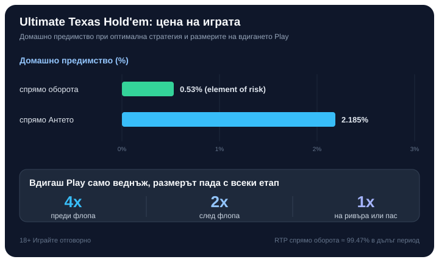

Title tag: Ultimate Texas Hold'em: правила, залози и стратегия | Всички Казина
Meta description: Ultimate Texas Hold'em срещу дилъра: задължителните Ante и Blind, страничният Trips, едно вдигане на 4x/2x/1x или пас, защо Антето се връща при некласиран дилър и колко струва играта.

---

# Ultimate Texas Hold'em: правила, залози и базова стратегия

Ultimate Texas Hold'em се играе срещу казиното, не срещу другите на масата. Стъпва на същите открити общи карти като [покера в неговия по-общ вид](/blog/kak-se-igrae-poker-kazino/), но логиката на залозите е обърната: колкото по-рано решиш да вдигнеш, толкова по-голям залог ти позволяват. Тази единствена особеност премества цялата игра от блъфа към сметката.

Който сяда с идеята, че ще чака перфектната ръка, губи предимството си още на първото решение. Силата тук е в това да заложиш едро, преди да си видял общите карти, когато началните ти две карти го оправдават.

## Трите залога на масата

Играта започва с два задължителни залога, които трябва да са с еднакъв размер: Ante и Blind. Слагаш ги, преди да получиш каквото и да било. Отделно стои Trips, незадължителен страничен залог, който изобщо не поглежда ръката на дилъра и се брои сам за себе си.

Раздават се по две закрити карти на теб и на дилъра, а в средата постепенно излизат пет общи карти, от които всеки съставя най-добрата си петкартова ръка. Дотук е класически Тексас Холдем. Разликата е какво можеш да заложиш и кога.

## Едно вдигане, три момента да го направиш

През цялата ръка имаш право да вдигнеш само веднъж, със залог, наречен Play. Кога го направиш определя колко голям е той, и точно това е сърцето на играта.

Първата възможност е веднага след двете закрити карти, преди която и да е обща карта. Тук вдигането е най-голямото допустимо, до 4 пъти Антето (някои маси разрешават и 3x). Ако вместо това провериш (check), гледаш флопа: първите три общи карти. След тях можеш да вдигнеш 2x Антето или пак да провериш. Провериш ли и втория път, идват последните две карти, търнът и ривърът, и оставаш пред последно решение: вдигаш 1x Антето или пасуваш. Пасът тук значи, че губиш и Антето, и Blind.

Веднъж вдигнеш ли на който и да е етап, край, второ вдигане няма. Затова силните начални ръце искат едрото вдигане отрано, а слабите чакат общите карти да ги оправят или да ги отпишат.

## Кога дилърът изобщо играе

След като приключат залозите, дилърът обръща картите си. За да участва ръката му, тя трябва да е поне чифт. Не се ли класира, се случва нещо характерно за тази игра: Антето не печели автоматично, а ти се връща непокътнато (push). Залогът Play пък се изплаща спрямо резултата, все едно дилърът е в играта.

Класира ли се дилърът и ръката ти е по-силна, Ante и Play плащат по 1:1. По-силна ли е неговата, губиш Ante, Play и Blind. При равни ръце залозите се връщат. Тази подробност с връщането на Антето е лесна за пропускане на масата, а тя обяснява защо чакането с посредствена ръка не е толкова скъпо, колкото изглежда.

## Blind: залогът, който мълчи до кентата

Blind е задължителен, но плаща само когато спечелиш ръката със силна комбинация, кента или по-добра. Спечелиш ли с по-слаба ръка, Blind просто се връща. Загуби ли ръката, Blind отпада заедно с останалите.

Изплащанията растат стръмно с рядкостта на комбинацията:

| Ръка | Blind изплаща |
|---|---|
| Роял флъш | 500:1 |
| Стрейт флъш | 50:1 |
| Каре | 10:1 |
| Фул хаус | 3:1 |
| Флъш | 3:2 |
| Кента | 1:1 |
| По-слабо от кента | връща се (push) |

Затова Blind е залог за големите ръце: през повечето раздавания той се връща или губи, а когато плати за каре или нагоре, плаща едро. Не е отделно решение, върви автоматично с Антето.

## Trips: страничният залог само за твоите карти

Trips гледа единствено твоята петкартова ръка. Плаща се дори когато загубиш раздаването и дори когато дилърът не се класира, стига картите ти да съставят три от вид или по-добра комбинация. Затова се усеща като чист залог на късмет.

Уловката е, че таблицата му се различава по казина, а разликата не е дребна. Ето най-щедрата разпространена таблица:

| Ръка | Trips изплаща |
|---|---|
| Роял флъш | 50:1 |
| Стрейт флъш | 40:1 |
| Каре | 30:1 |
| Фул хаус | 9:1 |
| Флъш | 7:1 |
| Кента | 4:1 |
| Три от вид | 3:1 |

При тази таблица домашното предимство върху Trips е около 0.90%. Свият ли изплащането за фул хаус и флъш, предимството скача до над 6% при по-стиснатите таблици. Първото за проверка на всяка маса е точно колко плащат фул хаусът и флъшът в колонката Trips.

## Един пример за цяла ръка

Числата тук са примерни. Слагаш Ante €10 и Blind €10, общо €20 задължителни. Получаваш чифт аса в закритите карти и вдигаш веднага 4x, тоест Play €40. Флопът и ривърът не ти носят нищо повече, но двата аса издържат срещу ръката на дилъра, който се класира с по-слаб чифт. Ante €10 и Play €40 печелят по 1:1, тоест връщат по още толкова. Blind обаче се връща непокътнат, защото чифт е под прага за изплащане. Ако беше уцелил кента с общите карти, същият Blind щеше да добави още €10 отгоре.

## Колко ти струва играта

Ultimate Texas Hold'em е сред по-евтините маси в казиното, но само при точна игра. Спрямо Антето домашното предимство при оптимална стратегия е около 2.185%. Спрямо всичко, което реално слагаш на масата (Ante, Blind и средното вдигане Play), тежестта пада до около 0.53%, число, което математиците наричат element of risk. Разликата идва оттам, че почти всяка ръка добавяш втори, често по-голям залог, така че процентът спрямо целия оборот е доста по-нисък от процента спрямо самото Анте.

*Домашно предимство спрямо оборота и спрямо Антето, и размерите на вдигането по етапи (при оптимална стратегия).*

Тези 0.53% важат за играч, който следва пълната стратегия. Опростената, човешка версия на стратегията вдига предимството до около 0.58% спрямо оборота и 2.43% спрямо Антето. RTP тук е същата монета от другата страна: около 99.47% спрямо оборота в дълъг период, изчислено върху хиляди ръце, а не върху твоята вечер. Trips е отделна сметка със собствено предимство и не влиза в тази.

## Базова стратегия, накратко

Цялата стратегия се върти около три решения. Преди флопа вдигаш 4x с всеки чифт от тройки нагоре, с всяка асо-карта или поп-карта от една боя, и с по-силните дама и вале от една боя; всичко по-слабо проверяваш и чакаш флопа. След флопа вдигаш 2x, когато вече държиш две двойки или по-добро, или скрит чифт от закритите си карти. На ривъра е обратната сметка: вдигаш 1x, освен ако твърде много от възможните карти на дилъра те бият, и чак тогава пасуваш.

Това е скелетът, не пълната таблица; точните прагове има смисъл да се държат под око на разпечатка, докато влязат в ръката. Важното за начало е посоката: едро отрано със силна ръка, търпение с посредствената, и пас само когато сметката наистина е срещу теб.

## Струва ли си като маса

Ниското домашно предимство не значи предимство за теб. Казиното пак печели в дълъг период, а бавното темпо на решенията има навика да те задържи по-дълго от планираното. Хазартът е платено забавление с известна цена, не начин за печелене на пари. Заложи само това, което можеш да загубиш изцяло, и си сложи лимит за депозит и загуба преди първата ръка; ако усетиш, че играта излиза извън контрол, виж [инструментите за отговорна игра](/otgovorna-igra/). 18+ Хазартът може да пристрасти. Играйте отговорно.

Ако седнеш на тази маса, дръж се за едрото вдигане със силните начални карти и остави Trips за настроение, не за стратегия. А честният начин да избереш къде да играеш минава през [публична методика, а не през усещане](/kak-ocenyavame/). Като една от [игрите на маса в казиното](/kazino-igri/), Ultimate Texas Hold'em възнаграждава сметката повече от късмета, но само дотолкова, доколкото я правиш преди залога, не след него.

---

**Георги Тодоров**
Публикувано: 25.09.2026 · Последна редакция: 25.09.2026

[About Всички Казина boilerplate]

**Отговорна игра.** 18+ Хазартът може да пристрасти. Играйте отговорно. Ако усетиш, че играта излиза извън контрол или искаш да я ограничиш, виж [инструментите за отговорна игра](/otgovorna-igra/) и възможността за самоизключване чрез националния регистър на уязвимите лица към НАП (подава се писмено само от засегнатото лице). Национална информационна линия за наркотиците, алкохола и хазарта („Солидарност") 0888 99 18 66, делнични дни 10:00–17:00.

**Разкриване на партньорства.** Всички Казина съдържа партньорски (афилиейт) връзки; когато отвориш оферта през такава връзка, това може да финансира сайта, без да променя цената за теб и без да влияе на оценките ни. От 1 август 2026 г. дейността на афилиейт оператори в България се лицензира съгласно Закона за държавния бюджет за 2026 г. (ДВ, бр. 69 от 31.07.2026 г.). Всички Казина е подало заявление за лиценз пред Националната агенция по приходите и очаква издаването му.
