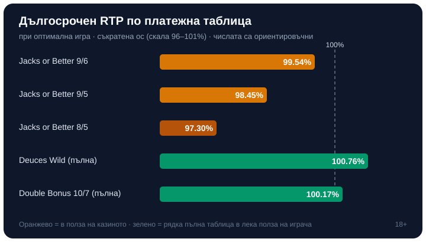

Title tag: Видеопокер: правила, вариации и стратегия | Всички Казина
Meta description: Как се играе видеопокер: раздаване, задържане и теглене на карти, защо платежната таблица определя RTP-то, Jacks or Better и Deuces Wild, базова стратегия и реалните шансове.

---

# Видеопокер: правилата, вариациите и защо таблицата решава всичко

Видеопокерът изглежда като ротативка с карти, но се играе като покер само донякъде. Сядаш сам пред машина, получаваш пет карти, решаваш кои да задържиш и колко да платиш. Няма дилър, няма други играчи на масата, няма блъфове. Печелиш или губиш спрямо една таблица с изплащания, а не спрямо ръката на съперник. Точно това го отличава от покера в казино, където играеш срещу дилъра или другите на [масата](/blog/kak-se-igrae-poker-kazino/). Тук противникът е математиката на самата машина, а тя е публикувана върху екрана, стига да знаеш къде да гледаш.

## Как протича една ръка

Залагаш от една до пет монети и машината раздава пет карти от разбъркано тесте. След това идва единственото ти истинско решение: кои карти да задържиш и кои да върнеш. Замените се теглят от останалите 47 карти в тестето, ръката ти се финализира и машината плаща според това какво си събрал. Всичко зад кулисите е генератор на случайни числа, който определя реда на картите; няма памет за предишни ръце и няма „загряла" машина. Една ръка отнема секунди, а темпото е измамно бързо, защото решенията са малко и лесни за автоматично щракане. Тази скорост е част от дизайна и е първото нещо, което променя парите ти по-бързо, отколкото очакваш.

## Платежната таблица е самата игра

Ключът към видеопокера е, че под едно и също име се крият различни игри. Определя ги таблицата на изплащане, отпечатана на екрана. При Jacks or Better най-често ще видиш обозначение като „9/6": деветката е колко плаща фул хаус на монета, шестицата е колко плаща флош. Пълната таблица 9/6 връща около 99.54% при математически перфектна игра, тоест за всеки заложен €100 в дългосрочен план се връщат около €99.54, а разликата остава у казиното.

| Ръка (Jacks or Better 9/6) | На 1 монета | На 5 монети |
|---|---|---|
| Роял флош | 250 | 4000 |
| Стрейт флош | 50 | 250 |
| Каре | 25 | 125 |
| Фул хаус | 9 | 45 |
| Флош | 6 | 30 |
| Стрейт | 4 | 20 |
| Три от вид | 3 | 15 |
| Две двойки | 2 | 10 |
| Двойка вале или по-високо | 1 | 5 |

Свали фул хауса и флоша с по една монета и играта тихо става по-скъпа: таблица 9/5 връща около 98.45%, а 8/5 пада до около 97.30%. Името на масата е същото, картите са същите, но всеки процент по-малко идва директно от твоя джоб в дългосрочен план. Затова опитните играчи първо четат таблицата и чак после сядат; лошата таблица е скъпа независимо колко добре играеш.

## Deuces Wild и по-агресивните вариации

Deuces Wild разбърква логиката, като прави всичките четири двойки заместващи: една двойка става каквато карта ти трябва, за да завършиш най-добрата ръка. При пълната таблица тази игра връща около 100.76% при оптимална стратегия, което е рядкост, защото номинално е в лека полза на играча. Уловката е, че такива щедри таблици почти не се срещат в реалния свят; повечето версии на Deuces Wild са орязани и връщат под 100%, а точният процент отново зависи от конкретните числа на екрана.

Има и вариации, които трупат бонуси за карето. Bonus Poker плаща допълнително за четири еднакви карти според ранга им, но за да финансира тези бонуси, сваля фул хауса; типична пълна таблица връща около 99.17%. Double Bonus Poker вдига още повече наградите за каре и при пълна таблица 10/7 стига около 100.17%, пак леко в полза на играча, пак трудна за намиране. Общото при всички е едно: колкото по-примамлив е върхът на таблицата, толкова по-често са орязани изплащанията за честите ръце, които реално пълнят баланса ти.

*Ориентировъчен дългосрочен RTP при оптимална игра според таблицата (по публични данни за пълните и орязаните таблици); реалните автомати варират.*

## Подредбата на ръцете и защо се залагат пет монети

Ръцете се подреждат както в класическия покер: роял флош е върхът, следван от стрейт флош, каре, фул хаус, флош, стрейт, три от вид, две двойки и накрая двойка от вале нагоре, която е най-ниската платима ръка при Jacks or Better. Тук идва една особеност, която обърква начинаещите. При една до четири монети роял флошът плаща 250 на монета, но на петата монета изплащането скача на 4000 общо, тоест 800 на монета. Всички останали ръце растат линейно с броя монети, а роялът прави рязък скок само на максималния залог. Този бонус е причината съветът „играй с пет монети" да е стандартен: играеш ли с по-малко, се лишаваш от най-голямата награда на играта тъкмо когато я удариш. Ако бюджетът не стига за пет монети на текущата стойност, по-разумно е да слезеш на по-нисък номинал и пак да заложиш пет монети, отколкото да залагаш по-малко монети на висок номинал.

## Базова стратегия: таблицата диктува всеки ход

Видеопокерът има правилен ход за всяка раздадена ръка и той не е въпрос на усет, а на очаквана стойност. За всяка комбинация от пет карти има точно решение кои да задържиш, което носи най-висока средна печалба в дългосрочен план, и то се променя според таблицата. Класически пример от Jacks or Better: получаваш ниска двойка и една висока карта. Инстинктът често казва да задържиш високата карта, но ниската двойка носи очаквана стойност около 0.82, докато самотната висока карта е около 0.47. Двойката печели с голяма разлика, затова се задържа тя. Тези решения са подредени в стратегически таблици за всяка вариация; не е нужно да ги помниш всичките, но е добре да знаеш, че съществуват и че „по усет" струва проценти RTP.

## Развлечение с известна цена

Дори добра таблица не е спестовна сметка. При 9/6 Jacks or Better волатилността е висока, със стандартно отклонение около 4.42, което на човешки означава дълги серии без нищо, прекъсвани от рядко голямо попадение като роял флош. Затова балансът може да пада часове наред при съвсем честна игра с добър RTP. Другата трезва истина е, че пълните, най-щедри таблици са изключение; повечето автомати в реалния свят връщат под 100% и то само ако играеш перфектно, а малцина играят перфектно. RTP-то е дългосрочна статистика над много изиграни ръце, не обещание за твоята вечер. Видеопокерът е една от [казино игрите](/kazino-igri/), в която уменията стесняват предимството на казиното повече, отколкото при чиста ротативка, но не го обръщат. Как гледаме на условията и числата около игрите е описано в [начина ни на оценяване](/kak-ocenyavame/).

Ако ще сядаш на видеопокер, задай си лимит за депозит и загуба преди първата ръка, пусни играта в демо режим, за да усетиш темпото ѝ без пари, и залагай само със суми, които можеш да загубиш изцяло. Хазартът не е финансова стратегия, а платено забавление с известна цена. 18+ Хазартът може да пристрасти. Играйте отговорно. Ако усетиш, че гониш роял флоша повече, отколкото си планирал, виж [инструментите за отговорна игра](/otgovorna-igra/). Умението помага да играеш по-евтино, но математиката на машината остава на страната на казиното.

---

**Георги Тодоров**
Публикувано: 25.09.2026 · Последна редакция: 25.09.2026

[About Всички Казина boilerplate]

**Отговорна игра.** 18+ Хазартът може да пристрасти. Играйте отговорно. Ако усетиш, че играта излиза извън контрол или искаш да я ограничиш, виж [инструментите за отговорна игра](/otgovorna-igra/) и възможността за самоизключване чрез националния регистър на уязвимите лица към НАП (подава се писмено само от засегнатото лице). Национална информационна линия за наркотиците, алкохола и хазарта („Солидарност") 0888 99 18 66, делнични дни 10:00–17:00.

**Разкриване на партньорства.** Всички Казина съдържа партньорски (афилиейт) връзки; когато отвориш оферта през такава връзка, това може да финансира сайта, без да променя цената за теб и без да влияе на оценките ни. От 1 август 2026 г. дейността на афилиейт оператори в България се лицензира съгласно Закона за държавния бюджет за 2026 г. (ДВ, бр. 69 от 31.07.2026 г.). Всички Казина е подало заявление за лиценз пред Националната агенция по приходите и очаква издаването му.
