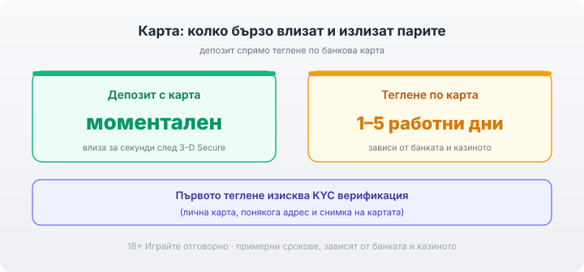

Title tag: Депозит с карта в казино: такси, срокове, сигурност
Meta description: Как работи депозитът с банкова карта (Visa/Mastercard) в онлайн казино: моментално захранване, 3-D Secure, срокове за теглене, KYC, такси и сигурност.

---

# Депозит с банкова карта (Visa/Mastercard) в онлайн казино: такси, срокове и сигурност

Картата е най-разпространеният начин да заредиш сметка в онлайн казино и причината е чисто практична: почти всяка Visa или Mastercard върши работа, а парите влизат моментално. На изхода нещата са по-заплетени: тегленето обратно по картата, таксите, които понякога идват от банката, и проверката на самоличността при първото изтегляне. Първата проверка, още преди депозита, е лицензът на казиното в публичния регистър на НАП. Банерът е реклама, общите условия са договорът.

## Защо картата стои първа в списъка

Visa и Mastercard се приемат на практика навсякъде, интерфейсът е познат на всеки, а сумата се отразява за секунди. И дебитна, и кредитна карта минават, макар че двете се държат различно на изхода и по таксите. За играч, който просто иска да зареди и да играе, това е най-краткият път: не се създава отделен профил в платежен посредник и не се чака превод от банка. Лимитите за депозит варират по казино и по карта, затова минималната и максималната сума се четат в касата на конкретния оператор всеки път. Как стоят картите спрямо касите и портфейлите по срокове и такси съм разписал в [прегледа на методите за плащане](/blog/casino-payments/).

## Как минава самият депозит

Въвеждаш номера на картата, срока на валидност и CVV кода в платежната форма на казиното и избираш сумата. Банката обикновено иска потвърждение през 3-D Secure, познато като Verified by Visa или Mastercard Identity Check: най-често код в банковото приложение или чрез SMS, който въвеждаш, за да одобриш плащането. След потвърждението сумата влиза за секунди и балансът е готов за игра. Тази стъпка е и първата ти защита: без твоето одобрение транзакцията не минава.

Ако депозитът бъде отказан, а по сметката има пари, причината рядко е у казиното. Част от банките спират плащанията към хазартни търговци по подразбиране или искат допълнително потвърждение при първия такъв превод, а понякога 3-D Secure просто не е настроен на картата. Едно обаждане до банката или проверка в приложението обикновено изчиства въпроса по-бързо, отколкото повторните опити, които само трупат откази.

## Тегленето обратно по картата не е моментално

Докато депозитът влиза за секунди, заявката за теглене по карта обикновено се обработва за 1–5 работни дни, а точният срок зависи от банката и от казиното. Първото теглене винаги минава през верификация (KYC): лична карта или паспорт, понякога доказателство за адрес отпреди не повече от няколко месеца, и снимка на картата с видими последни четири цифри и име, като останалата част се закрива. Това е стандартна практика по правилата срещу изпирането на пари, не приумица на конкретния оператор. Най-разумно е верификацията да се мине предварително, докато още няма какво да се тегли, за да не се удължава първата заявка.

*Депозитът влиза моментално; тегленето по карта отнема обикновено 1–5 работни дни (примерни срокове, зависят от банката и казиното), а първото теглене минава през KYC.*

## Правилото за същата карта

Много банки и казина връщат пари само на същата карта, от която е депозирано, и то до размера на депозита. Печалбата над тази сума често се изплаща по друг метод, банков превод или портфейл, защото картовите мрежи третират връщането като refund по първоначалното плащане, а не като нов изходящ превод. На практика това значи, че при примерен депозит от €200 и теглене от €500 около €200 могат да се върнат по картата, а остатъкът тръгва по втория метод, който казиното държи верифициран. Ако картата междувременно е изтекла или закрита, приготви се да подадеш друг метод и вероятно допълнителни документи. Затова картата, с която е депозирано, си струва да остане активна поне докато първоначалната сума се върне обратно.

## Кой всъщност таксува: казиното или банката

Самото казино обикновено не таксува депозита с карта. Когато видиш нещо отгоре, то почти винаги идва от страната на банката. Ако картата ти е в друга валута, при презгранична обработка банката може да начисли такса за валутно конвертиране: при депозит от €200 и примерна такса от 2% това са €4 отгоре, които казиното изобщо не вижда. Плащанията в българските казина са в евро (повече по темата в [материала за евро депозитите](/blog/evro-hazart-depoziti/)), така че евро карта в еврозоната обикновено минава без конвертиране, но какво точно пише в тарифата на банката ти се проверява там преди първия депозит. По-скъпият сценарий е с кредитна карта: някои издатели третират депозита в казино като теглене на пари в брой (cash advance), с отделна такса от порядъка на 3–5% и лихва, която тръгва от първия ден, без гратисния период на обичайните покупки. Точното третиране и тарифата обаче зависят от конкретната банка и карта, затова провери условията в тарифата на издателя или се обади за потвърждение, преди да заредиш по този начин. Дебитната карта почти винаги излиза по-евтина за тази цел.

## Колко е сигурно да даваш картата си онлайн

От страната на казиното данните на картата се пазят по стандарта PCI DSS и обикновено през токенизация: реалният номер се заменя със заместващ токен, така че платформата не съхранява самата карта в явен вид. Твоята основна задача е да се увериш, че казиното е с валиден лиценз от НАП, че адресът в браузъра е с https и че 3-D Secure е активен на картата ти, за да не минава плащане без твоето потвърждение. Лицензът остава първата проверка: без него няма кой да носи отговорност за парите ти. Данните на картата не си струва да се пазят в браузъра, нито да се оставя автоматично попълване на платежни форми по непознати сайтове. Задай си лимит за депозит и за загуба преди първото захранване, не след него, и гледай на сумата като на пари за развлечение, които можеш да загубиш изцяло. 18+ Хазартът може да пристрасти. Играйте отговорно. Ако усетиш, че играта излиза извън контрол, виж [инструментите за отговорна игра](/otgovorna-igra/).

## Комбиниране на картата с друг метод

Най-доброто разпределение обикновено е картата за бързото захранване и метод с по-предвидим срок за тегленето на печалба, особено ако картата е кредитна и рискува cash advance такса. Тарифата на своята банка и сроковете на конкретното казино се проверяват преди да въведеш номера, не след като парите вече са тръгнали. Пълната картина по захранване и изплащане стои в [раздела за депозити и теглене](/depoziti-i-teglenia/).

---

**Георги Тодоров**
Публикувано: 30.09.2026 · Последна редакция: 30.09.2026

[About Всички Казина boilerplate]

**Отговорна игра.** 18+ Хазартът може да пристрасти. Играйте отговорно. Ако усетиш, че играта излиза извън контрол или искаш да я ограничиш, виж [инструментите за отговорна игра](/otgovorna-igra/) и възможността за самоизключване чрез националния регистър на уязвимите лица към НАП (подава се писмено само от засегнатото лице). Национална информационна линия за наркотиците, алкохола и хазарта („Солидарност") 0888 99 18 66, делнични дни 10:00–17:00.

**Разкриване на партньорства.** Всички Казина съдържа партньорски (афилиейт) връзки; когато отвориш оферта през такава връзка, това може да финансира сайта, без да променя цената за теб и без да влияе на оценките ни. От 1 август 2026 г. дейността на афилиейт оператори в България се лицензира съгласно Закона за държавния бюджет за 2026 г. (ДВ, бр. 69 от 31.07.2026 г.). Всички Казина е подало заявление за лиценз пред Националната агенция по приходите и очаква издаването му.
