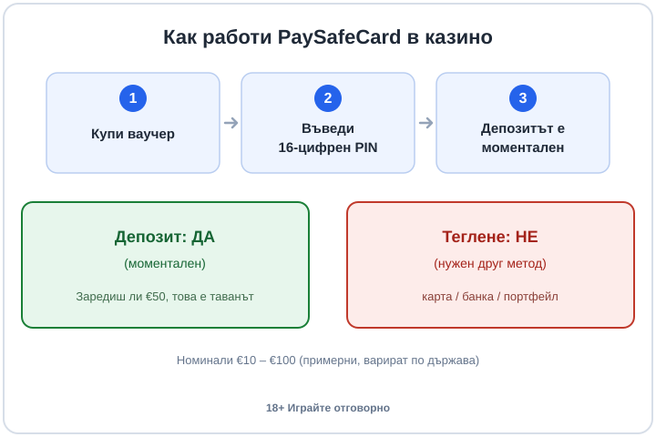

Title tag: PaySafeCard в казино: как работи, лимити, предимства
Meta description: PaySafeCard е предплатен ваучер с 16-цифрен PIN: депозитът е моментален и анонимен спрямо казиното, но теглене обратно няма. Лимити, такси и вграденият бюджет.

---

# PaySafeCard в онлайн казино: как работи, лимити и предимства

PaySafeCard е един от малкото начини да заредиш баланс в онлайн казино, без да даваш банкова информация на оператора. Купуваш предплатен ваучер, въвеждаш кода и парите са в сметката веднага. Има обаче едно ограничение, което сменя цялата сметка: обратно към PaySafeCard печалба не се тегли. Ето как работи методът на практика, какви са лимитите и къде се крият таксите.

## Какво е PaySafeCard и защо не иска банкова сметка?

PaySafeCard съществува от 2000 г. и е предплатен ваучер, нищо повече. Всеки ваучер носи 16-цифрен PIN код, който на практика представлява самите пари. Купуваш го в брой на каса, павилион, бензиностанция или магазин, а вариант за онлайн покупка също има. Банкова сметка не ти трябва, карта също. Това е и разликата с картовия депозит: при карта споделяш номер, срок и данни, при ваучера подаваш само един код.

Заради тази механика PaySafeCard попада в същата логика като касовите методи, които българските играчи ползват от години. Плащаш в брой, получаваш код, зареждаш онлайн, без банката да вижда транзакция към казино. Ако сравняваш начините за зареждане, [прегледът на казино плащанията](/blog/casino-payments/) минава през същите въпроси: кой метод е моментален, кой оставя следа в банката и кой ти връща печалба обратно.

## Как минава депозитът стъпка по стъпка?

Схемата е проста: купи ваучер, въведи 16-цифрен PIN и депозитът е моментален. На желаната стойност купуваш ваучера, отваряш касата на казиното, избираш PaySafeCard и вписваш кода. Сумата влиза без изчакване и без потвърждение от банка. Депозитът е моментален в буквалния смисъл, за разлика от банков превод, който може да седи с часове.

Депозитът е анонимен спрямо казиното в тесен смисъл: операторът не вижда банковите ти данни, а само че е постъпил ваучер на определена сума. Това не е анонимност спрямо закона. Акаунтът ти в казиното пак минава регистрация и верификация (KYC), а лицензираните оператори са длъжни да те идентифицират. Ваучерът просто държи платежните ти детайли настрана от оператора, което е различно нещо от това да си невидим.

*Депозит: ДА (моментален), теглене: НЕ (нужен друг метод). Номиналите €10 – €100 са примерни и варират по държава.*

## Защо не можеш да изтеглиш печалба обратно към PaySafeCard?

Логиката е една: депозит: ДА (моментален), теглене: НЕ (нужен друг метод). PaySafeCard е еднопосочен. Ваучерът зарежда пари към казиното, но не приема пари обратно. Класическият ваучер е похарчен и с това приключва ролята му, няма сметка, към която казиното да върне печалба.

На практика ти трябва втори метод за теглене: карта, банков превод или електронен портфейл. Затова мнозина комбинират, зареждат с PaySafeCard заради контрола и анонимността спрямо оператора, а за изход посочват друг метод, който вече е минал верификация. Съществува и регистриран акаунт my paysafecard, който в някои държави позволява получаване на средства, но и там изходът обикновено пак опира до карта или банка.

Преди да депозираш, провери какви методи за теглене приема казиното и дали изобщо съвпадат с тези за депозит. Някои сайтове изискват печалбата да излезе по същия метод, с който е зареден балансът, а при PaySafeCard това е невъзможно, така че операторът пренасочва към карта или банка по подразбиране. [Разделът за депозити и тегления](/depoziti-i-teglenia/) обяснява защо първото теглене е по-бавно заради KYC, независимо кой метод избереш. Ако смяташ да играеш сериозно, реши въпроса с изхода още преди първия ваучер: дръж верифицирана карта или банкова сметка готова, за да не откриеш проблема чак когато има какво да теглиш.

## Какви са лимитите и стойностите на ваучерите?

Ваучерите се предлагат в стойности от порядъка на €10 до €100, най-често €10, €25, €50 и €100, като точните номинали варират по държава и по обект. За по-голям депозит купуваш няколко ваучера и ги комбинираш.

Класическият ваучер има таван на транзакция, който в еврозоната обикновено е около €250 на транзакция [VERIFY: точният лимит варира по държава и се променя]. Регистрираният акаунт my paysafecard вдига лимитите, в някои случаи до около €1 000 на транзакция или на месец [VERIFY: варира по държава и статус на акаунта]. При по-големи суми самият доставчик може да поиска верификация, точно както го прави и казиното.

Ако искаш €150, а имаш три ваучера по €50, през my paysafecard ги събираш на едно място: 3 × €50 = €150 (примерни числа). Без такъв акаунт всеки ваучер обикновено се харчи при един търговец наведнъж, което при по-голяма сума значи няколко отделни въвеждания. Тук се вижда и защо методът пасва на по-малки, контролирани депозити: колкото по-голяма е сумата, толкова повече ваучери и верификация ти трябват, а предимството на бързината започва да се топи.

## Има ли такси, за които да внимаваш?

Самият ваучер се купува по номинал: €50 ваучер струва €50. На каса разпространителят понякога добавя малка такса при покупката [VERIFY: варира по обект и държава].

Две други пера заслужават поглед в общите условия на доставчика. Оставиш ли пари в неизползван ваучер за дълго, се начислява такса за неактивност след определен период на бездействие [VERIFY: сумата и срокът варират по държава и по това дали акаунтът е регистриран]. Ако ваучерът е в една валута, а плащаш в друга, влиза и валутно конвертиране [VERIFY: таксата зависи от доставчика]. И не всяко казино приема PaySafeCard, така че методът се проверява в касата на конкретния сайт преди регистрация, а не се приема за даденост. За еврото и зареждането в България [бележките за евро депозитите](/blog/evro-hazart-depoziti/) минават през същите детайли.

## Вграденият лимит на харчене работи като бюджет

Има едно предимство, което рядко влиза в банерите: ваучерът не може да похарчи повече, отколкото носи. Заредиш ли €50, това е таванът за сесията от този ваучер. Няма как да догониш загуба с още един клик, защото няма свързана карта, от която да тръгнат нови пари. За играч, който държи на фиксиран бюджет, това е реален инструмент за самоконтрол, не козметика.

Пак остава твоя работа да си зададеш лимити за депозит и загуба, преди да отвориш която и да е игра. PaySafeCard помага с дисциплината, но не мисли вместо теб. За зареждане с контрол и без банкови данни методът върши работа. За изхода разчитай на друго и го планирай преди първия депозит, спокойно, без да чакаш първата печалба. 18+ Хазартът може да пристрасти. Играйте отговорно. Ако усетиш, че играта излиза извън контрол, виж [инструментите за отговорна игра](/otgovorna-igra/).

---

**Георги Тодоров**
Публикувано: 30.09.2026 · Последна редакция: 30.09.2026

[About Всички Казина boilerplate]

**Отговорна игра.** 18+ Хазартът може да пристрасти. Играйте отговорно. Ако усетиш, че играта излиза извън контрол или искаш да я ограничиш, виж [инструментите за отговорна игра](/otgovorna-igra/) и възможността за самоизключване чрез националния регистър на уязвимите лица към НАП (подава се писмено само от засегнатото лице). Национална информационна линия за наркотиците, алкохола и хазарта („Солидарност") 0888 99 18 66, делнични дни 10:00–17:00.

**Разкриване на партньорства.** Всички Казина съдържа партньорски (афилиейт) връзки; когато отвориш оферта през такава връзка, това може да финансира сайта, без да променя цената за теб и без да влияе на оценките ни. От 1 август 2026 г. дейността на афилиейт оператори в България се лицензира съгласно Закона за държавния бюджет за 2026 г. (ДВ, бр. 69 от 31.07.2026 г.). Всички Казина е подало заявление за лиценз пред Националната агенция по приходите и очаква издаването му.
